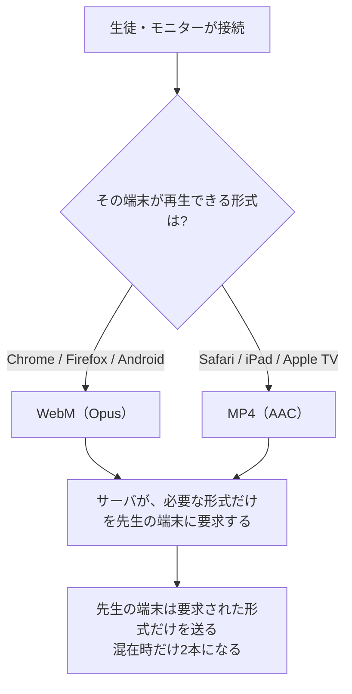
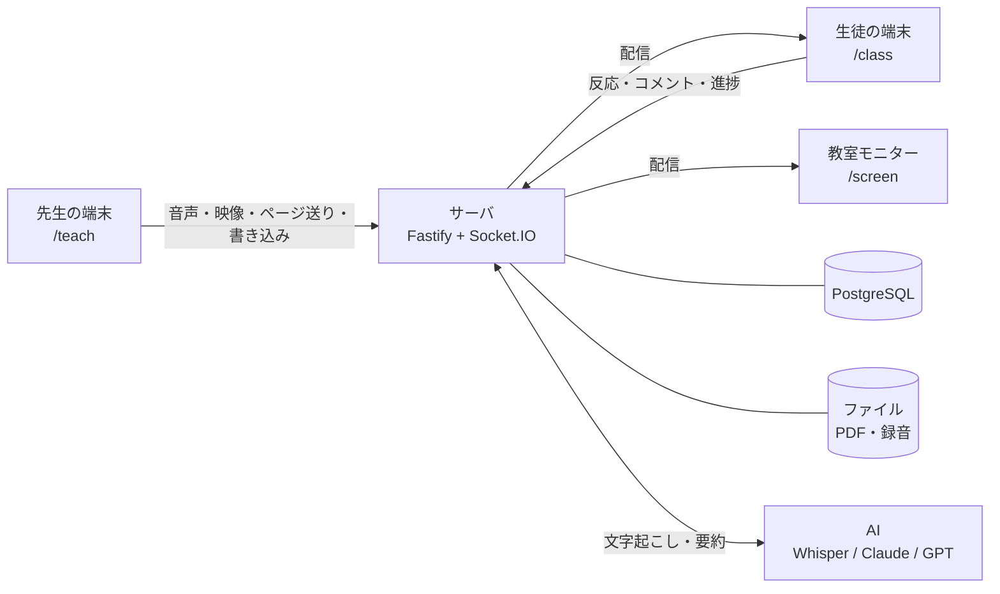

# 遠隔授業 理解度フィードバックシステム

高知工科大学 データ＆イノベーション学群のPBL(Project Based Learning)で製作したwebアプリです。
遠方の学校への配信・自宅受講・複数拠点への同時配信といった遠隔授業で、
**生徒の理解や進行度合いを、先生が授業中に把握しやすいよう支援します**。

生徒がボタン・コメント・タスク・アンケートで意思表示でき、コメントが届くと
**そのとき先生が何を説明していたのか**があわせて表示されます。
授業後は、その瞬間に戻っての振り返りや、復習動画の作成ができます。

先生も生徒もアプリのインストールは不要で、URLを開くだけで使えます。


---

## どこを読めばよいか

| あなたの立場 | 読むところ | 目安 |
|---|---|---|
| **どんなものか知りたい** | [何を解決するか](#何を解決するか) → [機能](#機能) → [画面一覧](#画面一覧) | 5分 |
| **なぜこの作りなのか知りたい** | [設計判断とその根拠](#設計判断とその根拠) — 実測して決めたこと3つ | 5分 |
| **授業で使う先生** | **[先生向けガイド](docs/先生向けガイド.md)** — 授業の流れに沿った説明書 | 必要なところだけ |
| **導入を検討している教員・職員** | **[導入を検討する方へ](docs/導入を検討する方へ.md)** — 費用・個人情報・必要な環境 | 10分 |
| **開発を引き継ぐ人** | [開発をはじめる](#開発をはじめる) → **[ARCHITECTURE.md](docs/ARCHITECTURE.md)** | 30分 |

---

## 何を解決するか

対面の教室では、生徒の表情や手の動きが説明を補う手がかりになります。
遠隔になると、その手がかりが届きにくくなります。

このシステムが足すのは、**生徒が手を挙げずに意思表示できる経路**と、
**その反応を時刻とともに残す仕組み**です。授業のあとに、その瞬間へ戻って確認できます。


### 設計の柱

#### 細い回線でも成立させること

配信するのは、音声・スライド・書き込みの3つです。音声は 48kbps で送ります。
カメラ映像は、使うかどうかを選べます。
**ギガを使い切ったあとの速度制限（128kbps程度）でも授業から落ちないこと**を基準にしています。
実際に足りるかは `/check` がその端末・その回線で測って判定します。
回線ごとの目安は [導入を検討する方へ「回線」](docs/導入を検討する方へ.md#回線) にあります。

#### カメラ映像は任意

カメラを使うのは**先生だけ**で、顔や手元の実演を映せます。**生徒が映ることはありません**。

映像には約900kbps必要なので、**受け取るかどうかは生徒の端末ごとに選べます**。
止めても音声とスライドは途切れません。

#### 個人情報を集めないこと

先生はログインIDと表示名だけ、**生徒は授業コードだけ**で使えます。
名前は任意で、空なら「青いネコ」のような仮名が自動で付きます。
連絡先・カメラ・マイクは取得せず、**入力された氏名も外部へは送りません**。

#### 先生の操作を増やさないこと

授業中は、スライドを送ることと話すことに集中していただけます。
文字起こしは裏で進み、コメントの分析は届いた時点で自動的に走ります。
コメントのカードだけは、対応済みにするまで画面に残ります（見落としを防ぐためです）。

---

## 機能

### 授業中

| 機能 | 説明 |
|---|---|
| **スライド配信** | PDFをアップロードするだけ。ページ送り・書き込み・ポインターがリアルタイムに同期 |
| **音声配信** | 先生のマイクを低遅延で配信。受け手の端末に合わせて Opus / AAC を自動で振り分け |
| **カメラ映像**（任意） | 先生の顔や手元の実演を配信。音声とずれないよう1本のストリームで送る。生徒側で受け取らない設定にできる |
| **白紙スライドの挿入** | 授業中にその場で白紙ページを差し込んで板書に使える（元のPDFは変更しない） |
| **リアクション** | 生徒がボタン（既定「わかった／わからない」、授業ごとに変更可）とコメントを送信。圏外で**送れなかったものだけ**を端末に取っておき、繋がったときに**押した時刻のまま**届ける |
| **自動字幕** | 先生の発話をリアルタイムに字幕表示（先生の端末が Chrome・Edge のとき）。聴覚に配慮が必要な生徒や、聞き取りにくい環境での使用向け |
| **タスク進捗** | 演習の項目を並べておくと、生徒がチェックした進み具合が棒グラフで見える。5分動いていない生徒は上に出る |
| **アンケート** | その場で設問を出す（選択式・段階評価）。集計は先生だけに表示する場合と、生徒へも表示する場合の2種類から選べる |
| **コメント分析** | コメントが届くと、AIが「先生がその直前に何を話していたか」を特定し、近い時刻の複数コメントを1枚のカードにまとめる。授業で扱っていない話題はその旨を表示する。カードは**対応済みにするまで残る**（[実際の出力](docs/先生向けガイド.md#5-授業中にできること)） |
| **教室モニター** | 教室モニター・電子黒板に投影する表示専用ページ。参加用QRコードは授業前に自動で出るほか、授業中も操作バーから出せる |

### 授業後

| 機能とタブ名 | 説明 |
|---|---|
| **同期再生** | 録音の再生位置に合わせて、その時点のスライド・書き込み・ポインターを自動で再現 |
| **AI要約** | 授業全体の文字起こしと、反応が集中した箇所をふまえた要約 |
| **反応** | ボタン反応とコメントを1本の時系列に並べ、それぞれの前後だけを切り出して聞ける。アンケートとタスクの要旨も確認できる |
| **アンケート** | 設問ごとの集計。選択式は円グラフ（未回答も区画として入る）、記述式は名前つきの一覧。 |
| **タスク** | タスクごとの完了人数と、1人目・半数・最後の1人が終えた時刻。押してすぐ取り消した完了は数えない |
| **復習動画** | つまずいた箇所を章に切り出し、選んだ章だけを**生徒に公開**できる。公開ページに生徒の名前やコメントは出ない |
| **スライド** | どのスライドに反応・コメントが集まったかで並び替え |

### 開発・運用の検証

| 画面 | 説明 |
|---|---|
| `/check` | **授業前**に「この端末で接続・音声・映像が使えるか」を調べる。ログイン不要。実際に通信量を測り、速度制限下で足りるかまで判定する |
| `/telemetry` | **授業後**に「実際の運用で何が起きたか」を開発側が見る。授業単位の匿名集計のみ |

---

## 設計判断とその根拠

このシステムの設計は、**遅延・通信量・精度を実際に測って決めています**。代表的な3つを載せます。
残りは [ARCHITECTURE.md「触るときに気をつけること」](docs/ARCHITECTURE.md#触るときに気をつけること) にあります。

### 音声・映像の形式は「受け手」が決める

Safari（iPad・Mac・Apple TV・テレビ内蔵ブラウザ）は WebM を再生できません。
ただし、全体を MP4 に寄せると、遅延が大きくなります。



**なぜ片方に決め打ちしないか。** Chrome の MediaRecorder は MP4 だとキーフレーム単位でしか
断片を切らないため、500ms を指定しても実際には**約4.1秒ごと**にしかデータが出てきません。
同一条件での実測は **WebM 1.4秒 / MP4 5.3秒**。全体を MP4 にすると、
Apple製の端末が1台混じるだけで、**全員の遅れが約4秒増えます**。

映像の MP4 は、使える環境では WebCodecs で自前に組み立てて 0.5 秒ごとに切っています（`client/src/lib/lowLatencyMp4.ts`）。
音声のみの配信にはこの問題が無い（AACでも約0.5秒ごとに出る）ため、そちらは MP4 優先のままです。

### 字幕はライブと履歴で出所を分ける

話し終わってから字幕が出るまでの時間が空くほど、いま聞いている話と噛み合わなくなります。
サーバ側の Whisper は用語の精度が高い代わりに、実測で**10秒以上遅れました**。
先生が次の話題に移ったあとに前の字幕が出る状態で、ライブには使えません。

そこでライブ字幕はブラウザの音声認識（Web Speech API、先生の端末で動く）で出し、
**用語の正しい版はあとから Whisper に差し替えます**。速さが要るところと正確さが要るところで、別の手段を使っています。

### 入り直しは自動で戻さない

参加トークンは sessionStorage にあるため、**タブを閉じると消えます**。
スマートフォンは背面のタブを勝手に破棄することがあり、入り直すと別の生徒になってタスクの進捗が0に戻ります。

そこで端末にも控えを残し、同じ授業コードを入れたときだけ
「この端末は先ほど**青いイヌ**として参加していました」と尋ねます。
**自動で戻さないのは、学校の共有端末を想定しているため**です。自動で戻すと、次に使う生徒が前の生徒のまま参加します。

案内を出すかどうかは、**毎回サーバへ問い合わせて確かめます**（`/api/join/resume-check`）。
端末にあるのは文字列だけで、それがまだ通用するかは端末側では分かりません。
確かめずに出すと、DBを入れ替えたあとに、もう居ない参加者の名前を見せてしまいます。

> **規模の実測** — サーバ1台で、音声のみなら2000台（0.26コア・96Mbps）、
> 映像込みでも300台へ300Mbpsを配れました。**規模は通信量で決まります。**
> CPUとメモリは、この範囲では余裕がありました。台数ごとの数字は
> [ARCHITECTURE.md「規模を決めるのは通信量です」](docs/ARCHITECTURE.md#規模を決めるのは通信量です) にあります。

---

## 画面一覧

| URL | 誰が | 何をする |
|---|---|---|
| `/register` `/login` | 先生 | アカウント登録・ログイン（メールアドレス不要） |
| `/dashboard` | 先生 | PDFをアップロードして授業を作成、過去の授業を開く |
| `/teach/:id` | 先生 | 授業本番。配信・書き込み・反応の確認・アンケート・タスク |
| `/screen/:id` | 教室 | 教室モニターへの投影（表示専用・ログイン不要） |
| `/m/:code` | 教室 | 上の短い入口。6文字のコードで開きます |
| `/review/:id` | 先生 | 授業後の振り返り・復習動画の作成 |
| `/join` → `/class` | 生徒 | 4文字の授業コードだけで参加（アカウント不要・名前は任意） |
| `/watch/:token` | 生徒 | 公開された復習動画（ログイン不要） |
| `/check` | 誰でも | 端末チェック（`Ctrl+Alt+C` でどの画面からでも開く） |
| `/telemetry` | 開発 | 匿名の通信集計（`Ctrl`+`Alt`+`T` でも開けます） |

---

## 授業当日の流れ


1. **事前** — 教室の端末で `/check` を開き、接続・音声・マイクを確かめます
2. **授業を作る** — `/dashboard` でPDFをアップロードすると、4文字の授業コードが出ます
3. **生徒に伝える** — 授業コード、URL、QRコードのいずれかを見せます
4. **開始** — 「授業を開始」で配信と録音が始まります。**ここからの時刻が、すべての記録の基準**です
5. **授業中** — スライドを送り、書き込みます。コメントが届くと、直前の説明を要約したカードが出ます
6. **終了** — 「授業を終了」を押すと、`/review/:id` でいつでも振り返れます

各画面の操作は **[先生向けガイド](docs/先生向けガイド.md)** にあります。

<!-- ▼ 2026-08-28: 操作とトラブル対処は先生向けガイドへ集約しました／編集どうぞ -->

教室のモニターへ投影する場合は `/m/コード` を開きます。**音を出す端末は1台に絞ります**
（[教室で対面と併用するとき](docs/先生向けガイド.md#教室で対面と併用するとき)）。
音や画面に不具合があるときは、まず `/check` で切り分けてから
[困ったときは](docs/先生向けガイド.md#困ったときは) をご覧ください。

<!-- ▲ここまで -->

---

## システム構成



```
client/  React 19 + Vite + pdf.js + socket.io-client（先生・生徒・モニター共通のSPA）
server/  Node.js 22 + Fastify 5 + Socket.IO 4 + Drizzle ORM
shared/  クライアントとサーバで共有する型定義（@shared）
```

<!-- ▼ 2026-08-28: 内部の詳細は ARCHITECTURE へ集約しました／編集どうぞ -->

- **DB**: PostgreSQL（`DATABASE_URL`）。未設定の場合は **PGlite**（ローカルファイルDB）へ落ちるため、開発はゼロ設定で始められます
- **ファイル**: PDFと録音は `DATA_DIR` 配下。DBには入れません
- **AI**: OpenAIのキー1つで文字起こしと要約をまかないます

プロセスの構成、起動の流れ、状態の持ち方は
[ARCHITECTURE.md「全体像」](docs/ARCHITECTURE.md#全体像) にあります。

<!-- ▲ここまで -->

---

## 個人情報の扱い

**なるべく個人情報を集めない方針です。** 先生はログインIDと表示名だけ（メールアドレスを求めません）、
生徒は登録不要で、名前も任意です。生徒のカメラとマイクは使いません。

保存するもの、外部サービスへ送るもの、削除したときの挙動は
[導入を検討する方へ「個人情報の扱い」](docs/導入を検討する方へ.md#個人情報の扱い)と
[同「外部サービスに送られるもの」](docs/導入を検討する方へ.md#外部サービスに送られるもの)にまとめています。

メールアドレスを集めていないため、**画面からパスワードを再設定することはできません**。
サーバを管理している方は [パスワードを設定し直す](#パスワードを設定し直す) の手順で設定し直せます。
授業の記録はアカウントに紐づいたまま残ります。

<!-- ▲ここまで -->

---

## 必要なもの

**端末**: 先生はマイクの使えるPC（自動字幕を使う場合は Chrome か Edge）。
生徒はスマートフォン・タブレット・PCのいずれでも、教室モニターはテレビ内蔵ブラウザでも動きます。

**回線**: 音声48kbps、カメラ映像を使う場合は受け取る側に別途900kbps。
`/check` が実際に測って判定します（128kbps の6割・約77kbps 以内なら○）。

詳しくは [導入を検討する方へ「比較表」](docs/導入を検討する方へ.md#比較表) と
[同「回線」](docs/導入を検討する方へ.md#回線) にあります。

<!-- ▼ 2026-08-28: 金額の表は「導入を検討する方へ」へ集約しました／編集どうぞ -->

### 月額のめやす

**サーバ代が月1,100円ほど、AI利用料が50分1コマあたり60円ほど**です。
内訳と、コマ数ごとの月額は [導入を検討する方へ「月額のめやす」](docs/導入を検討する方へ.md#月額のめやすクラウド運用) にあります。

AI利用料の8割は文字起こしです。**音声の分数で課金される**ため、
費用は「授業の長さ × コマ数」に、繋ぎ目の重なり分が1割ほど加わった額になります。
要約やコメントの文字数は、ほとんど効きません。
`LIVE_TRANSCRIBE_INTERVAL_MS` / `LIVE_TRANSCRIBE_OVERLAP_MS` で繋ぎ目の重なりを減らせます。

<!-- ▲ここまで -->

---

<!-- ▼ 2026-08-28: ここから先は開発を引き継ぐ方向け／編集どうぞ -->

## 開発をはじめる

> **ここから下は、開発を引き継ぐ方向けです。** 使い方を知りたい場合は
> [先生向けガイド](docs/先生向けガイド.md)、導入をご検討の場合は
> [導入を検討する方へ](docs/導入を検討する方へ.md) をご覧ください。


前提: Node.js 22 以上

```bash
npm install
npm run dev
```

- クライアント: http://localhost:5173 （APIは :3000 へプロキシ）
- DBは PGlite が `server/data/` に自動作成。マイグレーションは起動時に自動適用
- `/register` で先生アカウントを作り、`/dashboard` でPDFをアップロードして授業を作成
- 別のブラウザ（またはシークレットウィンドウ）で `/join` を開けば、生徒として参加できます

環境変数は、リポジトリ直下の `.env.example` を `server/.env` へコピーして設定します（読み込むのは `server/.env` です）。

```bash
npm run typecheck   # server と client の両方
npm run build       # クライアントの本番ビルド
npm run db:generate # スキーマ変更後のマイグレーション生成
```

### AIのキーを設定する

**このアプリはAIを使う前提です。** コメントの対象箇所の特定・授業後の要約・復習動画の章分けは、
すべて文字起こしの上に成り立っています。OpenAIのキー1つで、文字起こしと要約の両方をまかなえます。

```env
TRANSCRIBE_PROVIDER=openai
SUMMARY_PROVIDER=openai
OPENAI_API_KEY=sk-...
```

要約だけ Anthropic にする場合:

```env
SUMMARY_PROVIDER=anthropic
ANTHROPIC_API_KEY=sk-ant-...
```

モデルの既定値は `OPENAI_MODEL` / `ANTHROPIC_MODEL` で変更できます（`server/src/config.ts`）。
Claude API は音声入力に対応していないため、**文字起こしは常に OpenAI Whisper** を使います。

### 生徒を模擬する

```bash
node scripts/student-sim.mjs KC6W 生徒A confused 3000
```

引数は `<授業コード> [表示名] [リアクションkind] [遅延ms]` です。
同時に何本か走らせると、複数の生徒がボタンを押したときの先生の画面を再現できます。
このスクリプトは、ボタン反応だけを送ります。**コメントのカードは作られません。**
生徒画面から送ることで、カードを見ることができます。

### パスワードを設定し直す

画面からは再設定できないため、サーバ側で設定し直します。授業の記録はそのまま残ります。

```bash
node scripts/reset-password.mjs <ログインID>
```

`--list` でログインIDを一覧できます。接続先は `server/.env` を読みます。

---

## デプロイ（クラウド）

`Dockerfile` と Render 用の `render.yaml` を同梱しています。Docker対応のPaaS
（Render / Railway / Fly.io など）へそのまま載せられます。

必要なもの:

1. **PostgreSQL**（Neon / Supabase / PaaSのマネージドDB）→ `DATABASE_URL`
2. **永続ディスク**（PDF・録音用）→ マウント先を `DATA_DIR` に（例 `/data`）
3. `SESSION_SECRET`（長いランダム文字列）と、使う場合はAIのキー
4. `REGISTER_CODE`（**インターネットに公開する場合は設定してください**。下に説明があります）

Renderの場合（**新しく立てるとき**の手順です）:

1. https://render.com/ にGitHubアカウントでログイン
2. New + → **Blueprint** → このリポジトリを選択
3. 環境変数を入力して Apply
4. 発行された `https://～.onrender.com` で先生アカウントを登録して開始

> **すでに動いているサービスがある場合、Blueprint を読み込ませないよう注意してください。**
> 手で作ったサービスとは別のサービスが新しく作られ、**公開URLが変わります**。

### 運用に入ったあとの入れ替え

**`main` への `git push` が、そのまま本番への反映です。**
Renderがpushを見て自動で入れ替えます。手元での操作は要りません。

入れ替えには数十秒かかり、永続ディスクを付けていると**その間サーバが数秒止まります**。
**授業中はpushしないでください。** 配信が切れます
（生徒の画面は自動でつなぎ直しますが、先生のマイクの配信は止まったままになります）。

注意点:

- 音声配信に **WebSocket** を使います。対応するプラン・構成が必要です
- ライブ状態はメモリに持つため、**単一インスタンス構成**が前提です
- マイク（先生）と MediaSource 再生（生徒）のため、**HTTPS が必須**です
- `SESSION_SECRET` を設定しないと、ソースに書かれた既定の文字列でログインCookieに署名します。
  未設定のまま `NODE_ENV=production` で起動すると警告が出ます（`REGISTER_CODE` も同様）
- AIの利用料はサーバの持ち主に発生します

### 登録の合言葉（`REGISTER_CODE`）

未設定だと、**URLを知った人は誰でも先生アカウントを作れます**
（授業データは先生ごとに分かれているため、他人の授業は見えません）。

```env
REGISTER_CODE=好きな合言葉
```

設定すると登録画面に入力欄が出て、一致しないと登録できなくなります。試用中は未設定でも構いません。

---

## アイコンから起動する（PWA）

WordやExcelのように、アイコンから直接起動できます。

- **PC（Edge / Chrome）**: URLを開く → アドレスバー右端の「インストール」→ 以後はスタートメニューやタスクバーから独立ウィンドウで起動
- **スマートフォン**: URLを開く → 共有メニュー →「ホーム画面に追加」

アイコンを変えるときは `client/public/icon.svg` を編集して `node scripts/generate-icons.mjs` を実行します。

---

<!-- ▼ 2026-08-28: 利用者向けの制限は「導入を検討する方へ」へ集約しました／編集どうぞ -->

## 制限事項

開発を引き継ぐ方向けのものです。利用者向けの制限は
[導入を検討する方へ「できないこと」](docs/導入を検討する方へ.md#できないこと) にまとめています。

- **複数サーバインスタンスへのスケールアウトは未対応**（Socket.IOのアダプタ等が必要）。
  1台でどこまで届くかは
  [ARCHITECTURE.md「規模を決めるのは通信量です」](docs/ARCHITECTURE.md#規模を決めるのは通信量です) に実測値があります
- **同意管理・匿名化モードは未実装**です。スキーマ（`participants.consent_status` /
  `lessons.anonymize_mode`）だけ用意してあり、ロジックはありません

<!-- ▲ここまで -->

---

## ライセンス

[MIT License](LICENSE) です。自由に利用・改変・再配布できます。
