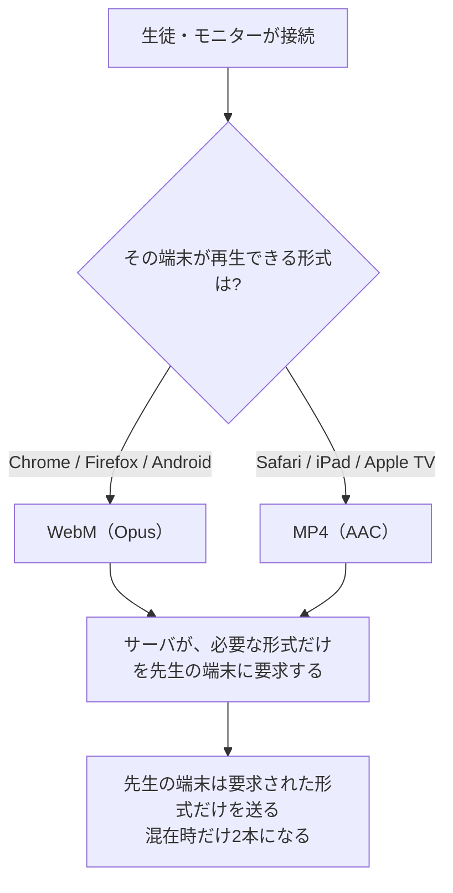
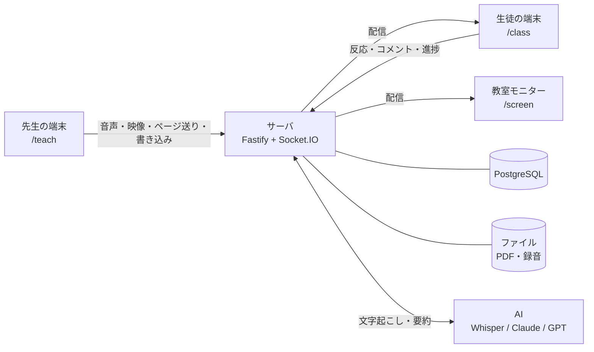

# 遠隔授業 理解度フィードバックシステム

<!-- ▼ 2026-08-29: READMEは導入部の柔らかさを残し、本文を説明書調に調整／編集どうぞ -->

高知工科大学 データ＆イノベーション学群のPBL（Project Based Learning）で製作したWebアプリです。
遠方の学校への配信・自宅受講・複数拠点への同時配信といった遠隔授業で、
生徒の理解や進行度合いを、先生が授業中に把握しやすいよう支援します。

生徒がボタン・コメント・タスク・アンケートで意思表示でき、コメントが届くと
**そのとき先生が何を説明していたのか**があわせて表示されます。
授業後は、その瞬間に戻っての振り返りや、復習動画の作成ができます。

先生も生徒もアプリのインストールは不要で、URLを開くだけで使えます。


---

## 目的別の参照先

| あなたの立場 | 読むところ | 目安 |
|---|---|---|
| **システムの概要を確認する** | [対象とする課題](#対象とする課題) → [機能](#機能) → [画面一覧](#画面一覧) | 5分 |
| **設計上の理由を確認する** | [設計判断とその根拠](#設計判断とその根拠) — 実測に基づく代表的な判断4件 | 5分 |
| **授業で使用する** | [先生向けガイド](docs/先生向けガイド.md) — 授業の流れに沿った操作説明 | 必要な箇所 |
| **導入を検討している教員・職員** | [導入を検討する方へ](docs/導入を検討する方へ.md) — 費用・個人情報・必要な環境 | 10分 |
| **開発を引き継ぐ** | [開発をはじめる](#開発をはじめる) → [ARCHITECTURE.md](docs/ARCHITECTURE.md) | 30分 |

---

## 対象とする課題

対面の教室では、生徒の表情や手の動きが説明を補う手がかりになります。
遠隔になると、その手がかりが届きにくくなります。

このシステムでは、**生徒が手を挙げずに意思表示できる機能**と、
反応を時刻とともに記録する機能を提供します。授業後は、反応があった時点へ戻って確認できます。


### 設計の柱

#### 通信速度が低い環境への対応

音声・スライド・書き込みを配信し、音声には48kbpsを使用します。
カメラ映像を受信するかどうかは、端末ごとに選択できます。
**速度制限中（128kbps程度）でも接続を維持できること**を設計の基準にしています。
実際の利用可否は、`/check` が端末と回線を測定して判定します。
回線ごとの目安は [導入を検討する方へ「回線」](docs/導入を検討する方へ.md#回線) にあります。

#### カメラ映像は任意

カメラは先生の端末で使用し、顔や手元の実演を配信できます。生徒のカメラ映像は取得しません。

映像には約900kbps必要なので、**受け取るかどうかは生徒の端末ごとに選べます**。
映像を停止した場合も、音声とスライドの配信は継続されます。

#### 取得する個人情報の範囲

先生はログインIDと表示名を登録し、**生徒は授業コードだけ**で参加できます。
名前の入力は任意です。未入力の場合は、「青いネコ」のような仮名が自動で付きます。
連絡先・カメラ・マイクは取得せず、**入力された氏名も外部へは送りません**。

#### 授業中の操作

文字起こしはバックグラウンドで処理され、コメントを受信すると分析が自動的に実行されます。
授業中に必要な操作は、スライドの操作と、届いたコメントへの対応です。
コメントのカードは、対応済みにするまで画面に表示されます。

---

## 機能

### 授業中

| 機能 | 説明 |
|---|---|
| **スライド配信** | PDFをアップロードすると、ページ送り・書き込み・ポインターがリアルタイムで同期されます |
| **音声配信** | 先生のマイク音声を低遅延で配信します。受信端末に応じて、Opus / AACを自動的に振り分けます |
| **カメラ映像**（任意） | 先生の顔や手元の実演を、音声と同じストリームで配信します。生徒は端末ごとに映像を受信しない設定を選択できます |
| **白紙スライドの挿入** | 授業中に白紙ページを挿入し、説明の書き込みに使用できます。元のPDFは変更されません |
| **リアクション** | 生徒はボタン（既定値は「わかった／わからない」、授業ごとに変更可能）とコメントを送信できます。通信できなかった内容は端末に保存され、再接続後もボタンを押した時刻で送信されます |
| **自動字幕** | 先生の発話をリアルタイムで字幕表示します。先生の端末にはChromeまたはEdgeが必要です |
| **タスク進捗** | 生徒がチェックした進捗を棒グラフで表示します。5分間チェックが変わっていない生徒は一覧の上部に表示されます |
| **アンケート** | 選択式・段階評価・記述式の設問を表示します。選択式と段階評価の集計結果は、生徒へ公開するかどうかを選択できます |
| **コメント分析** | コメントを受信すると、AIが直前の説明との関係を分析します。近い時刻のコメントは1枚のカードにまとめ、授業で扱っていない話題にはその旨を表示します。カードは対応済みにするまで表示されます（[実際の出力](docs/先生向けガイド.md#5-授業中の操作)） |
| **教室モニター** | 教室モニターや電子黒板に投影する表示専用ページです。参加用QRコードは、授業前に自動表示され、授業中も操作バーから表示できます |

### 授業後

| 機能とタブ名 | 説明 |
|---|---|
| **同期再生** | 録音の再生位置に合わせて、その時点のスライド・書き込み・ポインターを再現します |
| **AI要約** | 授業全体の文字起こしと、反応が集中した箇所をもとに要約を作成します |
| **反応** | ボタン反応とコメントを時系列で表示し、それぞれの前後の音声を確認できます。アンケートとタスクの要旨も表示されます |
| **アンケート** | 設問ごとの集計を表示します。選択式は未回答を含む円グラフ、記述式は名前付きの一覧です |
| **タスク** | タスクごとの完了人数と、1人目・半数・最後の1人が完了した時刻を表示します。完了直後に取り消された操作は集計しません |
| **復習動画** | 指定した箇所を章として切り出し、選択した章を生徒へ公開できます。公開画面には生徒の名前とコメントを表示しません |
| **スライド** | 反応とコメントが集まった件数を基準に、スライドを並び替えます |

### 開発・運用の検証

| 画面 | 説明 |
|---|---|
| `/check` | 授業前に、端末の接続・音声・映像を確認します。ログインは不要です。通信量を測定し、速度制限中の回線で利用できるかを判定します |
| `/telemetry` | 授業後に、実際の運用状況を開発側が確認します。授業単位の匿名集計を表示します |

---

## 設計判断とその根拠

このシステムでは、**遅延・通信量・精度の実測結果**を設計に反映しています。代表的な4件を説明します。
その他の設計上の注意事項は、[ARCHITECTURE.md「変更時の注意事項」](docs/ARCHITECTURE.md#変更時の注意事項)をご覧ください。

### 受信端末に応じた音声・映像形式

Safari（iPad・Mac・Apple TV・テレビ内蔵ブラウザ）は WebM を再生できません。
ただし、全体を MP4 に寄せると、遅延が大きくなります。



ChromeのMediaRecorderは、MP4ではキーフレーム単位で断片を生成します。500msを指定した場合も、
実際にデータが生成される間隔は**約4.1秒**でした。同一条件で測定した遅延は、
**WebMが1.4秒、MP4が5.3秒**です。すべてをMP4に統一すると、
Apple製の端末を含む場合に、全員の遅延が約4秒増加します。

映像のMP4は、対応環境ではWebCodecsを使用して組み立て、0.5秒ごとに分割します（`client/src/lib/lowLatencyMp4.ts`）。
音声だけを配信する場合は、AACでも約0.5秒ごとにデータが生成されるため、MP4を優先します。

### 用途に応じた字幕処理

字幕の表示が遅れると、表示内容と現在の発話が一致しなくなります。
サーバ側のWhisperは用語の精度が高い一方、実測では表示までに**10秒以上**かかりました。
この遅延は、リアルタイムの字幕表示には適していません。

ライブ字幕には先生の端末で動作するブラウザの音声認識（Web Speech API）を使用し、
履歴の字幕にはWhisperによる文字起こしを使用します。表示速度と用語の精度に応じて処理を分けています。

### 再参加時の参加者確認

参加トークンはsessionStorageに保存されるため、**タブを閉じると削除されます**。
スマートフォンでは、バックグラウンドのタブがOSによって破棄される場合があります。再参加時に別の生徒として扱われると、タスクの進捗は0に戻ります。

端末には参加情報の控えを保存し、同じ授業コードを入力した場合に限り、
「この端末は先ほど**青いイヌ**として参加していました」と確認します。
学校の共有端末では利用者が変わる可能性があるため、以前の参加者へ自動的には戻りません。

案内を表示する前に、サーバへ問い合わせて参加情報の有効性を確認します（`/api/join/resume-check`）。
これにより、DBの入れ替え後などに、存在しない参加者の名前が表示されることを防ぎます。

### 同時接続数と通信量

サーバ1台で、音声のみでは2000台（0.26コア・96Mbps）、映像を含む場合は300台へ300Mbpsを配信できました。
実測した範囲では、CPUとメモリの使用量は上限に達していません。同時接続数は、主にサーバの送信帯域によって制限されます。

台数ごとの数字は
[ARCHITECTURE.md「同時接続数と通信量」](docs/ARCHITECTURE.md#同時接続数と通信量)にあります。

---

## 画面一覧

| URL | 利用者 | 用途 |
|---|---|---|
| `/register` `/login` | 先生 | アカウント登録・ログイン（メールアドレス不要） |
| `/dashboard` | 先生 | PDFをアップロードして授業を作成、過去の授業を開く |
| `/teach/:id` | 先生 | 授業本番。配信・書き込み・反応の確認・アンケート・タスク |
| `/screen/:id` | 教室 | 教室モニターへの投影（表示専用・ログイン不要） |
| `/m/:code` | 教室 | 教室モニター用の短縮URL。6文字のコードで開きます |
| `/review/:id` | 先生 | 授業後の振り返り・復習動画の作成 |
| `/join` → `/class` | 生徒 | 4文字の授業コードだけで参加（アカウント不要・名前は任意） |
| `/watch/:token` | 生徒 | 公開された復習動画（ログイン不要） |
| `/check` | 誰でも | 端末チェック（`Ctrl+Alt+C` でどの画面からでも開く） |
| `/telemetry` | 開発 | 匿名の通信集計（`Ctrl`+`Alt`+`T` でも開けます） |

---

## 授業当日の流れ


1. **事前確認** — 教室の端末で`/check`を開き、接続・音声・マイクを確認します。
2. **授業の作成** — `/dashboard`でPDFをアップロードします。作成後に、4文字の授業コードが表示されます。
3. **参加方法の案内** — 授業コード、URL、QRコードのいずれかを生徒へ提示します。
4. **授業の開始** — 「授業を開始」を押すと、配信と録音が始まります。**ボタンを押した時刻以降の操作が記録されます。**
5. **授業中の操作** — スライドを送り、必要に応じて書き込みます。コメントを受信すると、直前の説明を要約したカードが表示されます。
6. **授業の終了** — 「授業を終了」を押します。終了後は、`/review/:id`で授業を振り返ることができます。

各画面の操作は **[先生向けガイド](docs/先生向けガイド.md)** にあります。

教室のモニターへ投影する場合は `/m/コード` を開きます。**音を出す端末は1台に絞ります**
（[対面授業との併用](docs/先生向けガイド.md#対面授業との併用)）。
音や画面に不具合がある場合は、`/check`で端末の状態を確認してから、
[トラブルへの対処](docs/先生向けガイド.md#トラブルへの対処)をご覧ください。

---

## システム構成



```
client/  React 19 + Vite + pdf.js + socket.io-client（先生・生徒・モニター共通のSPA）
server/  Node.js 22 + Fastify 5 + Socket.IO 4 + Drizzle ORM
shared/  クライアントとサーバで共有する型定義（@shared）
```

- **DB**：PostgreSQL（`DATABASE_URL`）を使用します。未設定の場合は、ローカルファイルDBの**PGlite**を使用します
- **ファイル**：PDFと録音は`DATA_DIR`配下へ保存し、DBには保存しません
- **AI**：OpenAIのAPIキーを使用して、文字起こしと要約を処理します

プロセスの構成、起動の流れ、状態の持ち方は
[ARCHITECTURE.md「全体像」](docs/ARCHITECTURE.md#全体像)にあります。

---

## 個人情報の扱い

取得する個人情報を必要な範囲に限定しています。先生はログインIDと表示名を登録しますが、メールアドレスは登録しません。
生徒は登録不要で、名前の入力も任意です。生徒のカメラとマイクは使用しません。

保存するもの、外部サービスへ送るもの、削除したときの挙動は
[導入を検討する方へ「個人情報の扱い」](docs/導入を検討する方へ.md#個人情報の扱い)と、
[同「外部サービスへ送られるもの」](docs/導入を検討する方へ.md#外部サービスへ送られるもの)をご覧ください。

メールアドレスを集めていないため、**画面からパスワードを再設定することはできません**。
サーバを管理している方は [パスワードを設定し直す](#パスワードを設定し直す) の手順で設定し直せます。
授業の記録はアカウントに紐づいたまま残ります。

---

## 必要なもの

**端末**：先生はマイクを使用できるPCを用意します。自動字幕を使用する場合は、ChromeまたはEdgeが必要です。
生徒はスマートフォン・タブレット・PCを使用できます。教室モニターには、テレビ内蔵ブラウザも使用できます。

**回線**：音声には48kbpsを使用します。カメラ映像を受信する場合は、別途約900kbpsが必要です。
`/check`が通信量を測定して判定します（128kbpsの6割に当たる約77kbps以内を○とします）。

詳しくは [導入を検討する方へ「比較表」](docs/導入を検討する方へ.md#比較表) と
[同「回線」](docs/導入を検討する方へ.md#回線) にあります。

### 月額のめやす

サーバ代が**月1,100円ほど**、AI利用料が**50分1コマあたり60円ほど**です。
内訳と、コマ数ごとの月額は [導入を検討する方へ「月額のめやす」](docs/導入を検討する方へ.md#月額のめやすクラウド運用) にあります。

AI利用料の8割は文字起こしです。**音声の分数で課金される**ため、
費用は「授業の長さ × コマ数」に、繋ぎ目の重なり分が1割ほど加わった額になります。
要約とコメントの文字数が費用に与える影響は小さい設計です。
`LIVE_TRANSCRIBE_INTERVAL_MS` / `LIVE_TRANSCRIBE_OVERLAP_MS`を変更すると、繋ぎ目の重なりを調整できます。

---

## 開発をはじめる

> **ここからは、開発を引き継ぐ方向けの内容です。** 操作方法は
> [先生向けガイド](docs/先生向けガイド.md)、導入をご検討の場合は
> [導入を検討する方へ](docs/導入を検討する方へ.md) をご覧ください。


前提: Node.js 22 以上

```bash
npm install
npm run dev
```

- クライアント: http://localhost:5173 （APIは :3000 へプロキシ）
- DBにはPGliteを使用し、`server/data/`に自動作成します。マイグレーションは起動時に自動適用されます
- `/register`で先生アカウントを作成し、`/dashboard`でPDFをアップロードして授業を作成します
- 別のブラウザまたはシークレットウィンドウで`/join`を開くと、生徒として参加できます

環境変数は、リポジトリ直下の `.env.example` を `server/.env` へコピーして設定します（読み込むのは `server/.env` です）。

```bash
npm run typecheck   # server と client の両方
npm run build       # クライアントの本番ビルド
npm run db:generate # スキーマ変更後のマイグレーション生成
```

### AIのキーを設定する

**このアプリはAIを使う前提です。** コメントの対象箇所の特定・授業後の要約・復習動画の章分けは、
すべて文字起こしをもとに処理します。OpenAIのAPIキー1つで、文字起こしと要約を利用できます。

```env
TRANSCRIBE_PROVIDER=openai
SUMMARY_PROVIDER=openai
OPENAI_API_KEY=sk-...
```

要約にAnthropicを使用する場合：

```env
SUMMARY_PROVIDER=anthropic
ANTHROPIC_API_KEY=sk-ant-...
```

モデルの既定値は `OPENAI_MODEL` / `ANTHROPIC_MODEL` で変更できます（`server/src/config.ts`）。
Claude API は音声入力に対応していないため、**文字起こしは常に OpenAI Whisper** を使います。

### 生徒を模擬する

```bash
node scripts/student-sim.mjs KC6W 生徒A confused 3000
```

引数は `<授業コード> [表示名] [リアクションkind] [遅延ms]` です。
複数のプロセスを同時に実行すると、複数の生徒がボタンを押した状態を再現できます。
このスクリプトはボタン反応だけを送信するため、**コメントのカードは作成されません。**
コメントのカードを確認する場合は、生徒画面からコメントを送信します。

### パスワードを設定し直す

画面から再設定できないため、サーバ側で新しいパスワードを設定します。授業の記録は保持されます。

```bash
node scripts/reset-password.mjs <ログインID>
```

`--list` でログインIDを一覧できます。接続先は `server/.env` を読みます。

---

## デプロイ（クラウド）

`Dockerfile`とRender用の`render.yaml`を同梱しています。Dockerに対応するPaaS
（Render / Railway / Fly.ioなど）へデプロイできます。

必要なもの:

1. **PostgreSQL**（Neon / Supabase / PaaSのマネージドDB）→ `DATABASE_URL`
2. **永続ディスク**（PDF・録音用）→ マウント先を `DATA_DIR` に（例 `/data`）
3. `SESSION_SECRET`（長いランダム文字列）と、使う場合はAIのキー
4. `REGISTER_CODE`（**インターネットに公開する場合は設定してください**。下に説明があります）

Renderを使用して**新しいサービスを作成する場合**：

1. https://render.com/ にGitHubアカウントでログイン
2. New + → **Blueprint** → このリポジトリを選択
3. 環境変数を入力して Apply
4. 発行された `https://～.onrender.com` で先生アカウントを登録して開始

> すでに動いているサービスがある場合、**Blueprint を読み込ませないでください。**
> 手で作ったサービスとは別のサービスが新しく作られ、**公開URLが変わります**。

### 運用に入ったあとの入れ替え

`main`への`git push`を検知すると、Renderが自動的に本番環境を更新します。
追加のデプロイ操作は必要ありません。

更新には数十秒かかり、永続ディスクを使用している場合は、サーバが数秒間停止します。
**授業中はpushしないでください。** 配信が切断されます。
生徒の画面は自動的に再接続しますが、先生のマイク配信は自動的に再開されません。

注意点:

- 音声配信に **WebSocket** を使います。対応するプラン・構成が必要です
- ライブ状態はメモリに持つため、**単一インスタンス構成**が前提です
- マイク（先生）と MediaSource 再生（生徒）のため、**HTTPS が必須**です
- `SESSION_SECRET` を設定しないと、ソースに書かれた既定の文字列でログインCookieに署名します。
  未設定のまま `NODE_ENV=production` で起動すると警告が出ます（`REGISTER_CODE` も同様）
- AIの利用料はサーバの持ち主に発生します

### 登録の合言葉（`REGISTER_CODE`）

未設定の場合は、**URLを知っている人が先生アカウントを登録できます**
（授業データは先生ごとに分かれているため、他人の授業は見えません）。

```env
REGISTER_CODE=好きな合言葉
```

設定すると登録画面に入力欄が表示され、合言葉が一致する場合だけ登録できます。試用中は未設定でも構いません。

---

## アイコンから起動する（PWA）

インストール後は、スタートメニューやホーム画面のアイコンから起動できます。

- **PC（Edge / Chrome）**: URLを開く → アドレスバー右端の「インストール」→ 以後はスタートメニューやタスクバーから独立ウィンドウで起動
- **スマートフォン**: URLを開く → 共有メニュー →「ホーム画面に追加」

アイコンを変えるときは `client/public/icon.svg` を編集して `node scripts/generate-icons.mjs` を実行します。

---

## 制限事項

開発を引き継ぐ方向けのものです。利用者向けの制限は
[導入を検討する方へ「できないこと」](docs/導入を検討する方へ.md#できないこと) にまとめています。

- **複数サーバインスタンスへのスケールアウトは未対応**です。対応にはSocket.IOのアダプタなどが必要です。
  サーバ1台での実測値は、
  [ARCHITECTURE.md「同時接続数と通信量」](docs/ARCHITECTURE.md#同時接続数と通信量)をご覧ください
- **同意管理・匿名化モードは未実装**です。スキーマ（`participants.consent_status` /
  `lessons.anonymize_mode`）だけ用意してあり、ロジックはありません

---

## ライセンス

[MIT License](LICENSE) です。自由に利用・改変・再配布できます。

<!-- ▲ここまで -->
