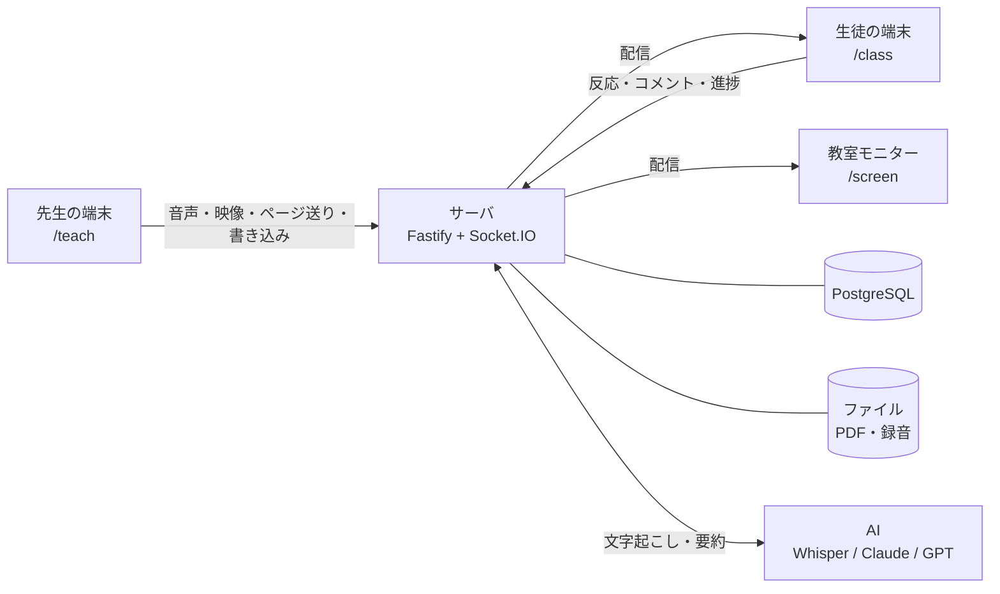
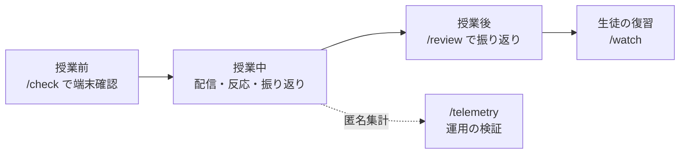
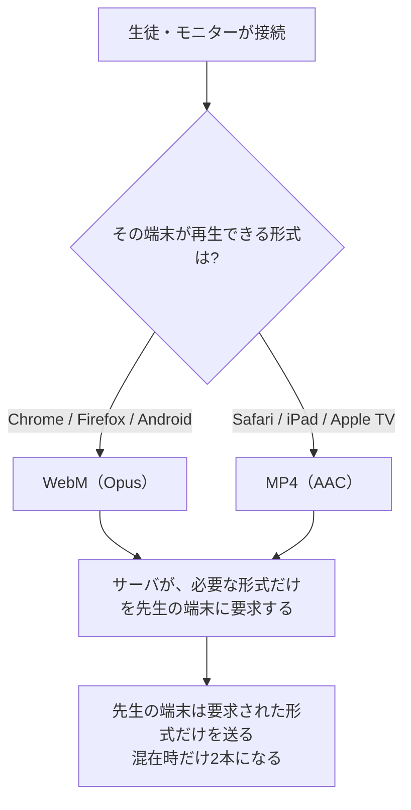

# 遠隔授業 理解度フィードバックシステム

遠方の学校への配信・自宅受講・複数拠点への同時配信といった遠隔授業で、
**対面なら顔を見れば分かっていた「生徒が分かっているかどうか」を、先生が授業中に把握できるようにする** Webアプリです。

先生も生徒もアプリのインストールは不要で、URLを開くだけで使えます。


---

## どこを読めばよいか

| あなたの立場 | 読むところ |
|---|---|
| **はじめてこのリポジトリを見た人** | [何を解決するか](#何を解決するか) → [設計判断とその根拠](#設計判断とその根拠) |
| **授業で使う先生** | **[先生向けガイド](docs/先生向けガイド.md)** — 授業の流れに沿った説明書 |
| **導入を検討している教員・職員** | **[導入を検討する方へ](docs/導入を検討する方へ.md)** — 費用・個人情報・必要な環境 |
| **開発を引き継ぐ人** | [開発をはじめる](#開発をはじめる) → **[ARCHITECTURE.md](docs/ARCHITECTURE.md)** |

---

## 何を解決するか

### 対面のとき

教室では、生徒の表情や手の動きが自然に目に入ってきます。
そこから「もう一度説明したほうがよさそうだ」「ここは先へ進んで大丈夫そうだ」と判断できます。

### 遠隔のとき

同じ情報が、届きにくくなります。

| 起きやすいこと | 背景 |
|---|---|
| 生徒がカメラを切る | 自宅が映る、通信量が気になる、映りたくない。理由はさまざまです |
| 「分かりましたか？」に反応が返ってこない | 分からないときほど、人前では言い出しにくいことがあります |
| 授業後のアンケートでも分からない | どこで分からなくなったかは、生徒自身も思い出しにくいものです |

### このアプリでできること

| できること | 仕組み |
|---|---|
| **生徒が名乗らずに意思表示できます** | ボタンを1つ押すだけです。**名前を入れる必要も**、話す必要も、カメラを点ける必要もありません |
| **反応が集まったことをお知らせします** | 通知は対応するまで残るので、手が空いたときに見ていただけます |
| **あとからその瞬間に戻れます** | すべての反応を「授業開始からの経過ミリ秒」で記録しています |

生徒の画面はこれだけです。ボタンを押すか、コメントを送るかの2つしかありません。


### 設計の柱

#### 細い回線でも成立させること

配信の主役は音声とスライドです。音声は 48kbps で送っているので、国内の家庭でよくある回線なら
問題なく受けられます。

| 家庭の回線 | 速度の目安 | 音声＋スライド | カメラ映像 |
|---|---|---|---|
| 光回線（FTTH） | 100Mbps〜1Gbps | ○ 余裕 | ○ |
| ケーブルテレビ・集合住宅の共用回線 | 数Mbps〜数十Mbps | ○ 余裕 | ○ |
| スマートフォンのテザリング（通常時） | 数Mbps〜数十Mbps | ○ | ○ |
| **ギガを使い切った後の速度制限** | **128kbps〜1Mbps（契約による）** | **○ ここが分かれ目** | 受け取らない設定にできます |
| 学校・自治体のフィルタリング回線 | 速度は足りるが WebSocket が塞がれることがある | `/check` で判定できます | 同じ |

**いちばん厳しい128kbpsでも授業から落ちないこと**を基準に設計しています。
実際の値は `/check` でその場で測れます。

#### カメラ映像は任意

カメラを使うのは**先生だけ**です。**生徒が映ることはありません**（生徒側にカメラを使う機能そのものがありません）。

先生のカメラは、**顔を見せる場合と、手元の実演を見せる場合の両方**を想定しています。
顔が見えるほうが授業として自然な場面は多いので、実演専用の機能とはしていません。

ただし映像には約900kbps必要です。そのため、**受け取るかどうかは生徒の端末ごとに選べます**。
映像を切っても音声とスライドは途切れないので、回線の細い生徒は映像だけを止められます。

#### 個人情報を集めないこと

先生はログインIDと表示名だけ、**生徒は授業コードだけ**で使えます。
名前の欄はありますが空のままで構わず、その場合は「あおいネコ」のような仮名が自動で付きます。
**同意書や個人情報保護の手続きが要らない範囲に、機能を収めています。**

#### 先生の操作を増やさないこと

授業中は、スライドを送ることと話すことに集中していただけます。
文字起こしは裏で進み、コメントの分析は届いた時点で自動的に走ります。
振り返りの通知だけは、対応するまで画面に残ります（見落としを防ぐためです）。

---

## 機能

### 授業中

| 機能 | 説明 |
|---|---|
| **スライド配信** | PDFをアップロードするだけ。ページ送り・書き込み・ポインターがリアルタイムに同期 |
| **音声配信** | 先生のマイクを低遅延で配信。受け手の端末に合わせて Opus / AAC を自動で振り分け |
| **カメラ映像**（任意） | 先生の顔や手元の実演を配信。音声とずれないよう1本のストリームで送る。生徒側で受け取らない設定にできる |
| **白紙スライドの挿入** | 授業中にその場で白紙ページを差し込んで板書に使える（元のPDFは変更しない） |
| **リアクション** | 生徒がボタン（既定「わかった／わからない」、授業ごとに変更可）とコメントを送信。圏外ではキューに保持し、復旧後に**元の時刻で**送り直す |
| **自動字幕** | 先生の発話をリアルタイムに字幕表示。聞き取りにくい環境や、聴覚に配慮が必要な生徒向け |
| **タスク進捗** | 演習の項目を並べておくと、生徒がチェックした進み具合が棒グラフで見える。5分動いていない生徒は上に出る |
| **アンケート** | その場で設問を出す（選択式・段階評価）。集計は先生だけに見える |
| **振り返りタイム** | 反応が集中したとき（既定3人以上）と一定時間ごと（既定15分）に先生へ通知。通知は**対応するまで残る** |
| **コメント分析** | コメントが届くと、AIが「先生がその直前に何を話していたか」を特定し、近い時刻の複数コメントを1枚のカードにまとめる。授業で扱っていない話題はそう表示する（[実際の出力](docs/先生向けガイド.md#5-授業中にできること)） |
| **教室モニター** | 教室の大画面・電子黒板に投影する表示専用ページ。参加用QRコードも出せる |

### 授業後

| 機能 | 説明 |
|---|---|
| **同期再生** | 録音の再生位置に合わせて、その時点のスライド・書き込み・ポインターを自動で再現 |
| **反応タブ** | ボタン反応とコメントを1本の時系列に並べ、それぞれの前後だけを切り出して聞ける |
| **スライドタブ** | どのスライドに反応・コメントが集まったかで並び替え |
| **復習動画** | つまずいた箇所を章に切り出し、選んだ章だけを**生徒に公開**できる。公開ページに生徒の名前やコメントは出ない |
| **AI要約** | 授業全体の文字起こしと、反応が集中した箇所をふまえた要約 |

### 開発・運用の検証

| 画面 | 説明 |
|---|---|
| `/check` | **授業前**に「この端末で接続・音声・映像が使えるか」を調べる。ログイン不要。実際に通信量を測り、速度制限下で足りるかまで判定する |
| `/telemetry` | **授業後**に「実際の運用で何が起きたか」を開発側が見る。授業単位の匿名集計のみ |

> この2画面は目的が違うので、分けたままにしています。`/check` は現地で先生が判断するためのもの、
> `/telemetry` は設計判断のための計測です。

---

## 画面一覧

| URL | 誰が | 何をする |
|---|---|---|
| `/register` `/login` | 先生 | アカウント登録・ログイン（メールアドレス不要） |
| `/dashboard` | 先生 | PDFをアップロードして授業を作成、過去の授業を開く |
| `/teach/:id` | 先生 | 授業本番。配信・書き込み・反応の確認・アンケート・タスク |
| `/screen/:id` | 教室 | 教室モニターへの投影（表示専用・ログイン不要） |
| `/m/:code` | 教室 | 上の短い入口。テレビのリモコンでも打てる6文字 |
| `/review/:id` | 先生 | 授業後の振り返り・復習動画の作成 |
| `/join` → `/class` | 生徒 | 4文字の授業コードだけで参加（アカウント不要・名前は任意） |
| `/watch/:token` | 生徒 | 公開された復習動画（ログイン不要） |
| `/check` | 誰でも | 端末チェック（`Ctrl+Alt+C` でどの画面からでも開く） |
| `/telemetry` | 開発 | 匿名の通信集計（`Ctrl`+`Alt`+`T` でも開けます） |

---

## 授業当日の流れ

<!-- 画像: 先生のダッシュボード（docs/images/dashboard.png） -->

1. **事前（できれば前日）** — 使う教室の端末で `/check` を開き、○が並ぶことを確認します
2. **授業を作る** — `/dashboard` でPDFをアップロード。4文字の授業コードが出ます（先生に渡すのはこのコードだけです）
3. **生徒に伝える** — 授業コード、または画面のQRコードを見せます。生徒は `/join` でコードを入れるだけ
4. **開始** — 「授業開始」を押すとマイクの配信と録音が始まります。ここから先の時刻が、すべての記録の基準になります
5. **授業中** — スライドを送り、書き込み、必要なら白紙ページを挿入。反応が集まると振り返りの通知が出ます
6. **終了** — 「授業終了」を押します。あとから `/review/:id` でいつでも振り返れます

各画面の操作は **[先生向けガイド](docs/先生向けガイド.md)** に詳しく書いてあります。

### 教室で対面と併用するとき

教室のモニターで `/m/コード` を開くと、そこに投影されます。
このとき、**音は教室モニターの1台だけから出す**ようにして、生徒の端末は「教室から参加」（音声OFF）にしておきます。
複数の端末から同じ音が出ると反響してしまうためです。

### 困ったときは

| 症状 | 見るところ |
|---|---|
| 生徒に音が届かない | その端末で `/check` を開きます。形式が非対応なのか、音量が0なのか、通信が塞がれているのかが分かれます |
| 生徒の画面が真っ白 | ページを再読み込みしてください。直らない場合は `/check` で通信を確認します |
| マイクが使えない | マイクは **HTTPS か localhost でしか使えません**（ブラウザ側の制約です）。IPアドレスを直接打ったHTTPのURLでは、許可の画面すら出ません |
| 甲高い音が鳴り続ける | ハウリングと思われます。先生のマイクの近くで音を出している端末を「教室から参加」に切り替えると収まります。先生画面はもともと自分の声を鳴らさないので、別の端末から音が出ていることが多いです |
| 字幕が出ない | 自動字幕は Chrome か Edge が必要です（Safariは不安定、Firefoxは非対応） |

症状別のより詳しい対処は **[先生向けガイド「困ったときは」](docs/先生向けガイド.md#困ったときは)** にあります。

---

## システム構成



```
client/  React 19 + Vite + pdf.js + socket.io-client（先生・生徒・モニター共通のSPA）
server/  Node.js 22 + Fastify 5 + Socket.IO 4 + Drizzle ORM
shared/  クライアントとサーバで共有する型定義（@shared）
```

単一のNodeプロセスが、API・Socket.IO・ビルド済みクライアントをすべて配信します。

- **DB**: PostgreSQL（`DATABASE_URL`）。未設定なら **PGlite**（ローカルファイルDB）で動くので、開発はゼロ設定で始められます。マイグレーションは起動時に自動適用
- **ファイル**: PDFと録音は `DATA_DIR` 配下。DBには入れません
- **AI**: プロバイダ差し替え式。キーが無くても `mock` で全フローが最後まで動きます

### 授業1コマの流れ



---

## 設計判断とその根拠

このシステムの設計は、ほとんどが**実測で決めています**。主なものを残しておきます。

### 音声・映像の形式は「受け手」が決める

Safari（iPad・Mac・Apple TV・テレビ内蔵ブラウザ）は WebM を再生できません。
かといって全体を MP4 に寄せると、別の問題が出ます。



**なぜ片方に決め打ちしないか。** Chrome の MediaRecorder は MP4 だとキーフレーム単位でしか
断片を切らないため、500ms を指定しても実際には**約4.1秒ごと**にしかデータが出てきません。
同一条件での実測は **WebM 1.4秒 / MP4 5.3秒**。全体を MP4 にすると、
Apple製の端末が1台混じるだけで、**全員の遅れが4秒ぶん増えてしまいます**。

映像の MP4 は、使える環境では WebCodecs で自前に組み立てて 0.5 秒ごとに切っています（`client/src/lib/lowLatencyMp4.ts`）。
音声のみの配信にはこの問題が無い（AACでも約0.5秒ごとに出る）ため、そちらは MP4 優先のままです。

### 字幕はライブと履歴で出所を分ける

**教室の字幕は5秒以内が許容ライン**とされています。サーバ側の Whisper は用語の精度が高い代わりに
**10秒以上遅れる**ので、これには間に合いません。

そこでライブ字幕はブラウザの音声認識（Web Speech API、先生の端末で動く）で出し、
**用語の正しい版はあとから Whisper に差し替えます**。速さが要るところと正確さが要るところで、別の手段を使っています。

### 入り直しは自動で戻さない

生徒の参加トークンは sessionStorage に置いてあるので、**タブを閉じると消えます**。
そのまま入り直すと別の生徒として扱われ、タスクの進捗が0に戻ります。
携帯の browser は背面のタブをメモリ不足で破棄することがあるので、これは実際に起きます。

そこで端末にも控えを残し、同じ授業コードを入れたときだけ
「この端末は先ほど**青いイヌ**として参加していました」と出して選ばせます。

**黙って引き継がない**のは、学校が配る共有端末を想定しているためです。
自動で戻すと、次にその端末を使う生徒が前の生徒として参加してしまいます。

案内を出すかどうかは、端末に残っている控えだけでは決めません。
**そのトークンがこの授業のものか**を、毎回サーバに確かめさせています（`/api/join/resume-check`）。
授業コードは4文字しかなく、生成時の重複チェックも5回で諦めるので、
将来べつの授業に同じコードが割り当たったときに前の授業の名前を見せないためです。
終了した授業でも案内は出ません。

### 仮名は連番にしない

名前を入れずに参加した生徒には、「あおいネコ」のような**色と動物の仮名**を配ります。

「生徒1・生徒2」のような連番にしていないのは、**参加した順番が先生に見えてしまう**ためです。
誰が早く来て誰が遅れたかは、この仕組みで扱う情報ではありません。

色と動物なら順番を漏らさず、先生が「さっきの赤いキツネの質問」と覚えていられる程度の手がかりは残ります。
仮名は**その授業の中でだけ**一貫し、次の授業では別の仮名になるので、授業をまたいで個人を追うことはできません。

なお、集計に必要なのは**参加者ID**であって名前ではありません。
連打の集約・「3人がわからない」の人数・アンケートの重複回答防止はすべてIDで動くので、
名前が仮名でも実データでも結果は変わりません。

### スライドは前後6ページしか描かない

以前は全ページを事前に描いて保持していました。しかし **iOS の Safari は画像の総メモリに上限があり、
超えるとエラーも出さずに真っ白に描かれます**。40ページの資料なら非圧縮で 200MB を超え、上限に当たります。
現在は前後6ページだけをキャッシュしています（`client/src/lib/pdf.ts`）。

### 無音を Whisper に渡さない

Whisper は、声が入っていない音声にも何かしらの文を出してきます。
検証では、**暗騒音10分に対して支離滅裂な文が44個生成されました**。
無音の割合が閾値を超える区間は、そもそも送りません。

### 文字起こしの用語ヒントは140字まで

授業タイトルとスライド本文から専門用語を抜き出して Whisper の prompt に渡すと、固有名詞の精度が上がります。
ただし長すぎると副作用が出ます。検証では、ヒントにあった「機械学習」に引かれて、
実際の発話「今回の授業」が**「機械の授業」と誤認識されました**。効く語だけを短く渡します。

### 授業中に文字起こしを貯めておく

コメントが届いてから授業全体を文字起こししていては間に合いません。
5分間隔で「前回からの新しいぶん」だけを裏で文字起こしし、区切りは直前を15秒重ねて繋ぎ目の欠けを防ぎます。
これで、コメントが来た時点では授業全体の文字起こしがほぼ手元にあります。

### ライブ状態は単一インスタンス前提

配信中の授業の状態はサーバのメモリに持ちます。複数インスタンスへのスケールアウトは未対応です。
再起動時は DB から自動復元します。**同じ授業へ複数の端末が同時に最初の接続をしたときに
別々のセッションが作られないよう、読み込み中の Promise を共有しています**（`server/src/live/liveSessions.ts`）。
意図的な処理なので、整理するときも残しておいてください。

---

## 個人情報の扱い

**このシステムは、個人情報を集めない設計です。**

| 項目 | このシステムでは |
|---|---|
| 先生の登録 | ログインIDと表示名のみ。**メールアドレスは求めません** |
| 生徒の登録 | **不要**。授業コードだけで参加できます。名前は任意で、空なら仮名が自動で付きます |
| 生徒のカメラ・マイク | **使いません**。生徒が映ることも、生徒の声が流れることもありません |
| 生徒どうし | 他の生徒の反応も進捗も見えません |
| 公開する復習動画 | 生徒の名前もコメントも出ません |

メールアドレスを集めていないため、**パスワードの再設定はできません**。忘れた場合はアカウントを作り直してください。

### 保存されるもの

授業の録音・PDF・スライドの切り替えや書き込みの記録・反応とコメント（表示名つき）を保存します。
これらは授業を削除すれば消えます。

`/telemetry` の匿名集計では、**氏名・参加者ID・IPアドレス・生のUser-Agent・
発言や字幕やコメントの内容は保存しません**。記録するのは授業単位の傾向（端末の種別の割合、
形式ごとの配信量、再接続の回数など）だけで、個人を追跡・評価する機能ではありません。

### 外部に送られるもの

以下は外部サービスを使います。利用の前にご確認ください。

| 機能 | 送り先 | 送られるもの |
|---|---|---|
| **自動字幕**（ライブ） | Google（Chromeの音声認識の実装） | 先生の音声 |
| 文字起こし | OpenAI（Whisper） | 先生の音声 |
| 要約・コメント分析 | OpenAI または Anthropic | 文字起こしのテキスト |

いずれも**先生の発話**であり、生徒の音声や個人情報は含まれません。
文字起こしと要約は、APIキーを設定しなければ動きません（`mock` のままなら外部へは何も送りません）。

---

## 必要なものと費用

| | ローカル運用 | クラウド運用 |
|---|---|---|
| 用意するもの | PC 1台と Wi-Fi | PaaSアカウント・PostgreSQL・永続ディスク |
| 費用 | 0円 | 月 $7 程度〜（Render Starter）+ AI利用料 |
| 校外から受講 | できない | できる |
| AI機能 | APIキーがあれば使える | 同じ |

AIのAPIキーが無くても、`mock` のまま全機能の流れは動きます（要約の中身がダミーになるだけです）。

**回線**: 音声のエンコード設定は 48kbps です。速度制限（128kbps程度）のかかった回線で
受ける生徒がいても成立するかを、`/check` が実際に測って判定します
（余裕を見て、128kbps の6割・約77kbps に収まれば○）。カメラ映像を使う場合は、受け取る側に別途約900kbps必要です。

**端末**: 先生はマイクの使えるPC（自動字幕を使う場合は Chrome か Edge）。
生徒はスマートフォン・タブレット・PCのいずれでも構いません。
教室モニターはテレビ内蔵ブラウザでも動きます。

---

## 開発をはじめる

前提: Node.js 22 以上

```bash
npm install
npm run dev
```

- クライアント: http://localhost:5173 （APIは :3000 へプロキシ）
- DBは PGlite が `server/data/` に自動作成。マイグレーションは起動時に自動適用
- `/register` で先生アカウントを作り、`/dashboard` でPDFをアップロードして授業を作成
- 別のブラウザ（またはシークレットウィンドウ）で `/join` を開けば、生徒として参加できます

環境変数は `.env.example` を `server/.env` にコピーして設定します。

```bash
npm run typecheck   # server と client の両方
npm run build       # クライアントの本番ビルド
npm run db:generate # スキーマ変更後のマイグレーション生成
```

### AIを実プロバイダで動かす

OpenAIのキー1つで、文字起こしと要約の両方をまかなえます。

```env
TRANSCRIBE_PROVIDER=openai
SUMMARY_PROVIDER=openai
OPENAI_API_KEY=sk-...
```

要約だけ Anthropic にする場合:

```env
SUMMARY_PROVIDER=anthropic
ANTHROPIC_API_KEY=sk-ant-...
```

モデルの既定値は `OPENAI_MODEL` / `ANTHROPIC_MODEL` で変更できます（`server/src/config.ts`）。
Claude API は音声入力に対応していないため、**文字起こしは常に OpenAI Whisper** を使います。

### 生徒を模擬する

```bash
node scripts/student-sim.mjs AB3K7X 生徒A confused 3000
```

引数は `<授業コード> [表示名] [リアクションkind] [遅延ms]`。
3つ同時に走らせて「わからない」を送ると、振り返りタイムの通知（既定の閾値3人）を再現できます。

---

## ローカル運用（デプロイせずに授業で使う）

クラウドに出さなくても、PC 1台をサーバにして同じWi-Fi内で授業ができます。

1. **`授業サーバを起動.cmd` をダブルクリック**
2. 黒いウィンドウに2つのURLが出ます
   - 先生用 `http://localhost:3000` — **サーバを動かしているこのPCで開いてください**（マイクは localhost か HTTPS でしか使えないため）
   - 生徒用 `http://<このPCのIP>:3000/join` — 同じWi-Fiのスマートフォン・PCから
3. 終わったら黒いウィンドウを閉じるだけ

データは `server/data/` に残ります。PCを入れ替えるときは、このフォルダごとコピーしてください。

---

## デプロイ（クラウド）

`Dockerfile` と Render 用の `render.yaml` を同梱しているので、Docker対応のPaaS
（Render / Railway / Fly.io など）にそのまま載ります。

必要なもの:

1. **PostgreSQL**（Neon / Supabase / PaaSのマネージドDB）→ `DATABASE_URL`
2. **永続ディスク**（PDF・録音用）→ マウント先を `DATA_DIR` に（例 `/data`）
3. `SESSION_SECRET`（長いランダム文字列）と、使うならAIのキー
4. `REGISTER_CODE`（**インターネットに公開するなら設定してください**。下記）

Renderの場合:

1. https://render.com/ にGitHubアカウントでログイン
2. New + → **Blueprint** → このリポジトリを選択
3. 環境変数を入力して Apply
4. 発行された `https://～.onrender.com` で先生アカウントを登録して開始

注意点:

- 音声配信に **WebSocket** を使うので、対応するプラン・構成にしてください
- ライブ状態はメモリに持つため、**単一インスタンス構成**が前提です
- マイク（先生）と MediaSource 再生（生徒）のため、**HTTPS 必須**です
- `REGISTER_CODE` を設定しないと、**URLを知った人は誰でも先生アカウントを作れます**。
  授業データは先生ごとに分かれているので他人の授業は見えませんが、AIの利用料はサーバの持ち主に出ます

### 登録の合言葉（`REGISTER_CODE`）

```env
REGISTER_CODE=好きな合言葉
```

設定すると、登録画面に合言葉の入力欄が出て、一致しないと登録できなくなります。
**未設定なら誰でも登録できます**（ローカル運用や校内限定ならこのままで構いません）。

---

## アイコンから起動する（PWA）

WordやExcelのように、アイコンから直接起動できます。

- **PC（Edge / Chrome）**: URLを開く → アドレスバー右端の「インストール」→ 以後はスタートメニューやタスクバーから独立ウィンドウで起動
- **スマートフォン**: URLを開く → 共有メニュー →「ホーム画面に追加」

アイコンを変えるときは `client/public/icon.svg` を編集して `node scripts/generate-icons.mjs` を実行します。

---

## 制限事項

- 複数サーバインスタンスへのスケールアウトは未対応（Socket.IOのアダプタ等が必要）
- パスワード再設定機能はありません（メールアドレスを収集していないため）。忘れた場合はアカウントを作り直します
- 自動字幕は Chrome・Edge が前提です（Safariは不安定、Firefoxは非対応）
- 文字起こしには OpenAI の APIキーが必要です
- 同意管理・匿名化モードはスキーマ（`participants.consent_status` / `lessons.anonymize_mode`）だけ用意してあり、ロジックは未実装です
- ローカル運用のデータはクラウドへ引き継がれません（別の環境として始まります）

---

## 説明書

| ファイル | 誰向けか |
|---|---|
| [docs/先生向けガイド.md](docs/先生向けガイド.md) | 授業で使う先生。準備から振り返りまでを流れに沿って |
| [docs/導入を検討する方へ.md](docs/導入を検討する方へ.md) | 導入を検討する教員・職員。費用・個人情報・必要な環境 |
| [docs/ARCHITECTURE.md](docs/ARCHITECTURE.md) | 開発を引き継ぐ人。構成と、触るときに気をつけること |

---

## ライセンス

[MIT License](LICENSE) です。自由に利用・改変・再配布していただけます。
