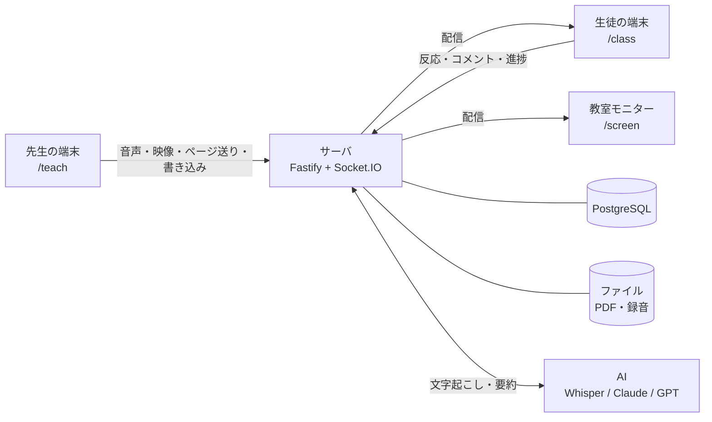
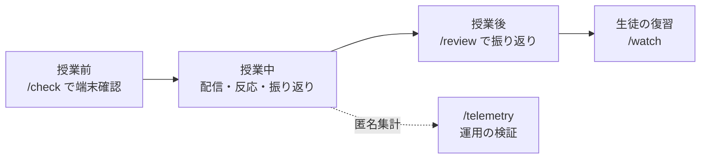
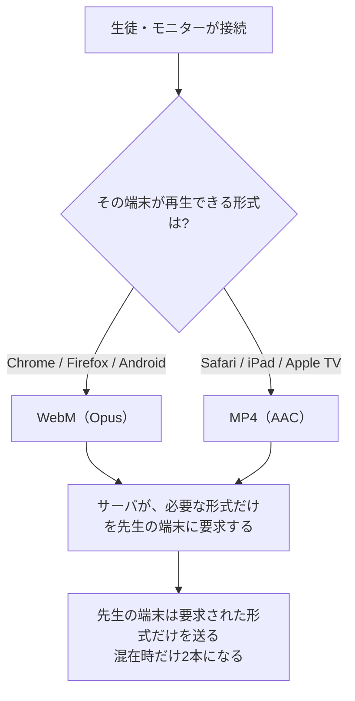

# 遠隔授業 理解度フィードバックシステム

高知工科大学 データ＆イノベーション学群のPBL(Project Based Learning)で製作したwebアプリです。
遠方の学校への配信・自宅受講・複数拠点への同時配信といった遠隔授業で、
**生徒の理解や進行度合いを、先生が授業中に把握しやすいよう支援します**。

生徒からのコメントが届くと、それにあわせて**そのとき先生が何を説明していたのか**表示されます。
他にも、「わかった／わからない」などのボタン、タスクの進捗確認、アンケートを採る、といった機能があります。
授業終了後には、それらの瞬間を確認し、授業の振り返りや、復習動画の作成ができます。

先生も生徒もアプリのインストールは不要で、URLを開くだけで使えます。


---

## どこを読めばよいか

| あなたの立場 | 読むところ |
|---|---|
| **はじめてこのリポジトリを見た人** | [何を解決するか](#何を解決するか) — 画面の写真つきで、できることを説明しています |
| **授業で使う先生** | **[先生向けガイド](docs/先生向けガイド.md)** — 授業の流れに沿った説明書 |
| **導入を検討している教員・職員** | **[導入を検討する方へ](docs/導入を検討する方へ.md)** — 費用・個人情報・必要な環境 |
| **なぜこの作りなのかを知りたい人** | [設計判断とその根拠](#設計判断とその根拠) — 運用で分かった問題と、どう直したか |
| **開発を引き継ぐ人** | [開発をはじめる](#開発をはじめる) → **[ARCHITECTURE.md](docs/ARCHITECTURE.md)** |

---

## 何を解決するか

遠隔授業では、生徒の様子が先生に伝わる手段が限られます。

このシステムは、**生徒が意思表示できる**手段を追加します。
生徒からの反応は時刻とともに記録します。授業のあとに、その瞬間へ戻って確認できます。

下図は、生徒用の画面を開いたところです。


### 設計の柱

#### 細い回線でも成立させること

このアプリは、音声とスライドを配信します。音声は 48kbps で送ります。
一般的な回線であれば、そのままお使いいただけます。

| 家庭の回線 | 速度の目安 | 音声＋スライド | カメラ映像 |
|---|---|---|---|
| 光回線（FTTH） | 100Mbps〜1Gbps | ○ 余裕 | ○ |
| ケーブルテレビ・集合住宅の共用回線 | 数Mbps〜数十Mbps | ○ 余裕 | ○ |
| スマートフォンのテザリング（通常時） | 数Mbps〜数十Mbps | ○ | ○ |
| **ギガを使い切った後の速度制限** | **128kbps〜1Mbps（契約による）** | **○ ここが分かれ目** | 受け取らない設定にできます |
| 学校・自治体のフィルタリング回線 | 速度は足りるが WebSocket が塞がれることがある | `/check` で判定できます | 同じ |

**いちばん厳しい128kbpsでも授業から落ちないこと**を基準に設計しています。
実際の値は `/check` で測定できます。

#### カメラ映像は任意

カメラを使うのは**先生だけ**です。**生徒が映ることはありません**。

先生のカメラは、**顔を見せる場合と、手元の実演を見せる場合の両方**を想定して設計しています。

ただし、映像には約900kbps必要です。そのため、**受け取るかどうかは生徒の端末ごとに選べます**。
映像を止めても、音声とスライドは途切れません。回線の細い生徒は、映像だけを止めることができます。

#### 個人情報を集めないこと

先生はログインIDと表示名だけ、**生徒は授業コードだけ**で使えます。
名前の欄はありますが空のままで構わず、その場合は「青いネコ」のような仮名が自動で付きます。

生徒から取得しないものは、**連絡先・カメラ・マイク**です。
また、**氏名を入力した場合でも外部には送信しません**。

手続きが必要かどうかをご確認いただく際の資料として、お使いください。

#### 先生の操作を増やさないこと

授業中は、スライドを送ることと話すことに集中していただけます。
文字起こしは裏で進み、コメントの分析は届いた時点で自動的に走ります。
コメントのカードだけは、対応済みにするまで画面に残ります（見落としを防ぐためです）。

---

## 機能

### 授業中

| 機能 | 説明 |
|---|---|
| **スライド配信** | PDFをアップロードするだけ。ページ送り・書き込み・ポインターがリアルタイムに同期 |
| **音声配信** | 先生のマイクを低遅延で配信。受け手の端末に合わせて Opus / AAC を自動で振り分け |
| **カメラ映像**（任意） | 先生の顔や手元の実演を配信。音声とずれないよう1本のストリームで送る。生徒側で受け取らない設定にできる |
| **白紙スライドの挿入** | 授業中にその場で白紙ページを差し込んで板書に使える（元のPDFは変更しない） |
| **リアクション** | 生徒がボタン（既定「わかった／わからない」、授業ごとに変更可）とコメントを送信。圏外で**送れなかったものだけ**を端末に取っておき、繋がったときに**押した時刻のまま**届ける |
| **自動字幕** | 先生の発話をリアルタイムに字幕表示（先生の端末が Chrome・Edge のとき）。聴覚に配慮が必要な生徒や、聞き取りにくい環境での使用向け |
| **タスク進捗** | 演習の項目を並べておくと、生徒がチェックした進み具合が棒グラフで見える。5分動いていない生徒は上に出る |
| **アンケート** | その場で設問を出す（選択式・段階評価）。集計は先生だけに表示する場合と、生徒へも表示する場合の2種類から選べる |
| **コメント分析** | コメントが届くと、AIが「先生がその直前に何を話していたか」を特定し、近い時刻の複数コメントを1枚のカードにまとめる。授業で扱っていない話題はその旨を表示する。カードは**対応済みにするまで残る**（[実際の出力](docs/先生向けガイド.md#5-授業中にできること)） |
| **教室モニター** | 教室の大画面・電子黒板に投影する表示専用ページ。参加用QRコードは授業前に自動で出るほか、授業中も操作バーから出せる |

### 授業後

| 機能とタブ名 | 説明 |
|---|---|
| **同期再生** | 録音の再生位置に合わせて、その時点のスライド・書き込み・ポインターを自動で再現 |
| **AI要約** | 授業全体の文字起こしと、反応が集中した箇所をふまえた要約 |
| **反応** | ボタン反応とコメントを1本の時系列に並べ、それぞれの前後だけを切り出して聞ける。アンケートとタスクの要旨も確認できる |
| **アンケート** | 設問ごとの集計。選択式は円グラフ（未回答も区画として入る）、記述式は名前つきの一覧。 |
| **タスク** | タスクごとの完了人数と、開始時・半数達成時・最終完了、それぞれの時刻。 |
| **復習動画** | つまずいた箇所を章に切り出し、選んだ章だけを**生徒に公開**できる。公開ページに生徒の名前やコメントは出ない |
| **スライド** | どのスライドに反応・コメントが集まったかで並び替え |

### 開発・運用の検証

| 画面 | 説明 |
|---|---|
| `/check` | **授業前**に「この端末で接続・音声・映像が使えるか」を調べる。ログイン不要。実際に通信量を測り、速度制限下で足りるかまで判定する |
| `/telemetry` | **授業後**に「実際の運用で何が起きたか」を開発側が見る。授業単位の匿名集計のみ |

> この2画面は目的が異なるため、分けたままにしています。`/check` は現地で先生が判断するためのもの、
> `/telemetry` は設計判断のための計測です。

---

## 画面一覧

| URL | 誰が | 何をする |
|---|---|---|
| `/register` `/login` | 先生 | アカウント登録・ログイン（メールアドレス不要） |
| `/dashboard` | 先生 | PDFをアップロードして授業を作成、過去の授業を開く |
| `/teach/:id` | 先生 | 授業本番。配信・書き込み・反応の確認・アンケート・タスク |
| `/screen/:id` | 教室 | 教室モニターへの投影（表示専用・ログイン不要） |
| `/m/:code` | 教室 | 上の短い入口。6文字のコードで開きます |
| `/review/:id` | 先生 | 授業後の振り返り・復習動画の作成 |
| `/join` → `/class` | 生徒 | 4文字の授業コードだけで参加（アカウント不要・名前は任意） |
| `/watch/:token` | 生徒 | 公開された復習動画（ログイン不要） |
| `/check` | 誰でも | 端末チェック（`Ctrl+Alt+C` でどの画面からでも開く） |
| `/telemetry` | 開発 | 匿名の通信集計（`Ctrl`+`Alt`+`T` でも開けます） |

---

## 授業当日の流れ


1. **事前** — 使う教室の端末で端末チェック（`/check`）を開くと、接続・音声・マイクが揃っているかを確認できます
2. **授業を作る** — 授業の一覧（`/dashboard`）でPDFをアップロードします。4文字の授業コードが出ます
3. **生徒に伝える** — 授業コード、またはコードが自動入力される授業のURLやQRコードを見せます。生徒は参加画面（`/join`）でコードや名前を入力できるようになっています
4. **開始** — 「授業開始」を押すとマイクの配信と録音が始まります。ここから先の時刻が、すべての記録の基準になります
5. **授業中** — スライドを送り、書き込み、必要に応じて白紙ページを挿入します。コメントが届くと、直前の説明を要約したカードが出ます
6. **終了** — 「授業終了」を押します。あとから `/review/:id` でいつでも振り返れます

各画面の操作は **[先生向けガイド](docs/先生向けガイド.md)** で詳しく説明しています。

### 教室で対面と併用するとき

教室のモニターで `/m/コード` を開くと、そこに投影されます。
このとき、**音は教室モニターの1台だけから出す**ようにしてください。生徒の端末は「教室から参加」（音声OFF）にします。
複数の端末から同じ音が出ると、ハウリング（音の回り込み）の原因になるためです。

### 困ったときは

| 症状 | 見るところ |
|---|---|
| 生徒に音が届かない | その端末で `/check` を開きます。形式が非対応なのか、音量が0なのか、通信が塞がれているのかが分かれます |
| 生徒の画面が真っ白 | ページを開き直してください。直らない場合は `/check` で通信を確認します |
| マイクが使えない | マイクは **HTTPS か localhost でしか使えません**（ブラウザ側の制約です）。IPアドレスを直接打ったHTTPのURLでは、マイク許可の画面が出ません |
| 高い音が鳴り続ける | ハウリング（音の回り込み）が考えられます。先生のマイクの近くで音を出している端末を「教室から参加」に切り替えてください。先生の画面は自分の声を鳴らさないため、音の発生源は他の端末になります |
| 字幕が出ない | 字幕は**先生の端末**で作ります。そのため、**先生の端末が Chrome か Edge** である必要があります（Safariは不安定、Firefoxは非対応）。生徒側のブラウザは問いません |

症状別のより詳しい対処は **[先生向けガイド「困ったときは」](docs/先生向けガイド.md#困ったときは)** にあります。

---

## システム構成



```
client/  React 19 + Vite + pdf.js + socket.io-client（先生・生徒・モニター共通のSPA）
server/  Node.js 22 + Fastify 5 + Socket.IO 4 + Drizzle ORM
shared/  クライアントとサーバで共有する型定義（@shared）
```

単一のNodeプロセスが、API・Socket.IO・ビルド済みクライアントをすべて配信します。

- **DB**: PostgreSQL（`DATABASE_URL`）。未設定の場合は **PGlite**（ローカルファイルDB）で動作するため、開発はゼロ設定で始められます。マイグレーションは起動時に自動適用
- **ファイル**: PDFと録音は `DATA_DIR` 配下。DBには入れません
- **AI**: プロバイダ差し替え式。キーが無くても `mock` で全フローが最後まで動きます

### 授業1コマの流れ



---

## 設計判断とその根拠

このシステムの設計は、ほとんどが**実測で決めています**。主なものを記録しています。

### 音声・映像の形式は「受け手」が決める

Safari（iPad・Mac・Apple TV・テレビ内蔵ブラウザ）は WebM を再生できません。
ただし、全体を MP4 に寄せると、別の問題が出ます。



**なぜ片方に決め打ちしないか。** Chrome の MediaRecorder は MP4 だとキーフレーム単位でしか
断片を切らないため、500ms を指定しても実際には**約4.1秒ごと**にしかデータが出てきません。
同一条件での実測は **WebM 1.4秒 / MP4 5.3秒**。全体を MP4 にすると、
Apple製の端末が1台混じるだけで、**全員の遅れが約4秒増えてしまいます**。

映像の MP4 は、使える環境では WebCodecs で自前に組み立てて 0.5 秒ごとに切っています（`client/src/lib/lowLatencyMp4.ts`）。
音声のみの配信にはこの問題が無い（AACでも約0.5秒ごとに出る）ため、そちらは MP4 優先のままです。

### 字幕はライブと履歴で出所を分ける

話し終わってから字幕が出るまでの時間が空くほど、いま聞いている話と噛み合わなくなります。
サーバ側の Whisper は用語の精度が高い代わりに、実測で**10秒以上遅れました**。
先生が次の話題に移ったあとに前の字幕が出る状態で、ライブには使えません。

そこでライブ字幕はブラウザの音声認識（Web Speech API、先生の端末で動く）で出し、
**用語の正しい版はあとから Whisper に差し替えます**。速さが要るところと正確さが要るところで、別の手段を使っています。

### 入り直しは自動で戻さない

生徒の参加トークンは sessionStorage に保存するため、**タブを閉じると消えます**。
そのまま入り直すと別の生徒として扱われ、タスクの進捗が0に戻ります。
スマートフォンのブラウザは、メモリが足りなくなると背面のタブを破棄することがあります。

そこで端末にも控えを残し、同じ授業コードを入れたときだけ
「この端末は先ほど**青いイヌ**として参加していました」と案内し、
続きから入るか、別の生徒として入るかを生徒が選べるようにしています。

**確認なしに引き継がない**のは、学校が配る共有端末を想定しているためです。
自動で戻すと、次にその端末を使う生徒が前の生徒として参加してしまいます。

案内を出すかどうかは、端末に残っている控えだけでは決めないようにしており、
**そのトークンがこの授業のものか**を、毎回サーバへ問い合わせて確かめています（`/api/join/resume-check`）。
端末に残っているのは文字列だけで、それがまだ通用するのかは端末側では分からないためです。
サーバに確かめずに出すと、データベースを入れ替えたあとなどに、もう居ない参加者の名前を見せてしまいます。
また、終了した授業では生徒名に関する案内は出ません。

### 仮名の割り振り

名前を入れずに参加した生徒には、「青いネコ」のような**色と動物の仮名**を配ります。

色と動物の組み合わせには参加した順番が含まれず、色と動物を連番で振り分けません。「赤いキツネ」のように、一人ひとり異なる名前になります。
仮名は**その授業の中でだけ**一貫します。次の授業では別の仮名になるため、授業をまたいで個人を追うことはできません。

なお、集計に使っているのは**参加者ID**であって、名前ではありません。
参加者IDは、参加した時点でサーバが振る**ランダムな文字列**です。
端末や氏名から作るものではなく、**授業ごとに振り直します**。
同じ生徒でも、次の授業では別のIDになります。授業をまたいで同じ人だと分かる手がかりは残りません。

連打の集約・「3人がわからない」の人数・アンケートの重複回答防止は、すべてこのIDで動きます。
名前が仮名でも実データでも結果は変わりません。

### スライドは前後6ページしか描かない

以前は全ページを事前に描いて保持していました。しかし **iOS の Safari は画像の総メモリに上限があり、
超えるとエラーも出さずに真っ白に描かれます**。40ページの資料なら非圧縮で 200MB を超え、上限に当たります。
現在は前後6ページだけをキャッシュしています（`client/src/lib/pdf.ts`）。

### 無音時に Whisper を用いない

Whisper は、声が入っていない音声にも何かしらの文を出すことがあります。
検証では、**暗騒音10分に対して無関係な文が44個生成されました**。
無音の割合が閾値を超える区間は、Whisperの機能を使わないようにしています。

### 文字起こしの用語ヒントは140字まで

授業タイトルとスライド本文から専門用語を抜き出して Whisper の prompt に渡すと、固有名詞の精度が上がります。
ただし長すぎると副作用が出ます。検証では、ヒントにあった「機械学習」に引かれて、
**実際の発話「今回の授業」が「機械の授業」と誤認識されました**。効く語だけを短く渡します。

### 文字起こしの費用は授業の長さでほぼ決まる

AIの利用料のうち、**8割ほどが文字起こし**です（[金額のめやす](#月額のめやすクラウド運用)）。
Whisper は**音声の分数**で課金されます。そのため費用は「授業の長さ × コマ数」でほぼ決まり、
要約やコメント分析の文字数は費用にあまり関係ありません。

**授業の全体を文字起こししている**のは、全文を必要とする機能が3つあるためです。

| 機能 | 必要な範囲 |
|---|---|
| コメントの「関連する説明」 | コメントが**どの発言**に向けられたかを、その時点までの全文から探す |
| 授業後のAI要約 | 授業全体 |
| 復習動画の章分け | 授業全体 |

**字幕のために追加の費用はかかりません。**
ライブの字幕は先生の端末のブラウザが作り、外部には送っていません。
授業中に見る「字幕の履歴」や、授業後に見る「用語を直した字幕」も、文字起こしを再構成して使っているだけです。
**字幕を使っても使わなくても、料金は変わりません**。

**授業のあとの操作でも、基本的に追加の文字起こし料金はかかりません。**
「AIでコメントの対象箇所を特定」も「AI要約」も、授業中に貯めた文字起こしを組み合わせて使い、
足りない範囲があるときだけ補います（`server/src/ai/fullTranscript.ts`）。

節約したい場合は、次の設定で調整できます。

- `LIVE_TRANSCRIBE_INTERVAL_MS`（既定5分）— 長くすると繋ぎ目の回数が減ります
- `LIVE_TRANSCRIBE_OVERLAP_MS`（既定15秒）— 短くすると重なりが減りますが、区切りで言葉が欠けやすくなります
- APIキーを設定しない場合は0円です。配信・反応の収集・録音・振り返りはそのまま動きます

### 授業中に文字起こしを貯めておく

文字起こしは、コメントが届いた際、または5分間隔で、**まだ文字起こししていない部分**だけを裏で処理します。
区切りは直前の15秒を重ねて取り、繋ぎ目で言葉が欠けないようにしています。

### ライブ状態は単一インスタンス前提

配信中の授業の状態はサーバのメモリに持ちます。複数インスタンスへのスケールアウトは未対応です。
再起動時は DB から自動復元します。**同じ授業へ複数の端末が同時に最初の接続をしたときに
別々のセッションが作られないよう、読み込み中の Promise を共有しています**（`server/src/live/liveSessions.ts`）。
意図した処理のため、整理するときも残しておいてください。

---

## 個人情報の扱い

**このシステムは、なるべく個人情報を集めない方針です。**

| 項目 | このシステムでは |
|---|---|
| 先生の登録 | ログインIDと表示名のみ。**メールアドレスは求めません** |
| 生徒の登録 | **不要**。授業コードだけで参加できます。名前は任意で、空なら仮名が自動で付きます |
| 生徒のカメラ・マイク | **使いません**。生徒の映像と音声は、配信・録音をしません |
| 生徒同士 | 他の生徒の反応・進捗は見えません |
| 公開する復習動画 | 生徒の名前・コメントは出ません |

メールアドレスを集めていないため、**画面からパスワードを再設定することはできません**。
サーバを管理している方であれば `node scripts/reset-password.mjs <ログインID>` で設定し直せます。
授業の記録はアカウントに紐づいています。この方法であれば、記録を残したまま入り直せます。

### 保存されるもの

授業の録音・PDF・スライドの切り替えや書き込みの記録・反応とコメント（表示名つき）を保存します。

**授業は、作った先生が授業一覧から削除できます。**
削除すると、録音・PDF・反応・コメント・文字起こし・要約がすべて消え、**元に戻せません**。
授業中は削除できません（サーバ側でも拒否します）。

`/telemetry` の匿名集計では、**氏名・参加者ID・IPアドレス・生のUser-Agent・
発言や字幕やコメントの内容は保存しません**。記録するのは授業単位の傾向（端末の種別の割合、
形式ごとの配信量、再接続の回数など）だけで、個人を追跡・評価する機能ではありません。

### 外部に送られるもの

以下は外部サービスを使います。利用の前にご確認ください。

| 機能 | 送り先 | 送られるもの |
|---|---|---|
| 自動字幕（ライブ） | Google（Chromeの音声認識の実装） | **先生の音声** |
| 文字起こし | OpenAI（Whisper） | **先生の音声** |
| 要約・コメント分析 | OpenAI | **先生の発言の文字起こし**と、**生徒が送ったコメントの本文** |

**生徒のコメントは、本文が送られます。** 
「そのコメントが先生のどの説明に向けられたものか」をAIが探す機能に用います。
送るのは**コメントの文字だけ**で、名前・参加者ID・端末の情報は付けていません。

> APIキーを設定しなければ、文字起こし、要約、コメント分析が動きません。`mock` のままなら外部へは何も送りません。

---

## 必要なもの

**回線**: 音声のエンコード設定は 48kbps です。速度制限（128kbps程度）のかかった回線で
受ける生徒がいても成立するかを、`/check` が実際に測って判定します
（余裕を見て、128kbps の6割・約77kbps 以内であれば○と判定します）。カメラ映像を使う場合は、受け取る側に別途約900kbps必要です。

**端末**: 先生はマイクの使えるPC（自動字幕を使う場合は Chrome か Edge）。
生徒はスマートフォン・タブレット・PCのいずれでも構いません。
教室モニターはテレビ内蔵ブラウザでも動きます。

誰がどんな端末を用意するとよいかは [導入を検討する方へ「比較表」](docs/導入を検討する方へ.md#比較表)、
必要な回線の速さは [同「回線」](docs/導入を検討する方へ.md#回線) にまとめています。
<!-- 2026-08-28: 見出しが変わっていてリンク切れだったので修正 -->

### 月額のめやす（クラウド運用）

| 内訳 | 金額 |
|---|---|
| サーバ（Render Starter） | 月 $7 = **約1,100円**。授業をしない月も同じ |
| データベース（Neon の無料枠） | **0円**。授業のデータは小さいため、無料枠で足ります |
| AI 文字起こし（Whisper） | **使った分だけ**。50分の授業1コマで **50円ほど** |
| AI 要約とコメント分析 | **使った分だけ**。同じ1コマで **10円ほど** |

文字起こしは、ほとんど**授業の長さ分**課金されます。そのためAI部分の費用は
**「授業の長さ × コマ数」でほぼ決まります**。

また、文字起こしは以下のような処理をしています。

| 内容 | 理由 |
|---|---|
| 5分ごとの繋ぎ目に15秒 | 区切りで言葉が切れないよう、直前を重ねて渡すため |
| コメント1件につき15秒 | そのコメントの時刻まで追いつくときに、同じく直前を重ねるため |

どちらも `LIVE_TRANSCRIBE_INTERVAL_MS` / `LIVE_TRANSCRIBE_OVERLAP_MS` で調整できます
（[文字起こしの費用は授業の長さでほぼ決まる](#文字起こしの費用は授業の長さでほぼ決まる)）。

| 月に50分授業を | AI利用料 | サーバ代と合わせた月額 |
|---|---|---|
| 4コマ（週1） | 約250円 | **約1,400円** |
| 20コマ（週5） | 約1,200円 | **約2,300円** |
| 50コマ | 約3,000円 | **約4,100円** |

> 2026年8月時点の[OpenAIの料金](https://developers.openai.com/api/docs/pricing)
> （Whisper $0.006/分、gpt-5.6-luna 入力 $0.20 / 100万トークン）と、1ドル155円で計算しています。
> **桁の感覚**としてお使いください。

---

## 開発をはじめる

前提: Node.js 22 以上

```bash
npm install
npm run dev
```

- クライアント: http://localhost:5173 （APIは :3000 へプロキシ）
- DBは PGlite が `server/data/` に自動作成。マイグレーションは起動時に自動適用
- `/register` で先生アカウントを作り、`/dashboard` でPDFをアップロードして授業を作成
- 別のブラウザ（またはシークレットウィンドウ）で `/join` を開けば、生徒として参加できます

環境変数は、リポジトリ直下の `.env.example` を `server/.env` へコピーして設定します（読み込むのは `server/.env` です）。

```bash
npm run typecheck   # server と client の両方
npm run build       # クライアントの本番ビルド
npm run db:generate # スキーマ変更後のマイグレーション生成
```

### AIを実プロバイダで動かす

OpenAIのキー1つで、文字起こしと要約の両方をまかなえます。

```env
TRANSCRIBE_PROVIDER=openai
SUMMARY_PROVIDER=openai
OPENAI_API_KEY=sk-...
```

要約だけ Anthropic にする場合:

```env
SUMMARY_PROVIDER=anthropic
ANTHROPIC_API_KEY=sk-ant-...
```

モデルの既定値は `OPENAI_MODEL` / `ANTHROPIC_MODEL` で変更できます（`server/src/config.ts`）。
Claude API は音声入力に対応していないため、**文字起こしは常に OpenAI Whisper** を使います。

### 生徒を模擬する

```bash
node scripts/student-sim.mjs AB3K7X 生徒A confused 3000
```

引数は `<授業コード> [表示名] [リアクションkind] [遅延ms]` です。
3つ同時に走らせると、複数の生徒が同時にボタンを押したときの先生画面を再現できます。
このスクリプトが送るのはボタン反応だけのため、コメントのカードは出ません
（カードは、生徒の画面から実際にコメントを送ることで見れます）。

### パスワードを設定し直す

メールアドレスを預かっていないため、「パスワードを忘れた」といった機能はありません。
先生から再設定のご希望があった場合は、サーバ側で設定し直してください。授業の記録は、アカウントに紐づいたまま残ります。

```bash
node scripts/reset-password.mjs <ログインID>
```

`--list` を付けると、登録されているログインIDを一覧できます。
接続先は `server/.env` と同じ設定を読みます。`DATABASE_URL` を使っている環境では、そちらへ接続します。

---

## ローカル運用（デプロイせずに授業で使う）

クラウドに出さなくても、PC 1台をサーバにして同じWi-Fi内で授業ができます。

1. `授業サーバを起動.cmd` をダブルクリック
2. 黒いウィンドウに2つのURLが出ます
   - 先生用 `http://localhost:3000` — サーバを動かしているこのPCで開いてください（マイクが localhost か HTTPS でしか使えないため）
   - 生徒用 `http://<このPCのIP>:3000/join` — 同じWi-Fiのスマートフォン・PCから
3. 終わったら黒いウィンドウを閉じる

データは `server/data/` に残ります。PCを入れ替えるときは、このフォルダごとコピーしてください。

---

## デプロイ（クラウド）

`Dockerfile` と Render 用の `render.yaml` を同梱しています。Docker対応のPaaS
（Render / Railway / Fly.io など）に、そのまま載せることができます。

必要なもの:

1. **PostgreSQL**（Neon / Supabase / PaaSのマネージドDB）→ `DATABASE_URL`
2. **永続ディスク**（PDF・録音用）→ マウント先を `DATA_DIR` に（例 `/data`）
3. `SESSION_SECRET`（長いランダム文字列）と、使う場合はAIのキー
4. `REGISTER_CODE`（**インターネットに公開する場合は設定してください**。少し先に詳細を書いております）

Renderの場合（**新しく立てるとき**の手順です）:

1. https://render.com/ にGitHubアカウントでログイン
2. New + → **Blueprint** → このリポジトリを選択
3. 環境変数を入力して Apply
4. 発行された `https://～.onrender.com` で先生アカウントを登録して開始

> **すでに動いているサービスがある場合、Blueprint を読み込ませないよう注意してください。**
> 手で作ったサービスとは別のサービスが新しく作られ、**公開URLが変わります**。

### 運用に入ったあとの入れ替え

**`main` への `git push` が、そのまま本番への反映です。**
Renderがpushを見て自動で入れ替えます。手元での操作は要りません。

入れ替えには数十秒かかり、永続ディスクを付けていると**その間サーバが数秒止まります**。
**授業中はpushしないでください。** 配信が切れます
（生徒の画面は自動でつなぎ直しますが、先生のマイクの配信は止まったままになります）。

注意点:

- 音声配信に **WebSocket** を使います。対応するプラン・構成が必要です
- ライブ状態はメモリに持つため、**単一インスタンス構成**が前提です
- マイク（先生）と MediaSource 再生（生徒）のため、**HTTPS が必須**です
- `SESSION_SECRET` を設定しないと、ソースに書かれた既定の文字列で先生のログインCookieに署名します。
  未設定のまま `NODE_ENV=production` で起動すると、起動時に警告を出します（`REGISTER_CODE` も同様です）
- `REGISTER_CODE` を設定しないと、**URLを知った人は誰でも先生アカウントを作れます**。
  授業データは先生ごとに分かれているため、他人の授業は見えません。
- AIの利用料はサーバの持ち主に発生します

### 登録の合言葉（`REGISTER_CODE`）

```env
REGISTER_CODE=好きな合言葉
```

設定すると、登録画面に合言葉の入力欄が出て、一致しないと登録できなくなります。
（試用の際は、未設定でも差し支えありません。）

---

## アイコンから起動する（PWA）

WordやExcelのように、アイコンから直接起動できます。

- **PC（Edge / Chrome）**: URLを開く → アドレスバー右端の「インストール」→ 以後はスタートメニューやタスクバーから独立ウィンドウで起動
- **スマートフォン**: URLを開く → 共有メニュー →「ホーム画面に追加」

アイコンを変えるときは `client/public/icon.svg` を編集して `node scripts/generate-icons.mjs` を実行します。

---

## 制限事項

- 複数サーバインスタンスへのスケールアウトは未対応（Socket.IOのアダプタ等が必要）。
  1台でどこまで届くかは [規模の頭打ちは、CPUではなく通信量です](docs/ARCHITECTURE.md#規模の頭打ちはcpuではなく通信量です) に実測値があります
- 画面からパスワードを再設定する機能はありません（メールアドレスを収集していないため）。サーバ側では `scripts/reset-password.mjs` で設定し直せます
- 削除した授業は元に戻せません（DBの行と `DATA_DIR` のファイルを両方消すため、取り消す手段がありません）
- 自動字幕は、**先生の端末**が Chrome・Edge である必要があります（Safariは不安定、Firefoxは非対応）
- 文字起こしには OpenAI の APIキーが必要です
- 同意管理・匿名化モードはスキーマ（`participants.consent_status` / `lessons.anonymize_mode`）だけ用意してあり、ロジックは未実装です
- ローカル運用のデータはクラウドへ引き継がれません（別の環境として始まります）

---

## 説明書

| ファイル | 誰向けか |
|---|---|
| [docs/先生向けガイド.md](docs/先生向けガイド.md) | 授業で使う先生。準備から振り返りまでを流れに沿って |
| [docs/導入を検討する方へ.md](docs/導入を検討する方へ.md) | 導入を検討する方。費用・個人情報・必要な環境 |
| [docs/ARCHITECTURE.md](docs/ARCHITECTURE.md) | 開発を引き継ぐ方。構成と、触るときに気をつけること |

---

## ライセンス

[MIT License](LICENSE) です。自由に利用・改変・再配布していただけます。
