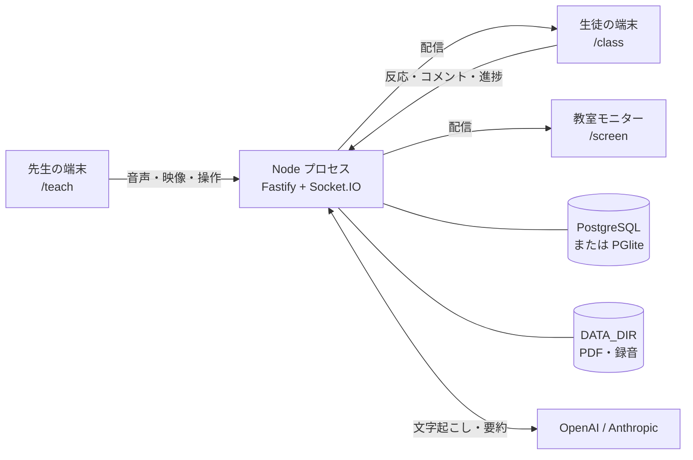
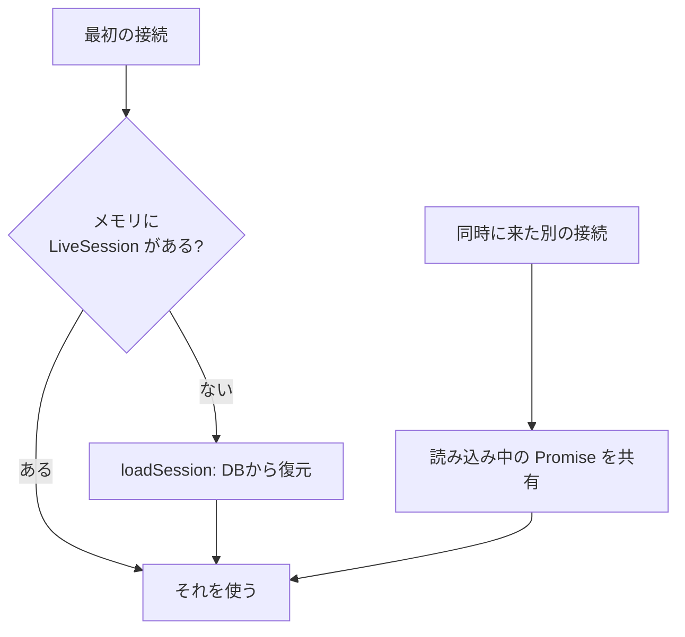
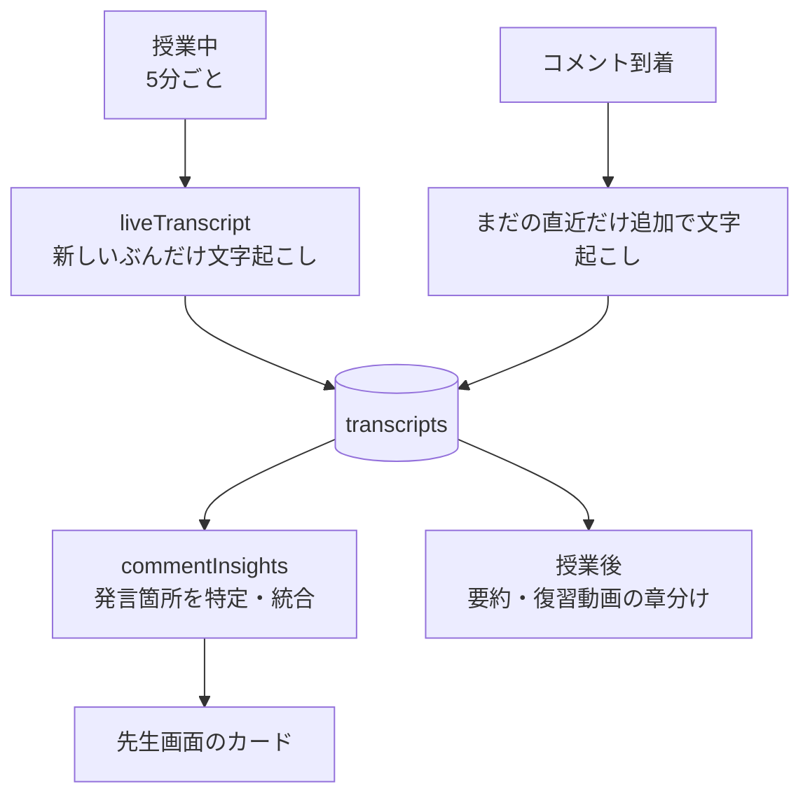

# ARCHITECTURE

このプロジェクトを引き継ぐ人向けの資料です。
**何がどこにあるか**と、**なぜそうなっているか**を書いています。

コードを変えるときに事故になりやすい箇所は、[触るときに気をつけること](#触るときに気をつけること) にまとめてあります。

- [全体像](#全体像)
- [ディレクトリ構成](#ディレクトリ構成)
- [起動の流れ](#起動の流れ)
- [ライブ授業の状態管理](#ライブ授業の状態管理)
- [Socket.IO のルーム構成](#socketio-のルーム構成)
- [タイムライン](#タイムライン)
- [音声と映像の経路](#音声と映像の経路)
- [AIのパイプライン](#aiのパイプライン)
- [データベース](#データベース)
- [ファイルの保存先](#ファイルの保存先)
- [触るときに気をつけること](#触るときに気をつけること)

---

## 全体像



**単一のNodeプロセス**が、API・Socket.IO・ビルド済みクライアントをすべて配信します。
リバースプロキシや別プロセスのワーカーはありません。

---

## ディレクトリ構成

npm workspaces のモノレポです。

```
client/          React 19 + Vite。先生・生徒・モニター共通のSPA
  src/pages/       画面（ルーティング単位）
  src/components/  先生画面のパネル類
  src/lib/         通信・音声・映像・PDF などの実装
server/          Node.js 22 + Fastify 5
  src/routes/      HTTP API
  src/live/        授業中の状態と処理
  src/ai/          文字起こし・要約・音声切り出し
  src/db/          Drizzle のスキーマと接続
shared/          クライアントとサーバで共有する型（@shared）
scripts/         開発用のスクリプト
docs/            この資料を含む説明書
```

`shared/src/index.ts` には**Socket.IO のイベント定義**が型として書かれています。
クライアントとサーバのどちらを変えるときも、最初にここを確認してみてください。
イベントを追加・変更したら両側に反映されるので、型チェックが食い違いを拾ってくれます。

---

## 起動の流れ

`server/src/index.ts` の `main()` が全体の順序です。

1. **`initDb()`** — マイグレーションをここで適用します。**`listen` より前**です
2. `DATA_DIR` を作成
3. Fastify に cookie / multipart / 各ルートを登録
4. `client/dist` があれば静的配信を登録し、**SPAフォールバック**を設定
   - `/api` で始まるもの、および**拡張子の付いたURL**は 404 を返します
   - それ以外（画面のURL）だけ `index.html` を返します
5. Socket.IO を同じHTTPサーバに載せる（`setupRealtime`）
6. `listen`

DBは `DATABASE_URL` があれば PostgreSQL、無ければ **PGlite**（`server/data/pglite` のファイルDB）です。
開発でDBを用意しなくていいのはこのためです。

---

## ライブ授業の状態管理

**配信中の授業の状態は、サーバのメモリに持ちます**（`server/src/live/liveSessions.ts` の `LiveSession`）。
DBには記録として書き込みますが、ライブの読み書きはメモリ側が主です。



サーバを再起動すると、次に誰かが接続したときにDBから復元されます。

### ここを外すと授業が分裂します

`sessionLoads` という Map で、**読み込み中の Promise を共有しています**。

同じ授業へ複数の端末が同時に最初の接続をすると、これが無い場合は
**それぞれが別々の `LiveSession` を作ってしまい**、片方の反応がもう片方に見えないという状態になります。
授業開始時の一斉入室で起きる条件です。意図してこう書いてあります。

---

## Socket.IO のルーム構成

| ルーム | 誰が入るか |
|---|---|
| `lesson:{id}` | 全員 |
| `lesson:{id}:teacher` | 先生の端末だけ |
| `lesson:{id}:audio:{webm\|mp4}` | **その形式を再生できる**受け手だけ |
| `lesson:{id}:av:{webm\|mp4}` | 同上（映像） |

形式ごとにルームを分けているのが要点です。
**サーバは、いま誰かが入っているルームの形式だけを先生に要求します**（`av_formats` / `audio_formats`）。
全員がWebMを再生できるならWebMだけ、Apple製だけならMP4だけ、混ざっていれば両方です。

---

## タイムライン

すべての出来事を `timeline_events(lesson_id, t_ms, type, payload)` に記録します。
`t_ms` は**授業開始からの経過ミリ秒**です。

この形にしてあるので、同期再生もクリップ再生も
**「任意の時刻を指定して状態を再構成する」だけ**で実現できます。特別な再生用データを別に持っていません。

録音は原則1レッスン1ファイルですが、先生が画面をリロードするなどして録音が再開された場合は
新しいパートに切り替わります。その境界も `audio_part` イベントとしてタイムラインに載ります。

---

## 音声と映像の経路

### 送信側（先生）

- 音声: `client/src/lib/audio.ts` — MediaRecorder、500msチャンク、48kbps
- 映像: `client/src/lib/camera.ts` — 映像と音声を**1本のストリーム**にまとめる（別々だと口の動きと声がずれるため）
- 低遅延MP4: `client/src/lib/lowLatencyMp4.ts` — WebCodecs + mp4-muxer で断片を自前に組み立てる

### 受信側

`client/src/lib/liveMedia.ts` の `LiveMediaPlayer` が、MediaSource へ流し込みます。
遅れが開いたら再生速度を少し上げて追いつき（`catchUp()`）、開きすぎたらシークします。

### 形式の振り分け

**どの形式を流すかは受け手が決めます。** 詳しい理由と実測値は
[README の「音声・映像の形式は『受け手』が決める」](../README.md#設計判断とその根拠) にあります。

要点だけ書くと、Chrome の MediaRecorder は MP4 だとキーフレーム単位でしか断片を切らないため、
500ms を指定しても実際には約4.1秒ごとにしか出てきません。
全体をMP4に寄せると、Apple製が1台混じるだけで全員の遅れが増えます。

### 形式が作れなかったときの扱い

先生の端末で、ある形式が **3秒**（`NO_DATA_MS`）何も出さなかったら、その形式を止めて先生画面に警告を出します。
記録用の形式だったときは、もう一方へ切り替えて録音を続けます。

ただし **15秒後に1回だけ試し直します**（`RETRY_AFTER_MS`、`client/src/lib/audio.ts`）。
マイクが立ち上がる最初の数秒だけデータが出ないことがあり、そこで諦めると
**本当は使えるOpusが授業中ずっと使われないまま**になります。
Opusが落ちるとAACへ切り替わるので、生徒側の通信量が増えます。
試し直しで復活したら、先生画面の警告も自動で消えます。2回目も駄目なら諦めます。

記録用の形式は、復活しても**戻していません**。戻しても録音がもう1つのパートに分かれるだけになるためです。

### 途中から参加した受け手

サーバは各形式の**初期セグメント**（WebMなら EBML ヘッダ、MP4なら `ftyp`）を保持しています。
途中参加の受け手には、これと次に来た生のチャンクを送ります。
チャンクがクラスタ境界で切れているので、これで再生が始まります。

---

## AIのパイプライン

差し替え式です。`TRANSCRIBE_PROVIDER` / `SUMMARY_PROVIDER` を `mock` にすると、
キー無しで全フローが最後まで動きます。開発時はこれで足ります。



| ファイル | 役割 |
|---|---|
| `ai/audio.ts` | ffmpeg で指定区間のWAVを切り出す。複数パートにまたがる場合はタイムラインどおりに合成 |
| `ai/transcribe.ts` | Whisper。**無音の区間は送らない** |
| `ai/vocabPrompt.ts` | 授業タイトルとPDF本文から用語のヒントを作る（140字まで） |
| `ai/summarize.ts` | 要約・発言箇所の特定・同一話題の判定。**出力の末尾のゴミを落とす**（下記） |
| `ai/fullTranscript.ts` | 授業全体の文字起こしをまとめる |
| `live/liveTranscript.ts` | 授業中に裏で文字起こしを貯める（5分間隔、15秒重ねる） |
| `live/commentInsights.ts` | コメントを分析してカードにする |
| `live/captions.ts` | ブラウザ音声認識の行と、Whisperの区間を突き合わせる |

字幕は**ライブと履歴で出所が違います**。ライブはブラウザの音声認識（速いが用語が弱い）、
履歴はWhisper（遅いが正確）に差し替えます。

### 要約の末尾に混ざる無関係な文字を落とす

LLMはまれに、無関係なトークンを文末にくっつけて返します。
実際に「…3か所で遅延が生じます。 **tekreplawsalt**」という要約が先生の画面に出ました。

`stripTrailingNoise()` が、**行ごとに** 最後の「。」より後ろを見て、
そこに日本語が1文字も無ければ落とします。落としたときは `[summarize]` としてログに出ます。

判定を控えめにしてあるのは、**消しすぎて意味を変えるほうが害が大きい**からです。

| 入力 | 結果 |
|---|---|
| `…です。 tekreplawsalt` | `…です。` に切り詰める |
| `…はHTTPです。` | そのまま（「。」で終わっている） |
| `12` / `はい` | そのまま（「。」が無い。発言の特定・同一判定の答えを壊さない） |
| `表題
説明です。` | そのまま（行ごとに見るので表題行は触らない） |

文の途中に紛れ込んだ場合は拾えません。頻発するようならログで気づけます。

---

## データベース

`server/src/db/schema.ts` に Drizzle のスキーマがあります。主なテーブルです。

| テーブル | 内容 |
|---|---|
| `teachers` | 先生のアカウント（ログインID・表示名・パスワードハッシュ） |
| `lessons` | 授業。参加コード・状態（draft / live / ended）・開始時刻 |
| `lesson_slides` | スライドの構成（挿入した白紙を含む） |
| `participants` | 参加者。名前のみ（未入力なら `anonymousName.ts` が配る仮名） |
| `timeline_events` | すべての出来事（`t_ms` 付き） |
| `reactions` | ボタン反応とコメント |
| `comment_insights` | コメント分析のカード |
| `reflection_points` | 振り返りタイムの通知 |
| `comment_clips` | 反応に対応する音声の参照（コピーではありません） |
| `review_chapters` | 復習動画の章 |
| `transcripts` | 文字起こし |
| `polls` / `poll_answers` | アンケート |
| `lesson_telemetry` | 授業単位の匿名集計 |

スキーマを変えたら `npm run db:generate` でマイグレーションを生成してください。
起動時に自動で適用されます。

`participants.consent_status` と `lessons.anonymize_mode` は将来用に用意してあるだけで、
**ロジックは未実装**です。

---

## ファイルの保存先

`server/src/storage.ts` に集約してあります。将来S3互換へ差し替えるならここだけを変えます。

```
DATA_DIR/lessons/{lessonId}/slides.pdf
DATA_DIR/lessons/{lessonId}/audio.webm
DATA_DIR/lessons/{lessonId}/clip_{start}_{end}.webm
```

クリップは**連続録音への参照**として扱っていて、反応のたびに音声をコピーしてはいません。
そのため反応が何件あってもディスクは増えません。

---

## 触るときに気をつけること

過去に実際に問題になった箇所です。理由を知らずに戻すと同じことが起きます。

### PDFは前後6ページしかキャッシュしない

**iOS の Safari は画像の総メモリに上限があり、超えるとエラーも出さずに真っ白に描かれます。**
40ページの資料なら非圧縮で200MBを超えて上限に当たります。
`client/src/lib/pdf.ts` の `MAX_CACHED_PAGES = 6` を大きくすると、また同じことが起きます。
全ページを事前に描く作りへ戻す場合も同じです。

### 無音をWhisperに渡さない

Whisper は声の入っていない音声にも何かしらの文を出します。
検証では**暗騒音10分に対して支離滅裂な文が44個**生成されました。
`transcribeRange` の無音判定を外すと、作り話が記録に混ざります。

### `socket.volatile.emit` は輻輳制御になりません

ブラウザの `ws.send()` はブロックせず `bufferedAmount` に積むだけなので、
`transport.writable` が false になるのは1ティックだけです。
つまり**クライアント側の volatile は「送らない」判断をほとんどしません**。
効いているのは「再接続後に古いパケットを流さない」ことだけです。

サーバ側（Node の `ws`）は送信コールバックがTCPのバックプレッシャで遅延するため
volatile が実際に効きますが、意図してそうしていません。
「volatile を付けたから通信量が抑えられている」という前提は、成り立ちません。

### 終わるときは、DBを閉じてから

ローカル運用のデータベースは **PGlite**（`server/data/pglite`）で、
**開いたままプロセスが落ちると、次に開けなくなることがあります**
（`PANIC: could not locate a valid checkpoint record`）。
先生がコンソールのウィンドウを閉じるのは普段の操作なので、そこで壊れては困ります。

`server/src/index.ts` の `shutdown()` が、次の順で片づけてから終了します。

| 順番 | すること | 閉じないとどうなるか |
|---|---|---|
| 1 | `io.disconnectSockets(true)` | つないだままの接続が残り、HTTPサーバが閉じ切らない |
| 2 | `app.close()` | — |
| 3 | `flushAllSessions()` | 録音の最後の数秒がファイルに残らない。5秒ごとにまとめている匿名集計も消える |
| 4 | `closeDb()` | **次回DBが開けなくなることがある** |

受けるのは `SIGINT` / `SIGTERM` / `SIGHUP`（Windowsではウィンドウを閉じたとき）と、
`SIGBREAK`（Windowsのみ）。**想定外の例外や、拾われなかった Promise の失敗でも同じ処理を通します。**
そのまま落ちるとDBが開いたまま残るためで、状態は壊れている可能性があるので続行はせず終了します。

**授業は終了させません。** 先生が止めたのではなくサーバ側の都合なので、
`lessons.status` は `live` のままにして、立ち上げ直せば同じ授業の続きから再開できるようにしています。

Windowsはウィンドウを閉じてから**約10秒**で問答無用に終了させるので、こちらは**8秒**で切り上げます。

> 実際に試した結果です。授業中（録音の書き込みが開いた状態）に終了させ、
> 録音ファイルは送った 1,376,256 バイトがそのまま残り、
> `pg_control` は `DB_SHUTDOWNED` になりました。
> 同じ状態で例外を起こしたときも、`DB_SHUTDOWNED` で終わります
> （この処理を入れる前は `DB_IN_PRODUCTION` のまま落ちていました）。

### 単一インスタンス前提です

ライブ状態がメモリにあるため、**インスタンスを増やすと授業が分裂します**。
スケールアウトするなら Socket.IO のアダプタと、状態の持ち方の変更が必要です。

### 入れ替え直後の「開いたままのタブ」

画面ごとのコードは `import()` で後から読み込んでいて、ファイル名には中身のハッシュが入ります。
**サーバを新しい版に入れ替えるとファイル名が変わる**ので、
入れ替え前からタブを開いたままの人が別の画面へ進むと、そのファイルはもう存在しません。

授業前にダッシュボードを開いておき、こちらがデプロイし、先生が授業を開く——という順番で起こります。

2か所で受け止めています。

| どこ | 何をしているか |
|---|---|
| `server/src/index.ts` | 拡張子の付いたURLには **404** を返す。ここで `index.html` を200で返すと「JSのはずがHTMLだった」という分かりにくい失敗になる |
| `client/src/components/ChunkErrorBoundary.tsx` | 読み込みの失敗を受け止め、**一度だけ自動で読み直す**。新しい `index.html` を取り直せば新しいファイル名で読める |

**受け止め手が無いと、その画面だけでなくアプリ全体が真っ白になります。**
React は描画中の例外を受け止める相手がいないと、木ごと外してしまうためです。

> 実際に試した結果です。版Aを開いたタブを持ったまま版Bへ入れ替え、別の画面へ進みました。
> **対策前**: 存在しないファイルに 200 のHTMLが返り、画面は真っ白（文字が1つも出ない）。
> **対策後**: 404 が返り、自動で読み直して**新しい版の画面が表示された**。

ビルド構成を変えたときは、チャンクが実際にJSとして配信されているかも確認してください。

### HTTPS でないと動かないもの

- マイク（`getUserMedia`）は HTTPS か `localhost` のみ
- セッションCookieの `Secure` 属性は、`localhost` / `127.0.0.1` では例外的に通りますが、
  **LANのIPアドレス（`192.168.x.x` など）では通りません**。平文HTTPのLAN越しにログインを試すとCookieが落ちます

### 依存パッケージを放置しない

過去に、production 依存だけで **high 8件**（`@fastify/static` の認可バイパス、`drizzle-orm` の SQLインジェクションを含む）
の状態になっていたことがあります。

```bash
npm audit --omit=dev
```

を定期的に確認してください。

### 用語ヒントは140字まで

長くすると、ヒントの語が実際の発話を引っ張ります。
検証では「機械学習」に引かれて、**実際の発話「今回の授業」が「機械の授業」と誤認識されました**。

### `/check` と `/telemetry` は統合しない

`/check` は**授業前に先生が現地で判断する**画面、
`/telemetry` は**授業後に開発側が設計を判断する**画面です。似ていますが目的が違います。
