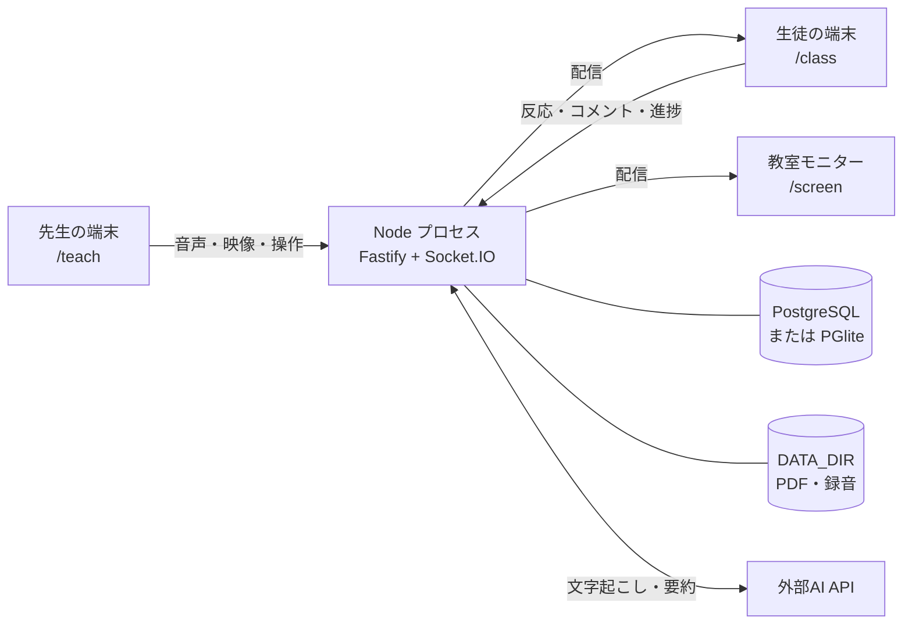
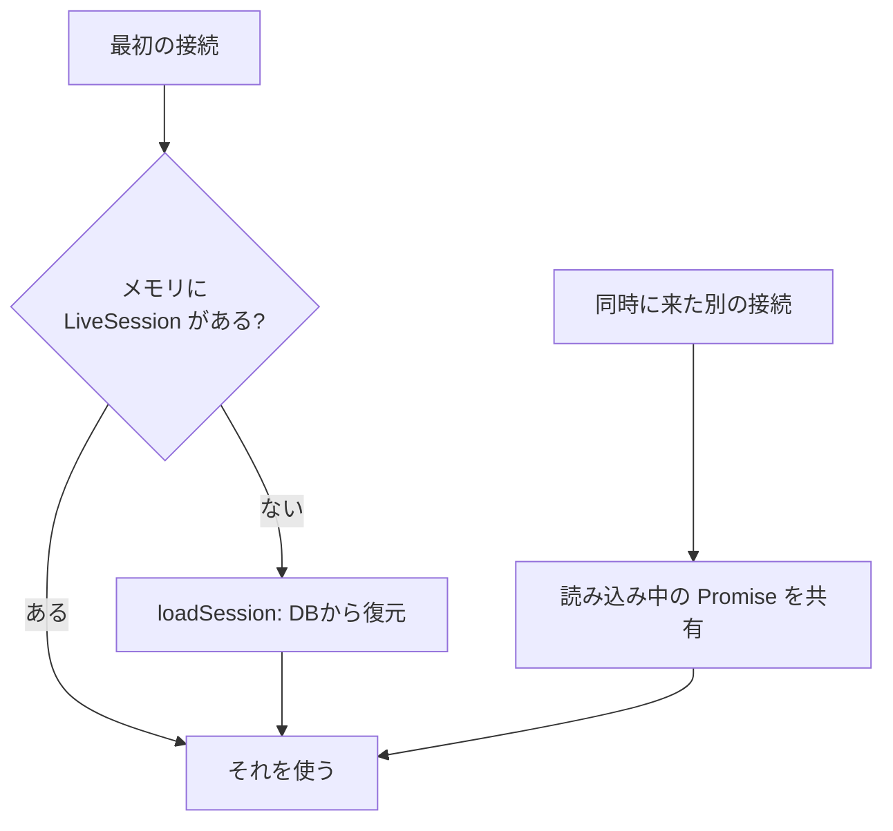
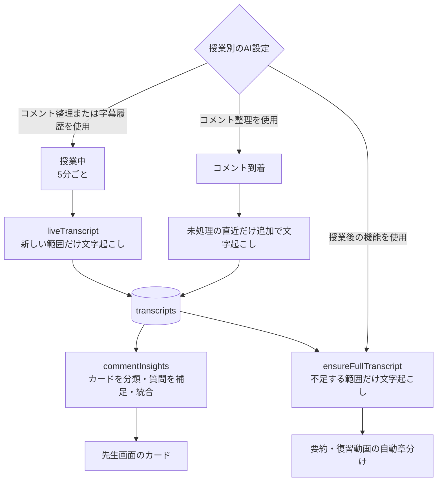

# ARCHITECTURE

この文書は、プロジェクトの保守と開発を引き継ぐ方向けの資料です。
構成要素の配置、処理の理由、変更時の注意事項を説明します。

過去に不具合が発生した箇所は、[変更時の注意事項](#変更時の注意事項)にまとめています。

- [全体像](#全体像)
- [ディレクトリ構成](#ディレクトリ構成)
- [起動の流れ](#起動の流れ)
- [ライブ授業の状態管理](#ライブ授業の状態管理)
- [Socket.IO のルーム構成](#socketio-のルーム構成)
- [タイムライン](#タイムライン)
- [音声と映像の経路](#音声と映像の経路)
- [AIのパイプライン](#aiのパイプライン)
- [データベース](#データベース)
- [ファイルの保存先](#ファイルの保存先)
- [変更時の注意事項](#変更時の注意事項)

---

## 全体像



**単一のNodeプロセス**が、API・Socket.IO・ビルド済みクライアントをすべて配信します。
リバースプロキシや別プロセスのワーカーはありません。

---

## ディレクトリ構成

npm workspaces のモノレポです。

```
client/          React 19 + Vite。先生・生徒・モニター共通のSPA
  src/pages/       画面（ルーティング単位）
  src/components/  先生画面のパネル類
  src/lib/         通信・音声・映像・PDF などの実装
server/          Node.js 22 + Fastify 5
  src/routes/      HTTP API
  src/live/        授業中の状態と処理
  src/ai/          文字起こし・要約・音声切り出し
  src/db/          Drizzle のスキーマと接続
shared/          クライアントとサーバで共有する型（@shared）
scripts/         開発用のスクリプト
docs/            この資料を含む説明書
```

`shared/src/index.ts`には、**Socket.IOのイベント定義**を型として記述しています。
クライアントまたはサーバのイベントを変更する場合は、このファイルも更新します。
型チェックにより、クライアントとサーバの定義の不一致を検出できます。

---

## 起動の流れ

`server/src/index.ts`の`main()`は、次の順序で起動します。

1. **`initDb()`** — `listen`の前にマイグレーションを適用します
2. `DATA_DIR` を作成
3. Fastify に cookie / multipart / 各ルートを登録
4. `client/dist` があれば静的配信を登録し、SPAフォールバックを設定
   - `/api`で始まるURLと、拡張子の付いたURLには404を返します
   - その他の画面URLには`index.html`を返します
5. Socket.IO を同じHTTPサーバに載せる（`setupRealtime`）
6. `listen`

`DATABASE_URL`が設定されている場合はPostgreSQL、未設定の場合は**PGlite**（`server/data/pglite`のファイルDB）を使用します。
PGliteを使用する開発環境では、DBサーバの準備は不要です。

---

## ライブ授業の状態管理

配信中の授業状態は、サーバのメモリに保持します（`server/src/live/liveSessions.ts`の`LiveSession`）。
DBには記録を保存し、ライブ配信中の読み書きにはメモリ上の状態を使用します。



サーバの再起動後は、最初の接続時にDBから状態を復元します。

### LiveSessionの同時初期化防止

`sessionLoads`のMapで、**読み込み中のPromiseを共有します**。

この排他処理がない場合、同じ授業へ複数の端末が同時に初回接続すると、
端末ごとに異なる`LiveSession`が作成されます。その結果、参加者間で授業状態と反応が共有されません。
授業開始時の一斉参加で発生するため、この排他処理が必要です。変更する場合は、同じ授業に対する初期化が1回だけ実行される構成を維持します。

---

## Socket.IO のルーム構成

| ルーム | 参加者 |
|---|---|
| `lesson:{id}` | 全員 |
| `lesson:{id}:teacher` | 先生の端末だけ |
| `lesson:{id}:audio:{webm\|mp4}` | その形式を再生できる受け手だけ |
| `lesson:{id}:av:{webm\|mp4}` | 同上（映像） |

ルームは再生形式ごとに分けます。ルーム構成を変更する場合は、配信先の形式が混在しないことを確認してください。
サーバは、参加者がいるルームの形式だけを先生の端末へ要求します（`av_formats` / `audio_formats`）。
全員がWebMに対応する場合はWebM、MP4だけに対応する端末だけの場合はMP4、両方が接続する場合は両形式を要求します。

---

## タイムライン

授業の再現と振り返りに使用する操作を、`timeline_events(lesson_id, t_ms, type, payload)` に記録します。
`t_ms` は**授業開始からの経過時間**です（単位はミリ秒）。

同期再生とクリップ再生では、指定した時刻のイベントから状態を再構成します。
再生専用の状態データは保持しません。

録音は、原則として1レッスンにつき1ファイルです。
先生が画面を再読み込みするなどして録音が再開された場合は、新しいパートに切り替わります。その境界は、`audio_part`イベントとしてタイムラインに記録します。

---

## 音声と映像の経路

### 送信側（先生）

- 音声：`client/src/lib/audio.ts` — MediaRecorder、500msチャンク、公称32kbps
- 映像：`client/src/lib/camera.ts` — 映像と音声のずれを防ぐため、**1本のストリーム**にまとめます
- 低遅延MP4：`client/src/lib/lowLatencyMp4.ts` — WebCodecsとmp4-muxerを使用して断片を生成します

### 受信側

`client/src/lib/liveMedia.ts`の`LiveMediaPlayer`が、MediaSourceへデータを渡します。
遅延が増加した場合は`catchUp()`で再生速度を上げ、差が大きい場合はシークします。

### 教室モニターの映像配置

`ScreenLayout`には、`slide`、`outside`、`video`、`slide-only`の4種類があります。
`outside`では、`PipPos`から最も近い上下左右の辺を`outsideDockFor()`で選び、
スライドの表示範囲と重ならない位置へカメラ映像を配置します。

教室モニターの画面で映像用の領域を確保するのは、`cameraOn`と`videoLive`がともに有効な場合だけです。
カメラが停止している場合、映像データを受信できない場合、または`slide-only`の場合は、
スライドを画面全体に表示します。生徒画面の映像はスライド上の小さい表示であり、
映像を閉じた場合や受信対象外の場合もスライドの表示範囲は変わりません。

### 形式の振り分け

配信形式は、受信端末が再生できる形式に応じて決定します。設計理由と実測値は、
[README「受信端末に応じた音声・映像形式」](../README.md#受信端末に応じた音声映像形式)をご覧ください。

ChromeのMediaRecorderで映像をMP4にする場合は、キーフレーム単位で断片を生成します。
500msを指定した試験でも、実際の生成間隔は約4.1秒でした。
MediaRecorderのMP4だけに統一すると、WebMを再生できる端末にも同じ遅延が加わります。
現在は、対応環境ではWebCodecsでMP4を0.5秒ごとに分割し、使用できない場合だけMediaRecorderへ戻します。

### 形式を生成できない場合の処理

先生の端末で、特定の形式のデータが**3秒間**（`NO_DATA_MS`）生成されない場合は、その形式を停止して警告を表示します。
録音に使用していた形式の場合は、別の形式へ切り替えて録音を継続します。

停止から15秒後に、1回だけ再試行します（`RETRY_AFTER_MS`、`client/src/lib/audio.ts`）。
マイクの起動直後にデータが生成されない場合があるためです。
Opusを生成できない場合はAACへ切り替わり、生徒側の通信量が増加します。
再試行に成功すると警告が消えます。再試行にも失敗した場合は、その形式を停止します。

録音形式は、再試行に成功した場合も元へ戻しません。形式を戻すと、録音ファイルが別のパートに分かれるためです。

### 途中から参加した受け手

サーバは各形式の**初期セグメント**（WebMなら EBML ヘッダ、MP4なら `ftyp`）を保持しています。
途中から参加した受信端末には、初期セグメントと次のチャンクを送信します。
チャンクはクラスタ境界で分割されているため、この組み合わせで再生を開始できます。

---

## AIのパイプライン

### AIプロバイダーの切り替え

現在の本番構成では、文字起こしと要約の両方にOpenAIを使用します。
文字起こしは`TRANSCRIBE_PROVIDER=openai`、要約は`SUMMARY_PROVIDER=openai`で設定します。

要約処理にはAnthropicへ切り替える実装もあります。`SUMMARY_PROVIDER=anthropic`と
`ANTHROPIC_API_KEY`を設定すると使用できます。文字起こしは区間情報が必要なため、OpenAI Whisperを使用します。

開発時は、`TRANSCRIBE_PROVIDER`と`SUMMARY_PROVIDER`を`mock`にすると、
APIキーを使用せずに一連の処理を確認できます。本番向けの案内では、現在使用しているOpenAIだけを記載しています。

### 処理の流れ



| ファイル | 役割 |
|---|---|
| `ai/audio.ts` | ffmpegで指定区間のWAVを切り出します。複数パートにまたがる場合はタイムラインに従って合成します |
| `ai/transcribe.ts` | Whisperへ音声を送信します。無音区間は送信しません |
| `ai/vocabPrompt.ts` | 授業タイトルとPDF本文から、140字以内の用語ヒントを作成します |
| `ai/summarize.ts` | 要約・発言箇所の特定・同一話題の判定・コメントカードの分類・質問への補足を行い、文章出力末尾の無関係な文字を除去します |
| `ai/fullTranscript.ts` | 授業全体の文字起こしをまとめます |
| `live/liveTranscript.ts` | コメント整理または字幕履歴の補正を使用する授業で、5分間隔、15秒の重なりで文字起こしを保存します |
| `live/commentInsights.ts` | コメントを分析してカードを作成します |
| `live/captions.ts` | ブラウザ音声認識とWhisperの区間を照合します |

ライブ字幕にはブラウザの音声認識を使用します。字幕履歴の補正を選択した授業では、履歴をWhisperの文字起こしと照合します。

### コメントの分類と質問への補足

`comment_insights.details`には、カード全体の`commentType`と、質問用の
`explainedContent`、`notYetExplainedContent`をJSONで保存します。
`commentType`の値は`question`、`trouble`、`unexpected`、`feedback`です。
先生画面では、それぞれ「質問」「困りごと」「授業外」「意見・感想」のチップとしてカードに1つ表示します。

`explainedContent`と`notYetExplainedContent`は質問があるカードだけで使用し、
「説明した内容」「説明前の内容」として、それぞれ最大1つ表示します。複数の原文をまとめたカードでは、
カード全体に対する補足を保存します。困りごと・授業外・意見や感想は、
AIによる言い換えを表示せず、チップと原文だけを表示します。

移行前の保存データにある`commentTypes`、`relatedExplanation`、`unconfirmedPoint`、`outsideLesson`、
`trouble`、`feedback`は削除せず、クライアントで新しい表示へ読み替えます。

LLMへ渡すものは、コメント本文と関連する発話の文字起こしです。生徒の名前、参加者ID、端末情報、PDF本文は渡しません。
プロンプトでは、先生への提案・指示・評価を出力せず、コメントに含まれない困りごとを推測しないよう指定しています。
コメント整理を外した授業でも、コメント原文、時刻、対応済みの状態は保存・表示します。

### 授業中の全文文字起こし

コメント整理または字幕履歴の補正を選択した授業では、授業中に文字起こしをバックグラウンドで保存します。
5分間隔とコメント受信時に、未処理の範囲を文字起こしします。
区間の先頭には直前の15秒を重ね、繋ぎ目で発話が欠けることを防ぎます。

授業全体の要約または復習動画の自動章分けだけを選択した場合、授業中の定期処理は行いません。
授業後に機能を実行した時点で、`ensureFullTranscript()`が不足する範囲を文字起こしします。
一度作成した授業全体の文字起こしは両機能で共用し、同じ音声の再処理を避けます（`server/src/ai/fullTranscript.ts`）。

4つのAI機能をすべて外した授業では、Whisperを呼び出しません。

ライブ字幕は先生の端末のブラウザで作成するため、Whisperの費用には含まれません。
授業中に読み返す字幕には、保存済みの文字起こしを使用します。
授業全体を処理対象にしますが、1回の処理範囲の95%以上が絶対音量の基準以下の場合は、
その範囲をWhisperへ送信しません。短い発話が含まれてこの条件から外れた範囲は、
無音部分を含む音声全体を送信するため、その長さに応じて料金が発生します。

費用の目安は [導入を検討する方へ「月額の目安」](導入を検討する方へ.md#月額の目安クラウド運用) にあります。

### 要約末尾の無関係な文字の除去

LLMの出力では、文末に無関係なトークンが付く場合があります。
実際の出力では、「…3か所で遅延が生じます。 **tekreplawsalt**」という要約を確認しました。

`stripTrailingNoise()`は、各行の最後の「。」より後ろを確認し、
日本語が1文字も含まれない場合に削除します。削除した場合は、`[summarize]`としてログへ出力します。

本文の意味が変わることを防ぐため、削除条件は限定しています。

| 入力 | 結果 |
|---|---|
| `…です。 tekreplawsalt` | `…です。`に切り詰める |
| `…はHTTPです。` | 変更しない（「。」で終わっている） |
| `12` / `はい` | 変更しない（「。」がなく、発言の特定・同一判定に使用する回答） |
| `表題\n説明です。` | 変更しない（行単位で判定するため、表題行は対象外） |

文中の無関係な文字は、この処理の対象外です。削除が発生した場合は、ログで確認できます。

---

## データベース

`server/src/db/schema.ts` に Drizzle のスキーマがあります。主なテーブルです。

| テーブル | 内容 |
|---|---|
| `teachers` | 先生のアカウント（ログインID・表示名・パスワードハッシュ） |
| `lessons` | 授業。授業コード・状態（draft / live / ended）・開始時刻・授業別のAI設定 |
| `lesson_slides` | スライドの構成（挿入した白紙を含む） |
| `participants` | 参加者。名前のみ（未入力なら `anonymousName.ts` が配る仮名） |
| `timeline_events` | 授業の再現と振り返りに使用する操作（`t_ms`付き） |
| `reactions` | ボタン反応とコメント |
| `comment_insights` | コメント整理のカード、カードの分類、質問への補足 |
| `reflection_points` | 旧「振り返りタイム」の通知。いまは読み書きしていない（過去データのために残置） |
| `comment_clips` | 反応に対応する音声の参照（コピーではありません） |
| `review_chapters` | 復習動画の章 |
| `transcripts` | 文字起こし |
| `polls` / `poll_answers` | アンケート |
| `lesson_telemetry` | 授業単位の匿名集計 |

スキーマを変更した場合は、`npm run db:generate`でマイグレーションを生成します。
起動時に自動で適用されます。

`participants.consent_status`と`lessons.anonymize_mode`は将来の拡張用で、ロジックは未実装です。

---

## ファイルの保存先

保存先の処理は`server/src/storage.ts`に集約しています。S3互換ストレージへ変更する場合は、このファイルを変更します。

```
DATA_DIR/lessons/{lessonId}/slides.pdf
DATA_DIR/lessons/{lessonId}/audio.webm
DATA_DIR/lessons/{lessonId}/clip_{start}_{end}.webm
```

クリップは**連続録音への参照**として扱い、反応ごとの音声ファイルは作成しません。
反応件数によって録音ファイルの使用量が増加することはありません。

---

## 仮名と参加者ID

名前を入力せずに参加した生徒には、「青いネコ」のように色と動物を組み合わせた仮名を割り当てます。
仮名は連番ではなく、授業ごとに一貫します。

集計には**参加者ID**を使用します。参加時にサーバが生成するランダムな文字列です。
端末情報や氏名からは生成せず、授業ごとに新しく割り当てます。
連続した反応の集約、反応人数の集計、アンケートの重複回答防止に、このIDを使用します。

仮名と参加者IDは授業ごとに生成されるため、異なる授業の参加者を同一人物として関連付ける用途には使用できません。

## 変更時の注意事項

この節では、過去に不具合が発生した箇所と、変更時に確認する内容を説明します。

### PDFページのキャッシュ範囲

iOSのSafariには画像の総メモリに上限があり、上限を超えるとエラーを表示せずに白い画面になります。
40ページの資料は、非圧縮では200MBを超える場合があります。
`client/src/lib/pdf.ts`の`MAX_CACHED_PAGES = 6`を大きくする場合は、iOS Safariでメモリ使用量を確認してください。
全ページを事前描画する構成へ変更する場合も、同じ確認が必要です。

先生画面の「スライド一覧」も、`SlideThumb`の`IntersectionObserver`で表示範囲の周辺だけを描画します。
一覧の描画方法を変更する場合は、全ページを同時に描画していないことを確認します。

ページ移動のキーは`Teach.tsx`で処理します。入力欄、選択欄、ボタン、編集可能な要素にフォーカスがある場合と、
Ctrl・Alt・Metaを併用している場合は処理しません。文字入力やブラウザのショートカットを妨げないための条件です。

### 無音区間の文字起こし除外

Whisperは、発話を含まない音声からも文字列を生成する場合があります。
検証では、**暗騒音10分に対して内容と関係のない文が44件**生成されました。
`transcribeRange`の無音判定を変更する場合は、発話を含まない音声が文字起こしへ混入しないことを確認してください。

### `socket.volatile.emit`の用途と制約

ブラウザの`ws.send()`は処理をブロックせず、データを`bufferedAmount`へ追加します。
このため、`transport.writable`がfalseになるのは、イベントループの短い期間に限られます。
クライアント側のvolatileは、送信量を抑制する用途には適していません。
volatileは、再接続後に古いパケットを送信しない用途で使用できます。

サーバ側（Nodeの`ws`）では、TCPのバックプレッシャによって送信コールバックが遅延するため、volatileが機能します。
現在の実装では、通信量を制御する目的では使用していません。

### サーバ終了時の処理順序

ローカル運用のデータベースは **PGlite**（`server/data/pglite`）です。
DBを閉じずにプロセスが終了すると、次回の起動時に開けなくなる場合があります
（`PANIC: could not locate a valid checkpoint record`）。
コンソールのウィンドウを閉じた場合も、終了処理を実行してDBを閉じます。

`server/src/index.ts`の`shutdown()`は、次の順序で処理します。

| 順番 | 処理 | 実行しない場合の影響 |
|---|---|---|
| 1 | `io.disconnectSockets(true)` | 接続が残り、HTTPサーバを終了できない場合がある |
| 2 | `app.close()` | — |
| 3 | `flushAllSessions()` | 録音の最後の数秒と、未保存の匿名集計が失われる |
| 4 | `closeDb()` | 次回DBが開けなくなることがある |

`SIGINT` / `SIGTERM` / `SIGHUP`（Windowsではウィンドウを閉じた場合）と、
Windowsの`SIGBREAK`を処理します。想定外の例外と未処理のPromise rejectionでも、同じ終了処理を実行します。
プロセス内の状態が不整合になっている可能性があるため、処理の続行は行いません。

終了処理では授業の状態を終了へ変更しません。`lessons.status`を`live`のまま保持し、
サーバの再起動後に同じ授業を再開できるようにします。

Windowsでは、ウィンドウを閉じてから約10秒後にプロセスが強制終了されるため、終了処理の上限を8秒に設定しています。

> 授業中に録音ストリームを開いた状態で終了させた検証では、送信した1,376,256バイトが録音ファイルに保存され、
> `pg_control`は`DB_SHUTDOWNED`になりました。同じ状態で例外を発生させた場合も、
> `DB_SHUTDOWNED`で終了しました。対策前は`DB_IN_PRODUCTION`の状態で終了していました。

### 同時接続数と通信量

次の表は、2026-08-27に1台の開発機上で行った負荷試験の結果です（16コア、PGlite、PC内部の通信）。
実端末を模擬接続数と同数だけ用意した試験ではありません。先生役から音声を8400バイト / 1.4秒（48kbps相当）、
映像を59000バイト / 0.5秒（約944kbps）で送信し、生徒役のSocket.IO接続数を増やして、
サーバのCPU時間と受信バイト数を測定しました。

| 使い方 | 模擬接続数 | サーバのCPU | メモリ | 送出量 | 計算上の送信量に対する受信量 |
|---|---|---|---|---|---|
| 音声なし | 500 | 0.01 コア | 188MB | 0 | — |
| 音声なし | 1500 | 0.02 コア | 205MB | 0 | — |
| 音声なし | 3000 | 0.33 コア | 247MB | 0 | — |
| 音声あり | 500 | 0.04 コア | 231MB | 24 Mbps | 100% |
| 音声あり | 1500 | 0.06 コア | 260MB | 70 Mbps | 98% |
| 音声あり | 2000 | 0.26 コア | 387MB | 96 Mbps | 99% |
| 音声あり | 3000 | 0.85 コア | 322MB | — | 破綻 |
| 音声＋映像 | 50 | 0.03 コア | 168MB | 48 Mbps | 96% |
| 音声＋映像 | 150 | 0.08 コア | 188MB | 141 Mbps | 95% |
| 音声＋映像 | 300 | 0.08 コア | 194MB | 300 Mbps | 101% |

受信量の割合は、公称ビットレートと測定時間から求めた送信量との比較です。
送信間隔のずれなどを含むため、101%は100%相当として扱います。

測定結果

- 300接続へ300Mbpsを配信した場合のCPU使用量は0.08コアでした
- 定常状態のメモリ使用量は、200〜390MBの範囲でした
- この負荷試験では1接続あたり48kbpsの音声を使用しました。現在の音声のみの配信設定は公称32kbpsです
- 音声ありの3000接続では配信が停止しました。測定用PCが先に上限へ達した可能性があるため、サーバの上限とは断定できません。2000接続までは模擬試験で配信を確認しました

### 通信量の内訳

受信端末1台あたりの通信量を示します。サーバの送信量は、接続台数に比例して増加します。

| データ | 通信量 | 送信する期間 |
|---|---|---|
| 音声 | 公称32kbps | 音声を受信する端末ごと |
| カメラ映像 | 約900kbps | 映像を受信する端末ごと |
| スライドへの書き込み | 32kbps | 書き込み中 |
| ポインター | 25kbps | ポインターの移動中 |
| スライドのPDF | ファイルの容量 | 参加時に1回 |
| スライドの切り替え・反応・コメント | 数百バイト | 操作時 |

この表とは別に、先生の端末からサーバへ録音用の音声を1形式送信します。
WebM用とMP4用の受信端末が混在する場合は、必要な2形式を送信します。
録音を継続するため、音声の受信端末が0台の場合も1形式の送信を維持します。

書き込みでは、追加された座標だけを送信します（`SlideCanvas.tsx` / `applyStrokeProgress`）。
以前は66msごとにその時点までの座標をすべて再送信していたため、線が長いほど通信量が増加していました。
3秒間の線を端末1台へ送信した実測では、合計通信量が**163KBから11KB**、ピークが**751kbpsから32kbps**になりました。

座標は`posFromClient`で小数4桁へ丸めます。幅1600pxでは0.16pxに相当し、
描画と当たり判定の精度を維持しながら、DBに保存するストロークの容量を削減します。

この経路にはvolatileを使用するため、送信されない断片が発生する場合があります。
連続しない断片は破棄し、描画終了時の確定ストロークで正しい表示へ更新します。
連続しない断片を結合すると、実際には描画していない線が表示されます。

#### 教室モニターで受信する構成

生徒の端末を「教室から参加」（音声OFF）に設定すると、音声の送信先は教室モニターに限られます。
書き込みは音声OFFの生徒端末にも送信されるため、通信量の見積もりには生徒端末も含めます。
次の表は通信量の内訳から算出した値で、同数の実端末を接続した試験結果ではありません。

| 教室数 | 生徒の端末 | 音声（モニターのみ） | 書き込み中（全端末） | 合計のピーク |
|---|---|---|---|---|
| 10教室 | 400台 | 0.3Mbps | 13.1Mbps | 約14Mbps |
| 20教室 | 800台 | 0.6Mbps | 26.2Mbps | 約27Mbps |

「書き込み中」は、生徒の端末と教室モニターの両方を送信先として計算しています。

接続台数に応じて、参加時のPDF、書き込み、ポインターの送信量と、一斉参加時の待ち時間が増加します。

### 一斉参加時の処理量

授業開始時には、多数の端末が同時に接続します。次の試験では、1台の開発機から生徒役の接続を模擬しています。
実端末を模擬接続数と同数だけ用意した試験ではありません。接続1件あたりの処理量を一定に保つ必要があります。
接続処理の中で全参加者を処理すると、全体の処理量が参加者数の二乗に比例します。
2026-08-27に、次の4か所を変更しました。

| 変更箇所 | 変更前 | 変更後 |
|---|---|---|
| `broadcastParticipants()` | 1人入るたびに参加者一覧を全員まとめて作って先生へ | 入退室は `participant_changed` でその1人だけ送る |
| `broadcastParticipantCount()` | 生徒の人数を授業のルーム全体へ送信 | 先生にだけ送る（使うのは先生の画面だけだった） |
| `noteConcurrency()` / `broadcastScreenCount()` | `fetchSockets()` で全接続を並べて役割で数える | 役割ごとのルームを作り `adapter.rooms.get(...).size` で数える |
| `generateAnonymousName()` | 仮名を配るたびに participants を全件読む | 授業ごとに使用済みの名前をメモリに持つ |

変更前後の測定結果（同じ機材と手順で連続して測定）

| 模擬接続数 | 変更前: 時間 / CPU | 変更後: 時間 / CPU |
|---|---|---|
| 150 | 1.4秒 / 1.8秒 | 0.9秒 / 1.2秒 |
| 300 | 3.4秒 / 3.4秒 | 2.3秒 / 2.1秒 |
| 600 | 10.2秒 / 10.4秒 | 7.3秒 / 4.4秒 |

模擬接続数600の場合、接続1件あたりのCPU時間は**17.3msから7.3ms**へ減少しました。
模擬接続数別のCPU時間は、変更前が12.0・11.3・17.3ms、変更後が8.0・7.0・7.3msでした。

> 絶対値は測定環境によって変わります。別の日に同じコードで600接続を模擬した結果は、8.8〜10.7秒でした。
> 上の表は変更前後を同じ環境で連続して測定した比較です。秒数は環境によって1.5〜2倍変動するため、
> 接続1件あたりの処理時間が模擬接続数に応じて増加していないことを確認してください。

> 接続処理を変更する場合は、接続1件の処理内で全参加者または全ソケットを走査しない構成にします。
> 特に、`fetchSockets()`とlessonIdを条件にした全件SELECTの追加時は、処理量を測定してください。

600の生徒役接続から2秒以内にボタン操作を送る試験では、先生役のSocket.IO接続で600件すべてを受信し、CPU時間は1.4秒でした。

> 測定スクリプトはリポジトリに含まれていません。再測定する場合は、生徒役のソケットを接続し、
> `audio_chunk`の到達バイト数と、測定前後のサーバプロセスのCPU時間を記録します。

### AIを使用しない構成

先生画面の「AI機能設定」で4項目をすべて外すと、その授業ではWhisperと文章を扱うAIを呼び出しません。
設定は`lessons.ai_settings`へ保存し、授業開始後は変更できません。

APIキーを設定しない場合は、`TRANSCRIBE_PROVIDER` / `SUMMARY_PROVIDER`に`mock`を設定します。
mockは固定の応答を返し、外部サービスへ情報を送信しません（`ai/transcribe.ts`）。

| 利用できる機能 | 利用できない機能 |
|---|---|
| 配信・書き込み・反応・コメント・タスク・アンケート・録音・振り返りの再生・ライブ字幕・復習動画の手動編集 | コメントカードの分類と質問への補足・字幕履歴のWhisper補正・AI要約・復習動画の自動章分け |

この構成は、APIキーを使用しない画面確認と、外部サービスへ情報を送信できない環境で使用します。
字幕はブラウザの音声認識を使用するため、この設定とは別に動作します。

### Renderを使用しない校内サーバ構成

本番環境はRender、Neon、永続ディスクの使用を前提としています。
サーバ費用を削減する構成として、校内のPC 1台でサーバを動かすこともできます。
生徒端末との通信は校内で完結し、AIへの問い合わせにはインターネットを使用します。

1. `授業サーバを起動.cmd` をダブルクリック
2. コンソールに表示される2つのURLを確認します
   - 先生用 `http://localhost:3000` — サーバを動かしているPCで開きます
     （マイクが localhost か HTTPS でしか使えないため）
   - 生徒用 `http://<このPCのIP>:3000/join` — 同じWi-Fiのスマートフォン・PCから
3. 使用後はコンソールを閉じます

`DATABASE_URL`が未設定の場合はPGliteを使用するため、DBの設定は不要です。
データは`server/data/`に保存されます。PCを変更する場合は、このフォルダをコピーします。

#### 注意事項

- クラウドのデータは引き継がれません。校内サーバは別の環境として開始します
- `NODE_ENV=production`を設定するとCookieに`secure`が付き、
  LAN IP（`192.168.x.x`）ではブラウザに保存されないため、ログインできません
  （[HTTPSを必要とする機能](#httpsを必要とする機能)）
- 生徒端末との通信は校内で完結します。AI機能を使用する授業では録音を外部サービスへ送信します。
  50分1コマの音声は約96MBで、授業中の定期処理を使用する場合は繋ぎ目の重なりが加わります
- PGliteは1つのプロセスから使用します。サーバの実行中に
  別のスクリプトから`server/data/pglite`を開くとDBが破損する可能性があります

### 単一インスタンス構成

ライブ状態をメモリに保持しているため、インスタンスを増やすと、授業状態がインスタンスごとに分かれます。
スケールアウトする場合は、Socket.IOのアダプタと状態管理の変更が必要です。

### デプロイ前から開いているタブ

画面ごとのコードは`import()`で遅延読み込みし、ファイル名に内容のハッシュを含めます。
デプロイによってファイル名が変わるため、デプロイ前から開いているタブが別の画面へ移動すると、
古いファイルが存在しない場合があります。

授業前にダッシュボードを開き、その後にデプロイを行い、デプロイ前のタブから授業画面を開く場合に発生します。

この読み込みエラーは、次の2か所で処理します。

| 処理箇所 | 処理内容 |
|---|---|
| `server/src/index.ts` | 拡張子の付いたURLには404を返します。`index.html`を200で返すと、JavaScriptの要求に対してHTMLが返されます |
| `client/src/components/ChunkErrorBoundary.tsx` | 読み込みエラーを捕捉し、1回だけ自動的に再読み込みします。新しい`index.html`から更新後のファイル名を取得します |

この処理がない場合は、Reactが描画中の例外によってコンポーネントツリーを取り外し、画面全体が白く表示されます。

> 版Aを開いた状態で版Bをデプロイし、別の画面へ移動する手順で検証しました。
> 対策前は、存在しないファイルに200のHTMLが返り、画面全体が白く表示されました。
> 対策後は、404を受け取って自動的に再読み込みし、版Bの画面が表示されました。

ビルド構成を変えたときは、チャンクが実際にJSとして配信されているかも確認してください。

### HTTPSを必要とする機能

- マイク（`getUserMedia`）はHTTPSまたは`localhost`で使用できます
- セッションCookieの `Secure` 属性は、`localhost` / `127.0.0.1` では例外的に通りますが、
  LANのIPアドレス（`192.168.x.x`など）では保存されません。平文HTTPのLAN経由ではログインできません

### 依存パッケージの確認

過去に、production 依存だけで **high 8件**（`@fastify/static` の認可バイパス、`drizzle-orm` の SQLインジェクションを含む）
の状態になっていたことがあります。

```bash
npm audit --omit=dev
```

を定期的に実行して確認します。

### 用語ヒントの文字数

用語ヒントを長くすると、実際の発話よりヒントの語が優先される場合があります。
検証では、「機械学習」のヒントによって、実際の発話「今回の授業」が「機械の授業」と認識されました。

### `/check`と`/telemetry`の役割

`/check`の「端末チェック」は、授業前に端末1台の対応形式と短時間の回線速度を確認し、利用できる機能の目安を表示する画面です。
同じURLの「料金の試算」は入力した授業条件から月額を計算します。
`/telemetry`は、授業後に開発側が運用状況を確認する画面です。目的が異なるため、別の画面として維持します。

`/check`の回線測定では、圧縮しにくい約128KBのデータを使用します。
すべての端末で`GET /api/check/download`による受信速度を測定し、先生の端末では
`POST /api/check/upload`による送信速度も測定します。応答には`Cache-Control: no-store`を付け、
ブラウザのキャッシュを測定しないようにしています。

この測定値は端末とRender間の短時間の実効値です。Renderプランの帯域保証や、
多数の端末が同時に接続した場合の学校全体の速度を示すものではありません。
RenderではHTTPとWebSocketの送信も外向き通信量へ加算されます。料金の確認先は、
[導入を検討する方へ「月額の目安」](導入を検討する方へ.md#月額の目安クラウド運用)です。

| 判定する機能 | 方向 | ○とする速度 |
|---|---|---:|
| スライド・ボタン・コメント | 受信 | 64kbps以上 |
| 音声・スライド・書き込み | 受信 | 96kbps以上 |
| カメラ映像の受信 | 受信 | 1.5Mbps以上 |
| 音声の配信 | 送信 | 96kbps以上 |
| カメラ映像の配信 | 送信 | 2.5Mbps以上 |

音声の判定値には、公称32kbpsの音声、最大約32kbpsの書き込み、通信方式の上乗せと変動分を含めます。
カメラ映像の送信は、WebMとMP4を同時に送る場合を含めて判定します。
必要な速度以上を○、75%以上かつ必要な速度未満を△、75%未満を×と表示します。
短時間の測定結果であり、授業中の速度を保証するものではありません。

### 料金試算

`/check?tab=cost`は、`client/src/components/CostEstimator.tsx`で次の月額を計算します。

| 項目 | 計算方法 |
|---|---|
| 固定費 | Renderサーバと3GBの永続ディスク |
| PDF | PDF容量 × 先生・生徒・教室モニターの表示端末数 × コマ数 |
| 音声 | 32kbps × 映像を受信しない教室モニターと各家庭の受信端末数 × 授業時間 |
| カメラ映像 | 音声を含む約1Mbps × 映像を受信する端末数 × 授業時間 |
| 画面操作 | 1端末・1コマあたり0.5MBとして見込む概算 |
| Whisperへの送信 | 16kHz・16bit・モノラルのWAVを1分1.92MBとして計算。授業中の定期処理には約5%、コメント時の追いつき処理には1件あたり最大15秒の重なりを加算 |
| 文章を扱うAI | コメント件数と、要約・自動章分けの実行回数に、処理ごとの入力・出力トークン数の範囲を掛ける |

映像の約1Mbpsには音声を含むため、映像受信端末を音声だけの通信量へ重ねて加算しません。
授業後の要約と自動章分けは、選択されている場合に各授業で1回実行する条件です。

単価は`server/src/routes/check.ts`の`COST_RATES`で、確認日と組にして管理します。
実行時に料金ページを解析しません。現在の値は、Renderサーバ$7/月、ディスク$0.75/月、
外向き通信量5GB/月までを含み超過分$0.15/GB、Whisper $0.006/分、
gpt-5.6-luna 入力$0.20・出力$1.20/100万トークンです。

円換算には日本銀行時系列統計データ検索サイトAPIの`FM08 / FXERD04`を使用します。
取得値は12時間保持し、5円単位に丸めます。取得できない場合は1ドル155円を使用し、
再取得までの間隔を1時間に短縮します。APIは`GET /api/check/cost-rates`から呼び出し、
単価・確認日・為替の取得元もクライアントへ返します。
