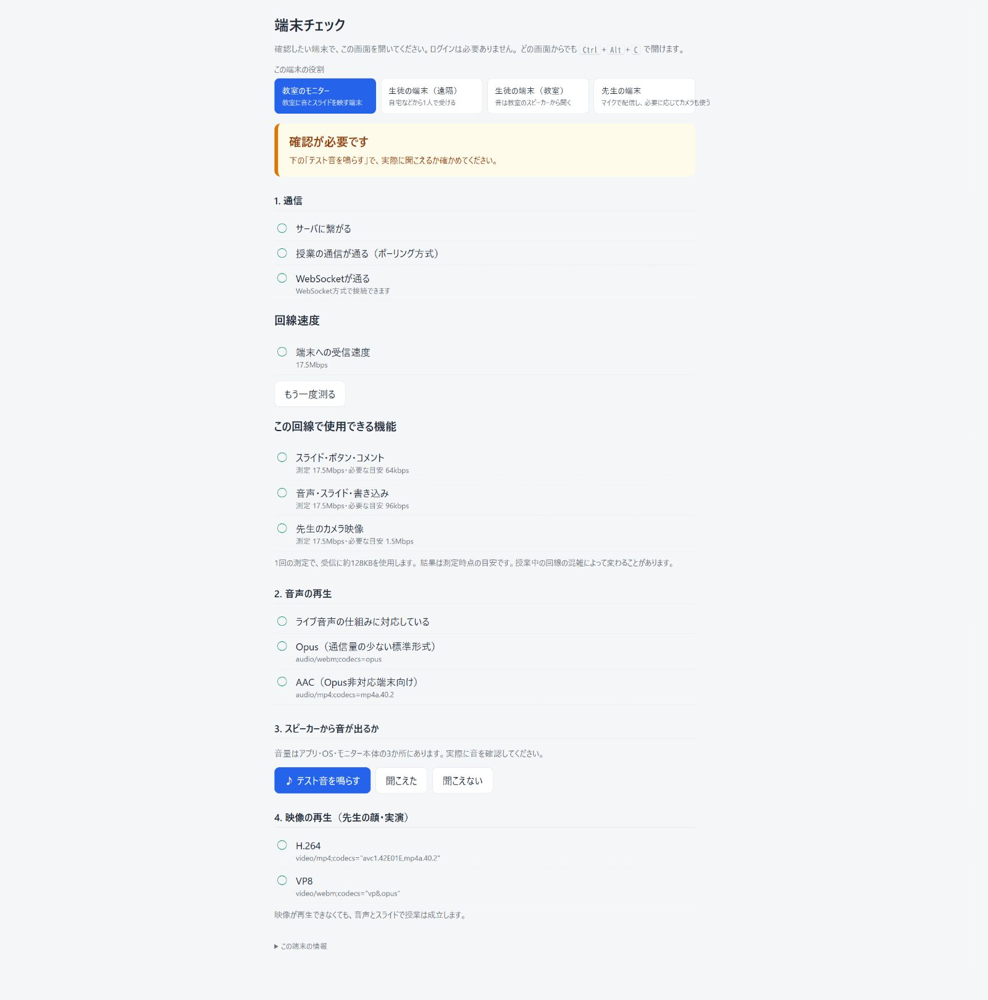
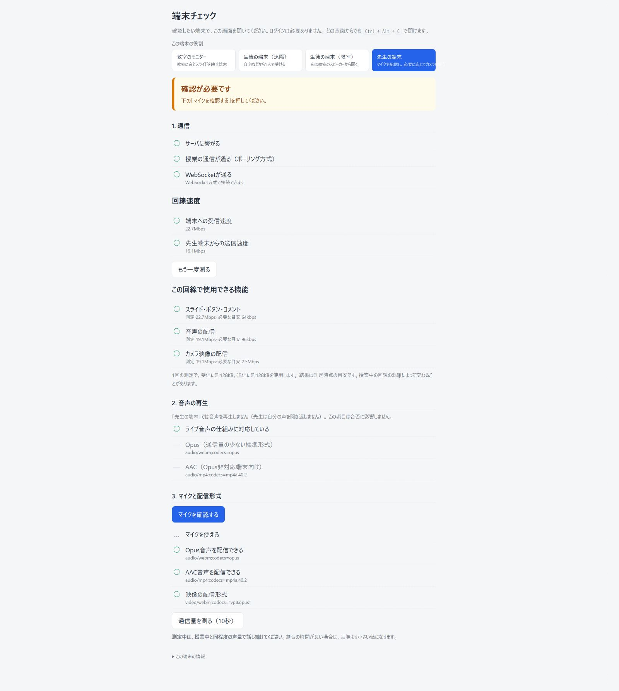
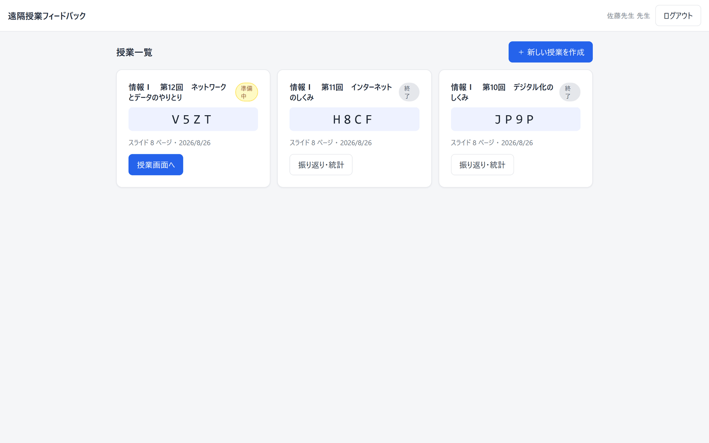
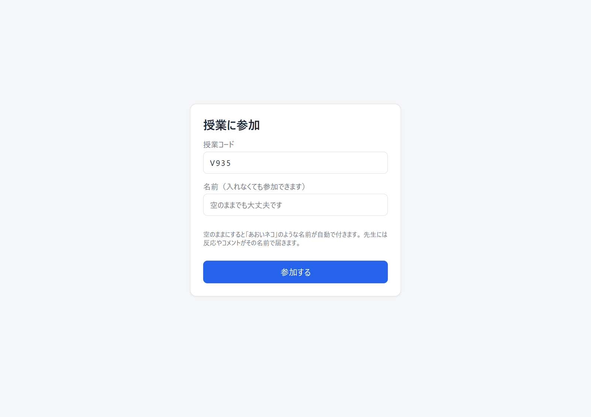
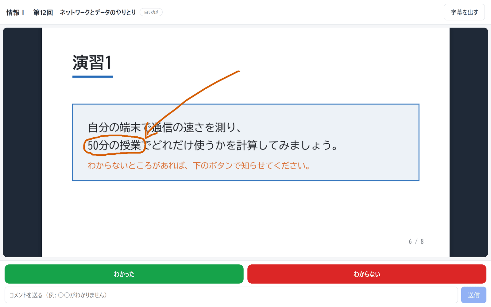
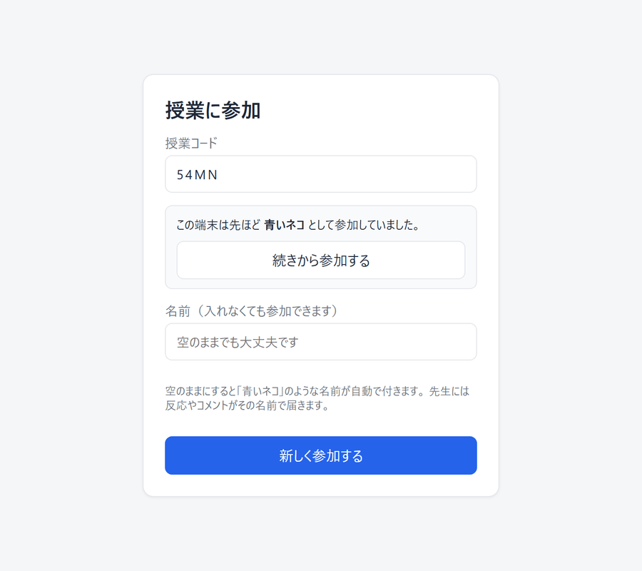
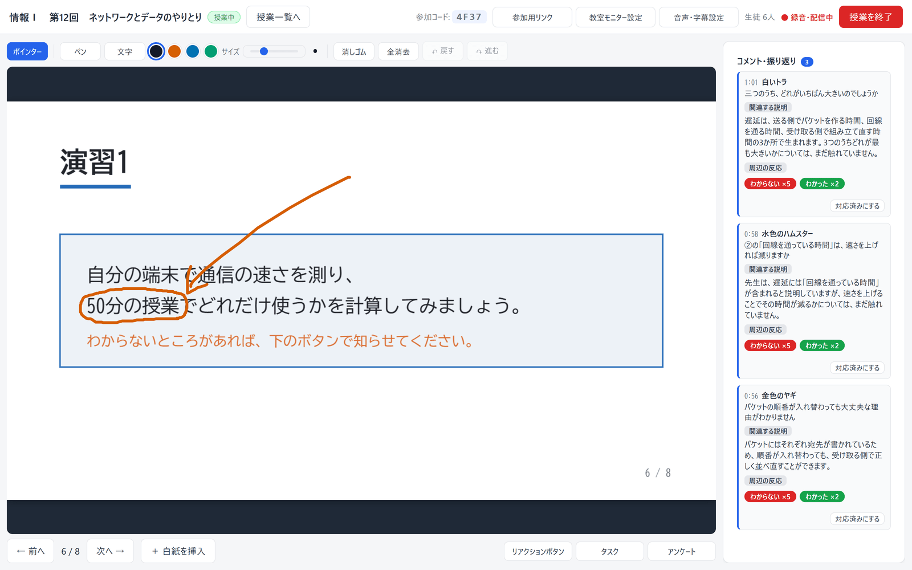
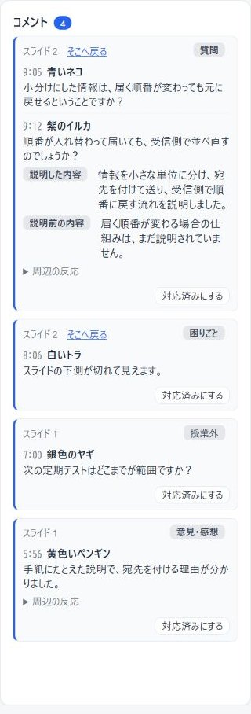
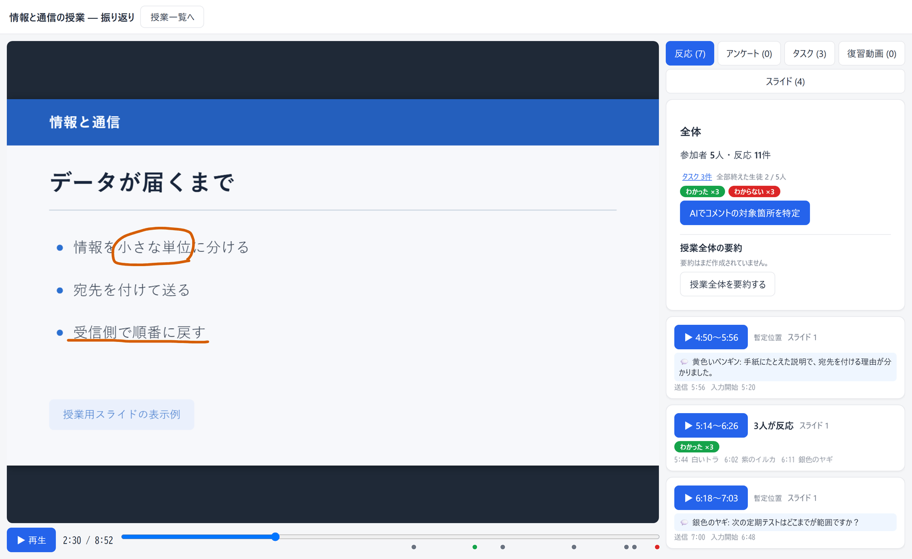
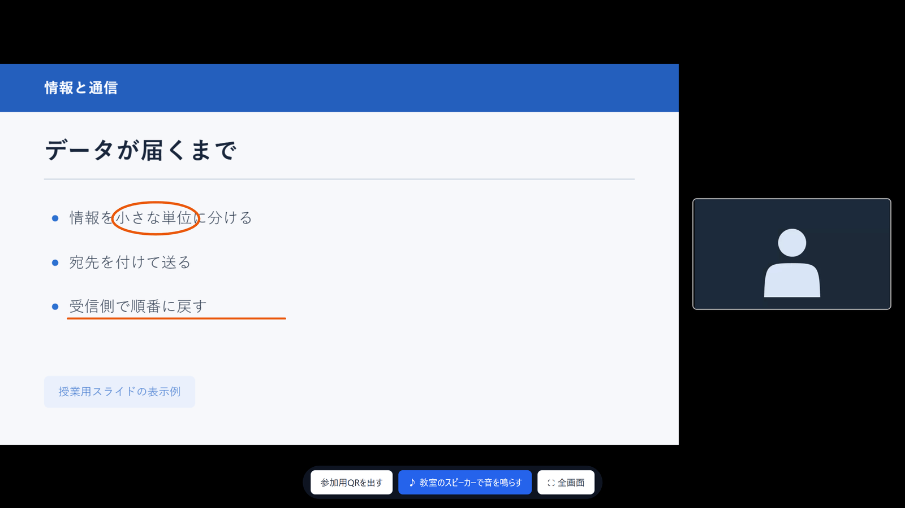

# 先生向けガイド

このシステムの使い方を、授業の流れに沿って説明します。
「困ったときは」だけ先に読んでいただいても構いません。

- [準備するもの](#準備するもの)
- [1. 授業の前に — 端末を確かめる](#1-授業の前に--端末を確かめる)
- [2. 授業を作る](#2-授業を作る)
- [3. 生徒の参加](#3-生徒の参加)
- [4. 授業を始める](#4-授業を始める)
- [5. 授業中にできること](#5-授業中にできること)
- [6. 授業を終える](#6-授業を終える)
- [7. 授業のあとで振り返る](#7-授業のあとで振り返る)
- [教室で対面と併用するとき](#教室で対面と併用するとき)
- [困ったときは](#困ったときは)
- [よくある質問](#よくある質問)

---

## 準備するもの

| | 必要なもの | 備考 |
|---|---|---|
| 先生 | マイクの使えるPC | アプリのインストールは不要です。字幕を使う場合は Chrome か Edgeで開く必要があります |
| 先生 | 授業で使うPDF | 複数のファイルを続けて1つのスライドにもできます |
| 生徒 | スマートフォン・タブレット・PCのいずれか | アプリのインストールは不要です。また、アカウントもつくりません |
| 教室（使う場合） | モニターや電子黒板につないだ端末 | テレビ内蔵のブラウザでも動きます |

アカウントを作っていない場合は、`/register` でログインIDと表示名を決めてください。
メールアドレスは必要ありません。

登録画面に「**登録の合言葉**」の欄が出た場合は、そのサーバでは合言葉が必要です。管理する方にお尋ねください。

> **パスワードは画面から再設定できません**（メールアドレスをお預かりしていないため）。
> 忘れた場合は、サーバを管理している方にお問い合わせください。記録を残したまま設定し直せます。

---

## 1. 授業の前に — 端末を確かめる

初めて使う教室や、初めて使う端末では、**授業の前に `/check` を開いて確認をお願いします**。
ログインは必要ありません。**どの画面からでも <kbd>Ctrl</kbd>+<kbd>Alt</kbd>+<kbd>C</kbd> で開けます**。

最初に、**その端末の役割**を選びます。役割によって必要な条件が変わるためです。

| 役割 | どんな端末か | 何を調べるか |
|---|---|---|
| **教室のモニター** | 教室に音とスライドを映す端末 | 通信・音声の形式・実際に音が出るか |
| **生徒の端末（遠隔）** | 自宅などから1人で受ける | 通信・音声の形式・実際に音が出るか |
| **生徒の端末（教室）** | 音は教室のスピーカーから聞く | 通信だけ（音は要らないため） |
| **先生の端末** | マイクとカメラで配信する | 通信・マイク・送れる形式 |

結果は ○ △ × で出ます。**× があると、その用途では授業に使えません。**

| 表示 | 意味 |
|---|---|
| **サーバに繋がる** | × のときは、ネットワークかフィルタリングの問題です。学校の回線でWebSocketが塞がれていることがあります |
| **ライブ音声の仕組みに対応している** | × のときは、そのブラウザでは音が鳴りません |
| **マイクを使える**（先生の端末） | × のときは、ブラウザの許可設定をご確認ください |
| **テスト音を鳴らす** | 実際にスピーカーから音を出します。イヤホンを使う場合は、挿した状態でご確認ください |

通信量も実際に測ります。ギガを使い切った生徒も授業を受けられるかどうか、その場で確認できます。

---

## 2. 授業を作る

1. 授業の一覧（`/dashboard`）を開きます
2. 「**＋ 新しい授業を作成**」を選びます
3. 授業のタイトルを入れ、**スライドPDF**を選びます
   - 複数のファイルを選べます。**上から順につながって1つのスライドになります**
4. 作成すると、**4文字の授業コード**が表示されます（例: `KC6W`）

PDFはこの時点でサーバに保存されます。事前に作成した場合、授業当日の再アップロードは必要ありません。

---

## 3. 生徒の参加

授業画面の「**参加用リンク**」に、生徒へ伝えるものがまとまっています。

| 伝え方 | どうするか |
|---|---|
| 授業コード | 4文字を口頭やチャットで伝えます。生徒は参加画面（`/join`）で入力します |
| QRコード | 画面に表示して見せます。教室モニターにも出せます（[教室モニターにQRを出す](#教室モニターにqrを出す)） |
| リンク | URLを生徒に送ります |

**名前の欄は空のままで構いません。** その場合は「青いネコ」「黄色いカワウソ」のような仮名が自動で付き、
先生の画面にはその名前で反応やコメントが届きます。
名前を入れてもらいたい場合は、生徒に「名前を入れてください」とお伝えください。

参加すると生徒の画面はこうなります。下に並ぶタスクは、先生がタスク機能を使ったときだけ出ます（[タスク](#タスク)）。

授業が始まる前に参加した生徒には、「授業の開始を待っています...」と表示されます。

### 生徒がタブを閉じてしまったとき

同一端末から、同じ授業に参加する場合、**「この端末は先ほど〇〇として参加していました」**と出ます。
「続きから参加する」を選べば、同じ生徒として戻れます（タスクの進捗もそのままです）。

「新しく参加する」を選べば別の生徒として入ります。
**共有端末で次の生徒が使う場合は、こちらを選んでください。**

---

## 4. 授業を始める

「**授業を開始**」を押すと、次のことが同時に始まります。

- マイクの音声配信
- 録音
- **時刻の記録**（ここからの経過時間が、すべての記録の基準になります）

画面に「**● 録音・配信中**」と表示されれば、生徒に届いています。

マイクが使えなかった場合は「**マイクエラー**」と表示されます。
この表示が出ているあいだ、生徒側では無音になります。

> 「授業を開始」を押す前に準備した板書は、そのまま授業に持ち込まれます。 これらは開始0分時点の書き込みとして記録されます。
> スライドの移動やポインタの軌跡は、開始前の分は記録されません。

---

## 5. 授業中にできること

### スライドを送る

矢印のボタン、またはキーボードでページを送ります。**生徒の画面も一緒に動きます**。

### 書き込む

| 道具 | 説明 |
|---|---|
| **ペン** | 色は 黒・朱色・青・緑 から選べます。目への負担を減らすために淡い色を採用しています |
| **文字** | 文字を書き込みます |
| **ペン・文字のサイズ** | 太さと大きさを変えます |
| **↶ 戻す**（<kbd>Ctrl</kbd>+<kbd>Z</kbd>） | 直前の書き込みを取り消します |
| **↷ 進む**（<kbd>Ctrl</kbd>+<kbd>Y</kbd>） | 取り消したものを戻します |
| **消しゴム / 全消去** | 一部だけ消す、まとめて消す |

書き込みをまとめて消すこともできます（確認の表示が出ます）。

### 白紙のページを差し込む

「**＋ 白紙を挿入**」を押すと、**いま表示しているスライドの直後に白紙ページが入ります**。
補足の説明や、その場で出た質問への板書に使えます。

**元のPDFは変更されません。** 差し込んだ白紙は、その授業だけのものです。

### 生徒の反応を見る

生徒が押したボタンとコメントが、リアルタイムで届きます。

コメントが届くと、AIが「**関連する説明**」（そのコメントが来る直前に先生が話していた内容）を探して表示します。
近い時刻に届いた複数のコメントは、1枚のカードにまとまります。
授業で扱っていない話題の場合は、「このコメントの内容について、先生は授業では話していません」と表示されます。

カードは、**対応済みにするまで画面に残ります**。見落としたまま授業が終わらないようにするためです。
対応したら「**対応済みにする**」を押してください。押し間違えた場合は「**✓ 対応済み（戻す）**」で戻せます。
対応済みにしたカードも消えず、下へ移るだけのため、あとから読み返せます。

カードは、**コメントが届いたとき**に作られます。ボタンだけの反応では作られません。

上の図の2枚目では、**先生がその直前に何を話していたか**が要約され、
「速さを上げると減るかどうかまでは、まだ話していない」ところまで書かれています。
**次に何を補えばよいか**が、録音を聞き直さずに分かります。

### リアクションボタンを変える

「**リアクションボタン**」から、生徒に見せるボタンを授業ごとに変えられます。
初期値は「わかった／わからない」です。

### タスク

演習の項目を並べておくと、生徒がチェックした進み具合が棒グラフで見えます。
**5分間チェックが動いていない生徒は上に出ます**。手が止まっている生徒が、一覧の上に集まります。

### アンケート

その場で設問を出せます。選択式・段階評価・記述式があります。

**集計は、そのままでは先生だけに見えます。** 締め切ったあとに「**結果を生徒に見せる**」を押すと、
選択肢ごとの人数が生徒の画面にも出ます。誰がどれを選んだかは、出したあとも含まれません。
記述式は、誰が書いたか分かるため見せられません。

### 音声・字幕設定

生徒の端末から音を出すかどうかを、ここでまとめて切り替えます。

| 項目 | 説明 |
|---|---|
| **🔇 全員 教室から参加** | 生徒の端末の音声をまとめてOFFにします。教室で対面と併用するときに使います |
| **🔊 全員 遠隔で参加** | 生徒の端末から音を出す状態に戻します |

**自動字幕**の設定も同じところにあります。先生の発話を字幕にして生徒へ送るものです。
**先生の端末が Chrome か Edge** のときに使えます。**生徒側のブラウザは問いません**。

### 教室モニター設定

教室のモニターに映すための設定と、**先生のカメラ**の設定がここにあります。
カメラは顔や手元の実演を映せます。表示サイズも変えられます。

生徒は、自分の端末で**先生の映像を閉じるかどうか選べます**。閉じた場合は、その生徒への映像の配信が止まり、通信容量を減らせます。
先生の音声と授業のスライドは、映像を閉じた場合も続きます。

---

## 6. 授業を終える

「**授業を終了**」を押します。確認の表示が出ます（録音も停止します）。

生徒の画面には「授業は終了しました。おつかれさまでした。」と表示されます。

終了したあとも、記録はすべて残っており、あとからいつでも振り返れます。

---

## 7. 授業のあとで振り返る

`/dashboard` から授業を選ぶと、振り返りの画面が開きます。

### 同期再生

録音を再生すると、**その時点のスライド・書き込み・ポインターが自動で再現されます**。
そのときに何を話していたかを、当時の画面ごと見返せます。

### 5つのタブ

| タブ | 何が見えるか |
|---|---|
| **反応** | ボタン反応とコメントが時系列に並びます。それぞれの前後の内容だけを切り出して確認できます |
| **アンケート** | 設問ごとの集計です。選択式は円グラフ、記述式は回答の一覧が出ます |
| **タスク** | どのタスクを何人が終えたのかと、タスク達成の時刻が確認できます |
| **復習動画** | つまずいた箇所を章に切り出し、生徒に公開できます |
| **スライド** | どのスライドに反応やコメントが集まったかを基準に並び替えられます |

「反応」タブの「全体」に、アンケートとタスクの要旨も出ます。押すとそれぞれのタブへ移ります。

### アンケートの見かた

未回答は灰色の区画として円に入ります。

同じ質問を「もう一度聞く」で繰り返した場合は、「1回目 / 2回」のように分けて並びます。
授業の前半と後半で聞いて、変化を見る使い方ができます。

記述式は書いた生徒の名前と一緒に出ます。**この画面は先生だけが見られます。**

開始した時刻を押すと、その時点の録音とスライドに移ります。

### タスクの見かた

棒の意味は、タスクの進め方によって変わります。

| 進め方 | 棒の意味 | 難所の見つけかた |
|---|---|---|
| 順番通り | そこまで終えた人数 | 前のタスクとの**落差が大きいところ** |
| 順不同 | そのタスクを終えた人数 | **短い棒** |

時刻は「1人目・半数・最後の1人」の3つが出ます。**半数と最後の1人の差が開いているタスクは、
生徒によってかかる時間の幅が大きかった**ところです。

押してすぐ取り消した完了は、押し間違いとみなして数えていません。

### 復習動画を生徒に公開する

授業全体をAIが確認し、**関連する話をまとめて章に分けます**。
「復習動画」タブで、**公開したい章だけを選んで**公開できます。
また、各章に後付けの説明を足すこともできます。
完成した復習動画は、各生徒がログインなしで見られます。

**公開したページに、生徒の名前とコメントは含まれません。** 含まれるのは、スライドと書き込み、先生の音声です。

---

## 教室で対面と併用するとき

教室のモニターにつないだ端末で `/m/コード` を開くと、そこに投影されます。
ここで使うのは**モニター用の6文字のコード**で、生徒に伝える4文字の授業コードとは別のものです。

このとき、**音は教室モニターの1台だけから出す**ようにしてください。
モニター画面の「♪ 教室のスピーカーで音を鳴らす」を押すと音が出ます。
生徒の端末は「教室から参加」（音声OFF）にしてください。

> 右下の枠は**カメラ映像が入る位置**で、実際にはここに先生の顔や手元が映ります。
> カメラを使わない授業では、スライドだけが大きく映ります。

映像の位置と大きさは「教室モニター設定」のプレビューで変えられます。
小さいほうを**ドラッグすると動き**、大きさは「スライド主体」「映像主体」「スライドのみ」から選べます。

先生のPCに外部ディスプレイをつないでいる場合は、先生画面から「別ウィンドウで開く」を使って、
そちらへドラッグする方法もあります。**モニター用のコードを入れる必要はありません。**

### 教室モニターにQRを出す

**授業を始める前**は、モニターに参加用のQRコードと授業コードが出ます。
`/m/コード` で開いたモニターでも、「別ウィンドウで開く」で出したモニターでも出ます。

授業を始めるとスライドに切り替わり、QRは消えます。
途中で出したいときは、モニター画面の「**参加用QRを出す**」を押してください（左下に小さく出ます）。
生徒が画面を閉じてしまったときや、あとから教室に来た生徒がいるときに使えます。

> 操作のボタンはマウスを動かすと出て、3秒で消えます。投影したままでも邪魔になりません。

### 先生も生徒も同じ教室にいる場合

先生が生の声で話しているため、**どの端末からも音を出す必要がありません**。

1. 「音声・字幕設定」で「**🔇 全員 教室から参加**」を選びます
2. 教室モニターの音も出しません（モニター画面の「♪ 教室のスピーカーで音を鳴らす」を押さずに授業をします。）

アプリは、スライドと反応だけに使います。
**録音は続いています**。文字起こし・コメント分析・授業後の振り返りは、そのまま使えます。

> モニターを使わない授業では「教室モニターが未接続です」と警告が出るときがありますが、そのままでも進行に問題はありません。

---

## 困ったときは

ここで何度か出てくる**端末チェック**は、その端末で音・マイク・通信が使えるかを判定する画面です。
ログインは要りません。どの画面からでも <kbd>Ctrl</kbd>+<kbd>Alt</kbd>+<kbd>C</kbd> で開き、
「元の画面に戻る」で戻れます。生徒に開いてもらう場合は、アドレスの最後を `/check` に変えるか、
リンクを送ってください。

### 音のトラブル

| 症状 | 対処 |
|---|---|
| **高い音が鳴り続ける** | ハウリング（音の回り込み）が考えられます。先生のマイクの近くで音を出している端末を「教室から参加」に切り替えてください。先生の画面は自分の声を鳴らさない設計になっています |
| **生徒に音が届かない** | 先生画面に「● 録音・配信中」が出ているか確認します。「マイクエラー」なら、ブラウザのマイク許可を確認してください |
| **一部の生徒だけ聞こえない** | その端末で**端末チェック**を開きます。形式が非対応なのか、音量が0なのか、通信が届いていないのか確認できます |
| **音量は上げたのに聞こえない** | 教室のモニターの場合、音量の設定は**アプリ・OS・モニター本体の3か所**にあります。入力切替もあわせてご確認ください |

### 画面のトラブル

| 症状 | 対処 |
|---|---|
| **生徒の画面が真っ白** | 生徒に「**ページを開き直してください**」とお伝えください。直らない場合は、**端末チェック**で通信を確かめます |
| **「再接続中...」が続く** | 通信が不安定です。学校の回線の設定で、このアプリが使用する通信が止められていることもあります。**端末チェック**で確認できます |
| **スライドが送られない** | 生徒に「**ページを開き直してください**」とお伝えください。開き直すと、今のページから表示されます |

### マイク・カメラのトラブル

| 症状 | 対処 |
|---|---|
| **マイクが使えない** | ブラウザの決まりで、アドレスが **`https://` で始まっていないとマイクを使えません**。`http://` や、数字だけのアドレス（`192.168.…`）で開いていると、マイク使用許可の画面が出ません。いつものURLで開き直してください |
| **許可を一度断ってしまった** | ブラウザのアドレスバーの左にある鍵やアイコンから、マイクの許可をやり直せます |
| **カメラが選べない** | 「教室モニター設定」の中にカメラの項目があります |

### 字幕のトラブル

| 症状 | 対処 |
|---|---|
| **字幕が出ない** | 字幕は**先生の端末**で作っています。**先生の端末が Chrome か Edge** かどうかをご確認ください（Safariは不安定、Firefoxは非対応）。生徒側のブラウザは問いません |
| **「字幕を作れません」と出る** | 先生の端末のブラウザが音声認識に対応していない場合に表示されます。Chrome か Edge での接続をお願いします |

---

## よくある質問

### Q. 生徒の顔や声は記録されますか

いいえ。**生徒はカメラやマイクを使いません。** システムに生徒の映像・音声を扱う機能を設けていません。

### Q. 生徒に他の生徒の反応は見えますか

基本的に見えません。アンケート機能のみ、先生が全体の結果を生徒へ表示するかどうか選択できます（各生徒がどの選択肢を選んだかは表示されません）。リアクションボタン、コメント、タスクは、先生にのみ表示されます。

### Q. 生徒は本名を入れる必要がありますか

ありません。**名前そのものを入れなくても参加できます。**
空のまま参加した生徒には「青いネコ」のような仮名が自動で付きます。

### Q. 仮名だと、誰が質問したのか分からなくなりませんか

仮名は**その授業の中では変わりません**。同じ生徒からの質問は同じ名前で届くため確認はできますが、
本名で呼びかけたい授業では、生徒に名前の入力について説明をお願いします。

### Q. 授業の途中で参加した生徒は、それまでの内容を見られますか

参加した時点のスライドから表示されます。それより前は授業中には戻せませんが、
復習動画を公開すれば、あとから見られます。

### Q. 生徒が別のアプリを見てから戻ってきても問題ありませんか

問題ありません。通信は自動でつなぎ直し、その間に押したボタンやコメントは端末に溜めておけます。

### Q. 生徒の回線が途切れたらどうなりますか

**先生に届かなかったボタンやコメントだけ**が、その端末の中に残ります。
繋がったときに改めて送信され、記録される時刻は**元々送信したときの時刻**になります。
一度先生のもとに届いたものが、もう一度送られることはありません。

### Q. 授業の記録はどこに残りますか

録音・PDF・スライドの切り替えや書き込みの記録・反応とコメントが保存され、
その授業を作った先生だけが見られます。

### Q. 授業を消せますか

消せます。授業一覧のカードの「削除」から消してください。
**録音・PDF・反応・コメントがすべて消え、元には戻せません。** 授業中は削除できません。

### Q. AIは何をしていますか。何が外部に送られますか

文字起こし、先生の話の要約、生徒からのコメントの分析に使っています。
外部に送られるのは**先生の音声と、その文字起こし**、そして**生徒が送ったコメントの本文**です。
名前（仮名）や端末の情報は付けていません。生徒の音声とカメラは、そもそも扱っていません。
何がどこへ送られるかは
[導入を検討する方へ「外部サービスに送られるもの」](導入を検討する方へ.md#外部サービスに送られるもの)
にまとめています。

### Q. 私のパソコンで使用できますか

マイクが使えるパソコンであれば問題ありません。**自動字幕を使う場合だけ Chrome か Edge** が必要です。
生徒の端末と教室のモニターも含め、**端末チェック**で実際に試せます。

### Q. 何人まで参加できますか

人数の上限は設けていません。**音をどこで聞くかによって変わります。**

各教室のモニターにつないで生徒の端末を「教室から参加」にしておけば、
音を送る先は教室の数だけなので、**学年全体（300人ほど）でも問題ありません**。
300人全員がそれぞれの端末で音を聞く場合は通信量が大きくなるため、管理者にご相談ください。
**カメラ映像も使う場合は 30〜50端末**が目安です（映像は音声の約20倍の通信量になります）。

台数ごとの目安は [導入を検討する方へ](導入を検討する方へ.md#回線) の
「回線」にまとめています。  <!-- 2026-08-28: 節をまとめ直したのでリンク先を変更 -->
