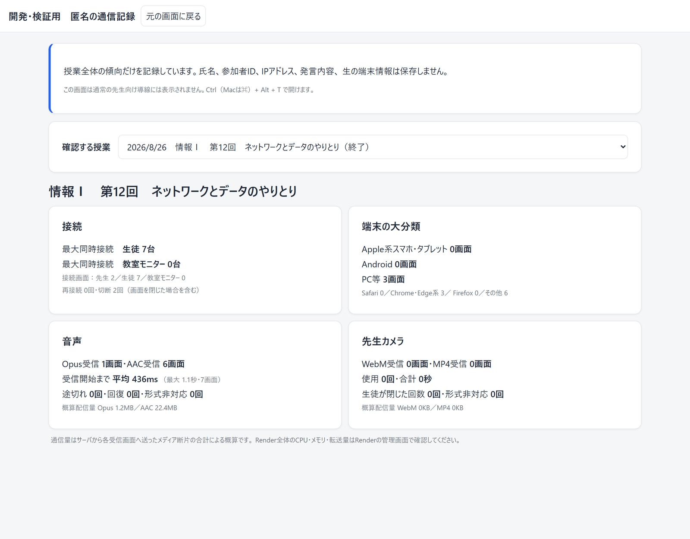

# 導入を検討する方へ

このシステムの導入を検討していただく際に、確認されることが多い点をまとめました。
技術的な内容には立ち入らず、**運用と個人情報の観点**から書いています。

- [何をするシステムか](#何をするシステムか)
- [生徒にお願いすること](#生徒にお願いすること)
- [個人情報の扱い](#個人情報の扱い)
- [外部サービスに送られるもの](#外部サービスに送られるもの)
- [必要な環境](#必要な環境)
- [費用](#費用)
- [できないこと](#できないこと)
- [よくある質問](#よくある質問)

---

## 何をするシステムか

遠隔授業で、**生徒が授業についてこられているかを、先生が授業中に把握できるようにする**Webアプリです。

対面の教室では、生徒の表情や手の動きから「もう一度説明したほうがよさそうだ」と気づけます。
遠隔になると、その情報が届きにくくなります。

このシステムでは、生徒が**ボタンを1つ押すだけ**で意思表示できます。
名乗る必要も、話す必要も、カメラを点ける必要もありません。

先生には、反応が集まったタイミングが通知されます。
授業のあとには、その瞬間の音声とスライドに戻って確認できます。

---

## 生徒にお願いすること

| | |
|---|---|
| **お願いすること** | URLを開いて、**授業コードを入れることだけ**です |
| **お願いしないこと** | アカウント登録、アプリのインストール、カメラ、マイク、**名前の入力** |

名前の欄はありますが、**空のままで参加できます**。
その場合は「青いネコ」のような仮名が自動で付き、先生の画面にはその名前で届きます。
仮名はその授業の中だけで一貫するので、授業をまたいで同じ生徒を追うことはできません。

アプリのインストールが要らないので、学校が配布している端末でも、生徒個人の端末でも使えます。

**共有端末でも、前の生徒を引き継ぎません。** タブを閉じたあと同じ授業へ入り直すときだけ
「続きから参加しますか」と尋ね、選ばなければ別の生徒として参加します。

---

## 個人情報の扱い

**このシステムは、個人情報を集めない設計です。**
「集めたうえで保護する」のではなく、**そもそも集めなくても動くように機能を設計しています。**

| 項目 | このシステムでは |
|---|---|
| 先生の登録 | ログインIDと表示名のみ。**メールアドレスは求めません** |
| 生徒の登録 | **不要**。授業コードだけで参加できます（名前は任意） |
| 生徒のカメラ | **使いません。** 生徒が映る機能そのものがありません |
| 生徒のマイク | **使いません。** 生徒の声が流れる機能そのものがありません |
| 生徒どうし | 他の生徒の反応も、進み具合も見えません |
| 成績・評価との連携 | ありません |
| 生徒に公開する復習動画 | 生徒の名前もコメントも出ません |

### 保存されるもの

授業ごとに、次のものが保存されます。

- 先生の音声の録音
- スライドのPDF
- スライドの切り替え・書き込みの記録
- 生徒の反応とコメント（名前つき。名前を入れずに参加した生徒は仮名）

これらはその授業を作った先生だけが見られます。

**授業は、作った先生が授業一覧から削除できます。**
削除すると上のものがすべて消え、**元に戻せません**。授業中は削除できません。

### 運用の記録について

開発側が通信の状況を把握するための、授業単位の集計があります。
ここでは次のものを**保存していません**。

> 氏名、参加者ID、IPアドレス、生のUser-Agent、発言・字幕・コメントの内容

記録しているのは授業単位の傾向（端末の種別の割合、通信量、再接続の回数など）だけで、
**個人を追跡したり評価したりする機能ではありません。**

---

## 外部サービスに送られるもの

AI機能を使う場合、次の情報が外部のサービスへ送られます。
**導入の判断で最も確認が必要な点だと考えているため、明記します。**

| 機能 | 送り先 | 送られるもの | 止められるか |
|---|---|---|---|
| **自動字幕**（リアルタイム） | Google | 先生の音声 | 字幕を使わなければ送られません |
| **文字起こし** | OpenAI | 先生の音声 | APIキーを設定しなければ動きません |
| **要約・コメント分析** | OpenAI | 先生の発言の文字起こしと、**生徒が送ったコメントの本文** | 同上 |

要約だけを Anthropic（Claude）に切り替える設定もありますが、**既定は OpenAI** です。
切り替えられるのは**サーバを管理する方だけ**で、先生や生徒の画面から変わることはありません。

**生徒が送ったコメントは、本文が外部へ送られます。**
「そのコメントが先生のどの説明に向けられたものか」をAIに探させる機能のため、
本文なしでは成り立ちません。送るのは**コメントの文字だけ**で、
仮名・参加者ID・端末の情報は付けていません。
生徒の音声とカメラは、そもそもこのシステムが扱っていません。

自動字幕は、ブラウザ（Chrome）に組み込まれた音声認識を使っています。
この仕組みは音声をGoogleのサーバへ送って認識する実装のため、
**字幕を使う場合は、その点を先生にお伝えください。**

AI機能を使わない設定でも、授業配信・反応の収集・録音・振り返りはすべて動きます。

---

## 必要な環境

### まず、この表です

**誰が、どんな端末と回線を用意すればよいか**をまとめました。
これで足りる場合は、以降の細かい説明は読まなくて構いません。

| 誰が | 端末 | 回線 | 使えること |
|---|---|---|---|
| **生徒**（各自の端末で音を聞く） | スマホ・タブレット・PC。数年前の機種で足ります | 受け取り **0.05Mbps**（速度制限中でも可） | 音声・スライド・ボタン・コメント・タスク・字幕 |
| **生徒**（教室のモニターで聞く） | 同上。音の再生の対応すら要りません | **ほぼ0** | ボタン・コメント・タスク |
| **生徒**（カメラ映像も見る） | 同上 | 受け取り **1Mbps** | 上に加えて先生の映像 |
| **先生** | マイクの使えるPC。自動字幕を使うなら **Chrome か Edge** | 送り出し **0.05Mbps**（カメラを使うと 1Mbps） | 配信・書き込み・字幕・授業後のAI |
| **教室のモニター** | テレビ内蔵ブラウザで可。映像も映すなら720pの再生 | 受け取り **0.05Mbps**（映像込みで 1Mbps） | 音とスライドの投影 |
| **サーバ** | クラウドの小さなプラン、または校内のPC 1台 | 送り出し **台数 × 上の値** | — |

**押さえていただきたいのは、この4点です。**

1. **台数で増えるのはサーバの送り出しだけ**です。先生の端末も生徒の端末も、
   何台つながっていても必要な速さは変わりません
2. **生徒の回線は、速度制限（128kbps程度）でも成立します。**
   音声の 48kbps は、その6割に収まるように決めた値です
3. **校内で各自の端末で聞く場合は、校内の合計が学校の1本の回線に集まります。**
   教室のモニターで受ければ、ここが台数に比例しなくなります
4. **授業のはじめだけ、スライドのPDFが台数の数だけ流れます**（以後は増えません）

> **迷ったら端末チェックです。** アドレスの最後を `/check` にすると開きます（ログイン不要）。
> その端末・その回線で実際に通信量を測り、○×で判定します。
> **導入前に、実際に使う教室の端末で一度お試しください。**

---

### 回線をもう少し細かく

配信の主役は音声とスライドです。音声は 48kbps で送っています。

| 生徒側の回線 | 授業が成立するか |
|---|---|
| 光回線・ケーブルテレビ | 余裕があります |
| スマートフォンの通常時 | 余裕があります |
| **ギガを使い切った後の速度制限**（128kbps程度） | **成立します。ここを基準に設計しています** |
| 学校・自治体のフィルタリング回線 | 速度は足りますが、通信が塞がれている場合があります。端末チェックで判定できます |

カメラ映像を使う場合は、受け取る側に別途 900kbps 程度が必要です。
ただし**映像を受け取るかどうかは生徒の端末ごとに選べる**ので、回線の細い生徒は映像だけを止められます。
音声とスライドは止まりません。

**学校の回線は、校内の合計で見てください**

| 校内で各自の端末で聞く台数 | 学校の回線に必要な速さ（受け取り） |
|---|---|
| 40台（1クラス） | 約2Mbps |
| 300台（1学年） | 約14Mbps |
| 40台が映像も見る | 約40Mbps |

同じ300人でも、**10教室のモニターで受ければ 0.5Mbps** で足ります。

**サーバの送り出し**

| 使い方 | 送り出し | 50分1コマの通信量 |
|---|---|---|
| 教室のモニター10台で受ける（生徒300人） | **0.5Mbps** | 約0.2GB |
| 300台がそれぞれの端末で音を聞く | **14Mbps** | 約5.4GB |
| 50台がカメラ映像も見る | **50Mbps** | 約19GB |

台数ごとの上限の目安は [どのくらいの規模まで使えるか](#どのくらいの規模まで使えるか) にあります。

> **先生の送り出しが倍になる場合があります。** 受け取る端末の対応が分かれていると
> （AACしか再生できない端末と、Opusしか再生できない端末が混じっているなど）、
> 先生の端末は**両方の形式を同時に作って送ります**。
> それでも音声だけなら 0.1Mbps、カメラを使っても 2Mbps 程度です。

**授業のはじめだけ、PDFが流れます**

生徒は参加した時点で**スライドのPDFを丸ごと受け取ります**（あとはページを送っても通信しません）。
そのため授業の最初だけ、**PDFの大きさ × 参加する台数**が一度に流れます。

| PDFの大きさ | 40台 | 300台 |
|---|---|---|
| 100KB（文字中心の資料） | 4MB | 30MB |
| 1MB | 40MB | 300MB |
| 3MB（写真の多い資料） | 120MB | **900MB** |

手元の47授業では**平均77KB、いちばん大きいもので2.7MB**でした。
文字中心の資料なら気になりません。**写真の多い資料を大人数へ配るときだけ**、
授業の最初に少し待つことがあります。

### 端末をもう少し細かく

#### 生徒の端末

**この中でいちばん性能が要りません。** マイクもカメラも使わず、
することは「スライドを表示する」「音を聞く」「ボタンとコメントを送る」だけです。

20ページの資料を使い、ブラウザのCPUを段階的に絞って実測した結果です
（開発機は16コアのPC。「4分の1」はその速さの4分の1で動かした、という意味です）。

| 端末の速さ | 参加してから最初のスライドが出るまで | 先生がページを送ってから出るまで |
|---|---|---|
| 開発機（16コアのPC） | 0.4秒 | 0.1秒 |
| その **4分の1** | 0.4秒 | 0.1秒 |
| その **8分の1** | 0.4秒 | 0.1秒 |
| その **16分の1** | 1.3秒 | 0.3秒 |

**16分の1の速さでも、ページ送りは0.3秒で追いつきます。**
学校で配られる端末や、数年前のスマートフォンで問題ありません。

メモリも、画面の処理に使う部分は 10MB 前後でした。
**20ページを送っても増えません**（表示中の前後だけを持ち、古いページは手放すため）。

必要なのは、ブラウザ（Chrome・Edge・Safari・Firefox のいずれでも可）と、
各自の端末で音を聞く場合の **Opus か AAC のどちらかの再生**だけです
（両方に対応していない端末はまずありません）。

#### 先生の端末

**3つの中で、ここだけ性能が要ります。** 音声を作って送り続けるのは先生の端末だからです。

| 使う機能 | 必要なもの | 無いとどうなるか |
|---|---|---|
| 音声の配信（必須） | マイクと、`https://` で始まるURL | マイクの許可画面すら出ません |
| **自動字幕** | **Chrome か Edge** | 字幕が出ません（授業は成立します） |
| カメラ映像 | カメラと、720pを送り出せる性能 | 映像なしで授業できます |
| カメラ映像の遅延を小さくする | Chrome か Edge | 映像だけ**数秒遅れることがあります**（音とスライドは遅れません） |

**普通のノートPCで足ります。** ただし**カメラを使う場合だけ**、720pの映像を
作り続ける負荷がかかるので、極端に古い機種は避けてください。
カメラを使わない授業なら、そこは要りません。

#### 教室のモニター（をつなぐ端末）

スライドを大きく映すだけなら、**生徒の端末と同じ程度**で足ります。
テレビの内蔵ブラウザでも動きます。

ただしテレビの内蔵ブラウザは、**対応している形式が古いことがあります。**
音が出ない・映像が出ない場合はそこが原因なので、
授業の前に端末チェックで「教室のモニター」を選んで確かめてください。

カメラ映像も映す場合は、**720pの映像を再生し続ける**ことになります。
スライドだけの場合より性能が要るので、映像が止まるようなら
「スライドのみ」のレイアウトに切り替えてください。

---

## 費用

運用の仕方によって2通りあります。

| | 校内だけで使う | 校外からも受講する |
|---|---|---|
| 用意するもの | PC 1台と校内のWi-Fi | サーバの契約 |
| 費用 | **0円** | 月 $7 程度〜（約1,100円）+ AI利用料 |
| 校外の生徒 | 参加できません | 参加できます |
| AI機能 | 利用料を払えば使えます | 同じ |

校内だけで使う場合は、先生のPC 1台をサーバにして、同じWi-Fi内で授業ができます。
クラウドに何も出さないので、**外部にデータを預けたくない場合はこの運用が選べます**
（ただしAI機能を使う場合は、上記の通り音声やテキストが外部へ送られます）。

### だいたいの月額（クラウド運用）

| 内訳 | 金額 |
|---|---|
| サーバ（Render Starter） | 月 $7 = **約1,100円**。授業をしない月も同じ |
| データベース（Neon の無料枠） | **0円**。授業のデータは小さいので無料枠で足ります |
| AI 文字起こし（Whisper） | **使った分だけ**。50分の授業1コマで **50円ほど** |
| AI 要約とコメント分析 | **使った分だけ**。同じ1コマで **10円ほど** |

文字起こしは**音声の分数**で課金されるので、AIの費用は
**「授業の長さ × コマ数」でほぼ決まります**。**50分の授業1コマで 60円前後**です。
この金額には、録音時間より**1割強多く送る量**が含まれています
（繋ぎ目を15秒重ねて取るのと、コメントが届いたときに追いつく量が乗ります）。

| 月に50分授業を | AI利用料 | サーバ代と合わせて |
|---|---|---|
| 4コマ（週1） | 約250円 | **約1,400円** |
| 20コマ（週5） | 約1,200円 | **約2,300円** |
| 50コマ | 約3,000円 | **約4,100円** |

> 2026年8月時点の[OpenAIの料金](https://developers.openai.com/api/docs/pricing)
> （Whisper $0.006/分、gpt-5.6-luna 入力 $0.20 / 100万トークン）と、1ドル155円で計算しています。
> 料金も為替も変わるので、**桁の感覚**としてお使いください。
>
> **APIキーを設定しなければ、この費用は発生しません。**
> 配信・反応の収集・録音・振り返りは、そのまま使えます。

---

## どのくらいの規模まで使えるか

**使い方によって、桁がひとつ変わります。**決めるのは処理能力ではなく、
**サーバから送り出す通信量**です。

| 使い方 | 1台あたり | 目安の上限 | 50分1コマの通信量 |
|---|---|---|---|
| **教室のモニターで受ける**（生徒の端末は「教室から参加」） | ほぼ0 | **1000台以上** | ほぼ0 |
| **各自の端末で音を聞く** | 48kbps | **300台**（余裕を見て） | 300台で 5.4GB |
| **音に加えてカメラ映像も見る** | 約1Mbps | **30〜50台** | 50台で 19GB |

### 使い方ごとの目安

**教室のモニターで受ける場合** — 人数はほとんど問題になりません。
音を送る先はモニターの台数だけで、生徒の端末からはボタンとコメントが時々届くだけです。
**学年全体でも、学校全体でも足ります。**

**各自の端末で音を聞く場合** — 300台なら安心して使えます。
600台でも動きますが、通信量はそのまま倍になります（1コマ 11GB）。
それ以上を常用されるなら、プランに含まれる転送量を先にご確認ください。

**カメラ映像も送る場合** — **人数を絞ってください。**
映像は音声の約20倍の通信量です。100台に送ると1コマで37GB、
送り続ける速度も約100Mbpsになり、一般的なプランでは足りません。
少人数のゼミや、教室のモニターだけに送る使い方に向いています。

> **通信量が増えるのはサーバ側だけです。** 先生の端末が送るのは、
> 何台つながっていても1本だけ（音声48kbps、映像を使う場合は+900kbps）です。
> 生徒の端末も、自分の1台に届く量しか受け取りません。

### 授業のはじめの待ち時間

授業が始まるとき、生徒が一斉に入ってきます。ここだけは人数が効きます。

| 一斉に入る台数 | 全員つながるまで |
|---|---|
| 150台 | 1秒ほど |
| 300台 | 2〜3秒 |
| 600台 | 7〜8秒 |

入ってしまえば、あとは人数に関係なく安定します。

> 上の数字は開発機（16コア）で実際に接続して測ったものです。
> **本番のサーバはこれより性能が小さいので、待ち時間は2倍前後を見てください。**

---
## できないこと

- **生徒側からの映像・音声の送信はできません。** 発表や対話を映像でやり取りする用途には向きません。
- **画面からパスワードを再設定することはできません。** メールアドレスをお預かりしていないためです。
  サーバを管理する方が設定し直す手順は用意してあり、その場合も授業の記録は残ります。
- **削除した授業は元に戻せません。** 授業一覧から削除できますが、
  記録とファイルを両方消すため、取り消す手段はありません。
- **自動字幕は、先生の端末が Chrome・Edge であることが前提です。** Safari では不安定、Firefox では動きません。
  生徒側のブラウザは問いません。
- **サーバ1台で動かす前提です。** 使い方ごとの目安は
  [どのくらいの規模まで使えるか](#どのくらいの規模まで使えるか) にまとめてあります。
  そこに書いた範囲を大きく超える場合は、サーバを増やせるようにする改修が必要です。
- **成績処理や出欠管理との連携はありません。**

---

## よくある質問

**Q. 保護者への説明や同意書は必要ですか。**

**必要かどうかは、こちらでは判断できません。**
ご判断の材料として、このシステムが生徒から取得しないものを挙げておきます。

- 氏名・連絡先は取得しません（名前の入力は任意で、空のままなら仮名が付きます）。
- カメラ・マイクは使いません（生徒側にその機能そのものがありません）。
- 成績・出欠との連携はありません。

**「個人情報を取得しなくても成り立つ範囲で作る」ことを設計の目標にしていますが、
それが法令上どの区分に当たるかを判定したものではありません。** 規程のご確認をお願いします。

**Q. 生徒が名前を入れないと、ふざけた投稿が出ませんか。**

コメントには必ず名前（または仮名）が付き、**同じ生徒からの投稿は同じ名前でまとまって見えます**。
先生は「この名前の生徒が繰り返している」と分かるので、完全な放任にはなりません。
本名で運用したい授業では、生徒に名前を入れてもらうこともできます。

**Q. 授業の録音は誰が見られますか。**

その授業を作った先生だけです。生徒に公開する場合は、
先生が「復習動画」で公開する部分を選んだときに限られ、その画面に生徒の名前やコメントは出ません。

**Q. 誰でも先生アカウントを作れてしまいませんか。**

インターネットに公開して運用する場合は、`REGISTER_CODE`（登録の合言葉）を設定できます。
設定すると、その合言葉を知っている人しかアカウントを作れません。
校内だけで使う場合は、設定しなくても外から届きません。

**Q. 生徒の端末の通信量が心配です。**

音声とスライドで 48kbps 程度です。50分の授業で 20MB 前後が目安になります。
映像を使う場合はもっと増えますが、生徒側で映像だけを止められます。

**Q. 300人規模で使えますか。**

**生徒がどこで音を聞くかで変わります。**
各教室のモニターにつなぎ、生徒の端末を「教室から参加」にしておけば、
音を送る先は教室の数だけになるので、**300人でも問題になりません**。
全員がそれぞれの端末で音を聞く場合は、サーバが 14Mbps を送り続け、1コマで 5.4GB になります。

台数ごとの目安は [どのくらいの規模まで使えるか](#どのくらいの規模まで使えるか) にまとめてあります。

**Q. 導入したあと、開発者がいなくなったらどうなりますか。**

ソースコードは MITライセンスで提供しているので、引き継いだ方が自由に利用・改変できます。
「なぜその作りにしたか」も [ARCHITECTURE.md](ARCHITECTURE.md) に記録してあるので、
別の人が手を入れられる状態にしてあります。

**Q. アップデートは行われますか。**

実際の授業での運用を通じて改良を重ねていきます。
運用で判明した問題と、それに対してどう設計を変えたかは、
[README の「設計判断とその根拠」](../README.md#設計判断とその根拠) に記録しています。
